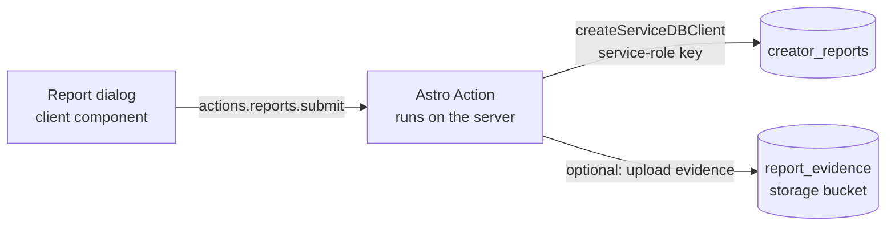
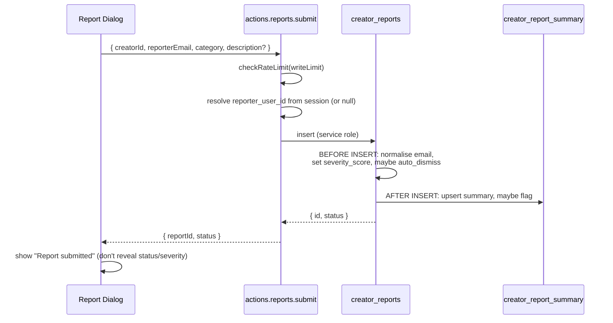

# Creator Reports — Frontend Implementation Guide

This page covers how to wire the "Report this creator" flow into the **marketing** app (the public-facing Astro site where readers/supporters land on a creator's profile). Unlike most other services, `creator_reports` and `creator_report_summary` are **service-role-only** — RLS denies every `authenticated`/`anon` policy and table privileges are revoked outright (see [Backend Overview](../backend/)). This means the client can never call `supabase.from('creator_reports')` directly; everything must go through a server-side **Astro Action**.

## Why an Astro Action (not a direct table call / RPC)



The action handler runs server-side and is the only place allowed to hold the service-role key (`createServiceDBClient`). It is responsible for:

1. Validating input with `zod`
2. Rate limiting + bot/spam protection
3. Resolving `reporter_user_id` from the session (or treating the report as anonymous)
4. Inserting the row via the service-role client (bypasses RLS by design)
5. Optionally uploading evidence to the private `report_evidence` bucket

> The `reporter_email` normalisation, `severity_score` assignment, and duplicate auto-dismissal all happen in `handle_creator_report_insert()` — the action does **not** need to replicate that logic. Just pass the raw fields through.

## Action Definition

```ts
// src/pages/@[handle]/_components/_report/actions/report.ts
import { ActionError, defineAction } from "astro:actions";
import { z } from "astro/zod";
import { createDBClient, createServiceDBClient } from "@/lib/db";
import { checkRateLimit, writeLimit } from "@/lib/upstash";

const ReportCategories = [
  "bullying_or_harassment",
  "illegal_activity",
  "nudity_or_explicit_content",
  "hate_speech_or_discrimination",
  "inaccurate_or_misleading_info",
  "scam_or_fraud",
  "intellectual_property",
  "incomplete_or_unfulfilled_orders",
  "other",
] as const;

export const reports = {
  submit: defineAction({
    accept: "json",
    input: z.object({
      creatorId: z.string(),
      reporterEmail: z.email(),
      category: z.enum(ReportCategories),
      description: z.string().max(2000).optional(),
      evidenceUrl: z.url().optional(),
    }),
    handler: async (input, context) => {
      await checkRateLimit(writeLimit, context.request);

      const dbClient = createDBClient({
        request: context.request,
        cookies: context.cookies,
      });

      const {
        data: { user },
      } = await dbClient.auth.getUser();

      if (user?.id === input.creatorId) {
        throw new ActionError({
          code: "BAD_REQUEST",
          message: "You can't report your own profile.",
        });
      }

      const supabaseAdmin = createServiceDBClient();

      const { data, error } = await supabaseAdmin
        .from("creator_reports")
        .insert({
          creator_id: input.creatorId,
          reporter_user_id: user?.id ?? null,
          reporter_email: input.reporterEmail,
          category: input.category,
          description: input.description,
          evidence_url: input.evidenceUrl,
        })
        .select("id, status")
        .single();

      if (error) {
        console.error("creator_reports insert error:", error);
        throw new ActionError({
          code: "INTERNAL_SERVER_ERROR",
          message: "Failed to submit report. Please try again.",
        });
      }

      return {
        reportId: data.id as string,
        status: data.status as string,
      };
    },
  }),
};
```

### Notes on the fields

| Field | Source | Notes |
|---|---|---|
| `creator_id` | route param / loaded profile | Validate it resolves to a real creator before calling the action |
| `reporter_user_id` | `dbClient.auth.getUser()` | `null` for anonymous reporters — do **not** require auth for this flow |
| `reporter_email` | form input | Required even for signed-in users (used for de-duplication); the trigger lower-cases + trims it server-side |
| `category` | form select | Must match `public.report_category` — keep `ReportCategories` in sync with the enum |
| `description` / `evidence_url` | form input | Optional |
| `severity_score`, `status` | **not accepted from the client** | Set entirely by `handle_creator_report_insert()` |

::: warning Self-report check happens twice
The DB enforces `creator_reports_no_self_report check (creator_id is distinct from reporter_user_id)`. The action's check above is just for a friendlier error message — if it's bypassed somehow, the insert fails with a constraint violation that you should also map to a `BAD_REQUEST`.
:::

## Submission Flow



::: tip Don't surface internal state to the reporter
`status` can come back as `'pending'` or `'auto_dismissed'` (silent duplicate dedup). Show the **same** generic "Thanks, we've received your report" confirmation regardless of which one it is — revealing `auto_dismissed` would let someone probe whether a prior report exists.
:::

## Calling the Action from the Client

```tsx
// _report/components/ReportCreatorDialog.tsx
import { actions } from "astro:actions";
import { useState } from "react";

const CATEGORY_LABELS: Record<string, string> = {
  bullying_or_harassment: "Bullying or harassment",
  illegal_activity: "Illegal activity",
  nudity_or_explicit_content: "Nudity or explicit content",
  hate_speech_or_discrimination: "Hate speech or discrimination",
  inaccurate_or_misleading_info: "Inaccurate or misleading info",
  scam_or_fraud: "Scam or fraud",
  intellectual_property: "Intellectual property violation",
  incomplete_or_unfulfilled_orders: "Incomplete or unfulfilled orders",
  other: "Other",
};

export function ReportCreatorDialog({ creatorId }: { creatorId: string }) {
  const [submitting, setSubmitting] = useState(false);

  async function handleSubmit(values: ReportFormValues) {
    setSubmitting(true);

    const { data, error } = await actions.reports.submit({
      creatorId,
      reporterEmail: values.email,
      category: values.category,
      description: values.description || undefined,
      evidenceUrl: values.evidenceUrl || undefined,
    });

    setSubmitting(false);

    if (error) {
      if (error.code === "TOO_MANY_REQUESTS") {
        toast.error("Too many reports submitted. Try again later.");
      } else if (error.code === "BAD_REQUEST") {
        toast.error(error.message);
      } else {
        toast.error("Couldn't submit your report. Please try again.");
      }
      return;
    }

    toast.success("Thanks — we've received your report and will review it.");
    closeDialog();
  }

  // ...form JSX with category select, email input, description textarea
}
```

## Uploading Evidence (optional attachment)

The `report_evidence` bucket is **private** (no RLS policies — default deny). Files must be uploaded server-side through the action using the service-role client; never request a client-side signed URL for this bucket. Accept the file as `multipart/form-data`:

```ts
// reports.uploadEvidence — separate action, called after `submit` returns reportId
export const reports = {
  // ...submit from above
  uploadEvidence: defineAction({
    accept: "form",
    input: z.object({
      reportId: z.string(),
      file: z.instanceof(File),
    }),
    handler: async (input, context) => {
      await checkRateLimit(writeLimit, context.request);

      if (input.file.size > 10 * 1024 * 1024) {
        throw new ActionError({ code: "BAD_REQUEST", message: "File too large (max 10MB)." });
      }

      const allowed = ["image/jpeg", "image/png", "image/gif", "image/webp", "image/svg+xml", "application/pdf"];
      if (!allowed.includes(input.file.type)) {
        throw new ActionError({ code: "BAD_REQUEST", message: "Unsupported file type." });
      }

      const supabaseAdmin = createServiceDBClient();
      const path = `reports/${input.reportId}/evidence`;

      const { error: uploadError } = await supabaseAdmin.storage
        .from("report_evidence")
        .upload(path, input.file, { contentType: input.file.type, upsert: true });

      if (uploadError) {
        throw new ActionError({ code: "INTERNAL_SERVER_ERROR", message: "Evidence upload failed." });
      }

      const { error: updateError } = await supabaseAdmin
        .from("creator_reports")
        .update({ evidence_file_path: path })
        .eq("id", input.reportId);

      if (updateError) {
        throw new ActionError({ code: "INTERNAL_SERVER_ERROR", message: "Failed to link evidence to report." });
      }

      return { path };
    },
  }),
};
```

Call it as a second step right after `submit` resolves, passing the returned `reportId`:

```ts
const { data: submission, error } = await actions.reports.submit(values);
if (error || !submission) return handleError(error);

if (selectedFile) {
  const formData = new FormData();
  formData.set("reportId", submission.reportId);
  formData.set("file", selectedFile);
  await actions.reports.uploadEvidence(formData);
}
```

::: warning Evidence is best-effort
If `uploadEvidence` fails after `submit` already succeeded, don't block the success state on it — the report has already been recorded. Log the failure and let the reporter retry the attachment, or simply drop it; the moderation team can still act on `description` / `evidence_url` alone.
:::

## Error Codes Reference

| `error.code` | When | Suggested UI |
|---|---|---|
| `TOO_MANY_REQUESTS` | Rate limit exceeded (`writeLimit`) | "Too many reports — try again in a minute" |
| `BAD_REQUEST` | Self-report attempt, invalid file type/size, validation failure | Inline form error / toast with `error.message` |
| `INTERNAL_SERVER_ERROR` | Insert/upload/update failure | Generic "Something went wrong, please try again" |

## What You Should Not Build

- **No status/history UI for reporters.** Reports are one-way — there's no "my reports" view. Once submitted, the reporter gets a single confirmation and nothing else.
- **No client-side severity or duplicate-detection logic.** That's entirely owned by `handle_creator_report_insert()` / `handle_creator_report_flagged()` in the schema — duplicating it client-side would only get out of sync.
- **No direct `supabase.from('creator_reports')` reads.** Even for the reporter's own submissions — RLS denies it and the table privileges are revoked for `anon`/`authenticated`.
