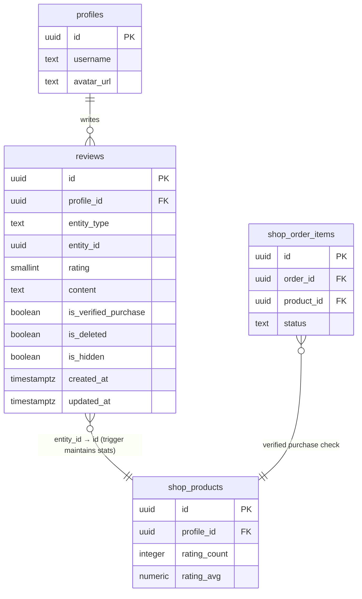

# Reviews & Ratings — Backend Overview

A polymorphic reviews and star-ratings system. Each review belongs to an `entity_type + entity_id` pair rather than a specific service, so new entity types can be added with minimal schema changes.

Currently supports: `shop_product`.

## Dependencies

| Dependency | Why |
|---|---|
| `public.profiles` | Reviewer FK; display name and avatar for `get_product_reviews` |
| `public.shop_products` | Denormalized `rating_count` / `rating_avg` columns |
| `public.shop_orders` | Verified-purchase check in `upsert_review` |
| `public.shop_order_items` | Verified-purchase check (status = `fulfilled` \| `delivered`) |
| `public.handle_updated_at()` | `updated_at` trigger (common.sql) |
| `public.authorize_manager()` | Permission check in `hide_review` |

## Module Inventory

| Object | Type | Purpose |
|---|---|---|
| `public.reviews` | Table | Polymorphic review + rating rows |
| `trg_reviews_updated_at` | Trigger (BEFORE UPDATE) | Maintains `updated_at` |
| `trg_reviews_shop_product_stats` | Trigger (AFTER INSERT/UPDATE/DELETE) | Recomputes `rating_avg`, `rating_count` on `shop_products` |
| `public.upsert_review` | RPC | Create or update caller's review; auto-sets `is_verified_purchase` |
| `public.delete_review` | RPC | Soft-deletes caller's own review |
| `public.hide_review` | RPC | Manager-only (`content.moderate`); sets `is_hidden = true` |
| `public.get_product_reviews` | RPC | Paginated public review listing for a product |

## ER Diagram



## Design Decisions

### 1. Polymorphic entity_type + entity_id pattern
A single `reviews` table covers all entity types. The `entity_type` column has a `CHECK` constraint listing supported values. To add a new entity type (e.g. `newsletter_post`): add it to the constraint, add an `ELSIF` branch in `upsert_review` for the verified-purchase check, and add a branch in `trg_reviews_shop_product_stats` to maintain stats on the new target table.

### 2. Reuse `content.moderate` for hide_review
Adding a new `manager_permission` enum value requires an `ALTER TYPE` migration touching every caller of `authorize_manager`. The semantics — suppressing user-generated content from public view — are identical to the existing `content.moderate` permission already used for shop products and feed posts.

### 3. Denormalize rating_avg + rating_count onto shop_products
Consistent with `sales_count` and `total_views`. Enables O(1) reads on product listing cards without a `GROUP BY` join on every render. `rating_avg` is `NULL` (not `0.00`) when no reviews exist — a meaningful distinction for the UI ("no reviews yet" vs "rated zero").

### 4. Stats trigger recomputes from scratch on every relevant change
A single `SELECT COUNT(*), AVG(rating) WHERE is_deleted=false AND is_hidden=false` on the covering index `idx_reviews_stats_covering` handles all state transitions (insert, soft-delete, hide, rating update, restore, un-hide) correctly by construction — no incremental arithmetic drift. The trigger fires only on `UPDATE OF rating, is_deleted, is_hidden` (not every column) to avoid spurious recomputes from `updated_at` writes.

### 5. is_hidden preserved on upsert (user edit does not auto-unhide)
A manager hide is a moderation action that survives user edits. If a reviewer edits their review text or rating, `is_hidden` stays `true`. Un-hiding requires an explicit manager action (future `unhide_review` RPC or service-role update).

## RLS Summary

| Operation | Who can |
|---|---|
| SELECT | Authenticated: active+visible rows, OR own rows (incl. deleted/hidden), OR `content.moderate` manager |
| INSERT | Blocked directly — use `upsert_review` RPC |
| UPDATE | Blocked directly — use `upsert_review` / `delete_review` / `hide_review` RPCs |
| DELETE | Blocked directly — soft-delete only via `delete_review` |
| anon | No access (`REVOKE ALL`) |

## RPC Reference

### upsert_review
```
upsert_review(
  p_entity_type text,
  p_entity_id   uuid,
  p_rating      smallint,       -- 1–5
  p_content     text DEFAULT NULL
) → jsonb
```
Creates or updates the caller's review. One review per user per entity (unique constraint). `is_verified_purchase` is set automatically. `is_hidden` is preserved on update.

**Returns:** `{ success, review_id, is_verified_purchase }` or `{ success: false, error: CODE }`

**Error codes:** `UNAUTHENTICATED`, `INVALID_ENTITY_TYPE`, `INVALID_RATING`, `ENTITY_NOT_FOUND`, `CANNOT_REVIEW_OWN_PRODUCT`

---

### delete_review
```
delete_review(p_review_id uuid) → jsonb
```
Soft-deletes caller's own review (`is_deleted = true`). Stats recomputed by trigger. Reviewer can restore by calling `upsert_review` again.

**Error codes:** `UNAUTHENTICATED`, `NOT_FOUND`

---

### hide_review
```
hide_review(p_review_id uuid) → jsonb
```
Manager-only (`content.moderate`). Sets `is_hidden = true`. Idempotent. Excludes review from public reads and aggregate stats.

**Error codes:** `UNAUTHORIZED`, `NOT_FOUND`

---

### get_product_reviews
```
get_product_reviews(
  p_entity_id uuid,
  p_limit     integer     DEFAULT 20,
  p_cursor    timestamptz DEFAULT NULL  -- last page's created_at for keyset pagination
) → TABLE(review_id, rating, content, is_verified_purchase, created_at, updated_at,
           reviewer_username, reviewer_avatar_url)
```
Paginated public reviews. Max 50 per call. Excludes soft-deleted and hidden reviews.
