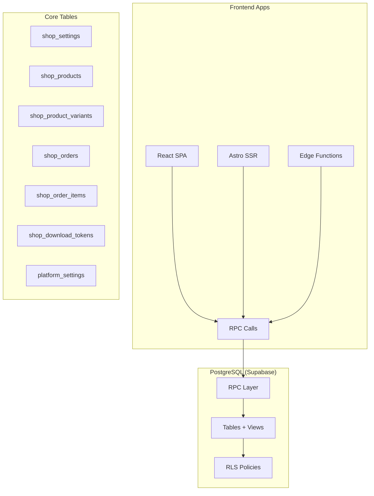

# Shop Service — Backend Overview



The shop service is a multi-product e-commerce layer built entirely on PostgreSQL (Supabase). All business logic lives in RPCs (`SECURITY DEFINER` functions) so clients never touch tables directly — they call functions and receive typed JSONB responses.

## What's in this section

| Page | Contents |
|---|---|
| [Database Schema](./schema) | Every table, column, constraint, index, and RLS policy |
| [Shop Settings](./shop-settings) | Complete guide to `shop_settings`, eligibility, shipping, theming, and policies |
| [All RPCs (Quick Reference)](./rpc-reference) | Single-page lookup for all 34 RPCs |
| [Helpers & Eligibility](./rpc-helpers) | `get_platform_setting`, `check_shop_active_eligibility` |
| [Products, Variants & Files](./rpc-products) | Product CRUD, multi-axis variants, file management |
| [Checkout & Payments](./rpc-checkout) | `initiate_shop_checkout`, `handle_shop_payment_success` |
| [Orders & Fulfillment](./rpc-orders) | Order queries, tracking, mark-delivered |
| [COD & Wallet Debt](./rpc-cod) | Cash confirmation, cancellation, `cod_debt` topup |
| [Dashboard & Cron](./rpc-dashboard) | `get_shop_overview`, auto-deactivate cron job |

## Dependencies

The shop service depends on these tables and functions from other migrations:

```
public.profiles               — FK target for seller/buyer profile_id
public.wallets                — balance + cod_debt (added by this migration)
public.transactions           — financial ledger (service_type = 'shop')
public.activities             — event log (used for notifications)
public.handle_updated_at()    — shared trigger function
public.visibility_enum        — shared enum
public.reference_type_enum    — shared enum (used in transaction rows)
public.payment_status_enum    — shared enum
public.transaction_direction_enum
public.provider_enum
public.user_services          — triggers auto-provision of shop_settings on service enable
```

The `alter table wallets add column cod_debt` statement runs as part of the shop migration. Make sure `wallets.sql` runs first.

---

## Design Decisions

These 15 decisions are the authoritative source of truth for the service. Every schema choice and RPC branch traces back to one of these.

### 1. Product types — `digital` vs `physical`

Products have a `product_type` column (`digital | physical`) that forks almost every downstream behaviour:

| Concern | Digital | Physical |
|---|---|---|
| Fulfillment | Instant — download tokens created on payment | Manual — creator ships, marks delivered |
| Shipping fee | None | Per-product inside/outside Dhaka rates |
| COD | Never allowed | Optional per product (`cod_enabled`) |
| Files | `shop_product_files` rows | None |
| Stock | Counted if set; null = unlimited | Same |

### 2. Multi-axis variants (JSONB, Option C)

Variants are stored as JSONB rather than relational rows. The product holds the axis *definitions*; each variant row holds its *combination*.

```sql
-- On shop_products:
option_definitions jsonb  -- [ { "name": "Size", "values": ["S","M","L"] },
                          --   { "name": "Color", "values": ["Red","Blue"] } ]

-- On shop_product_variants:
options jsonb             -- { "Size": "M", "Color": "Red" }
```

**Constraints enforced by RPCs (not just the DB):**
- Maximum 3 axes per product
- Every key in `options` must match an axis name in `option_definitions`
- Every value must be in that axis's `values` array
- All axes must be covered (no partially-defined combinations)
- `options` is **immutable** after creation — delete + recreate to change the combination

**Sparse variants** are allowed. Not every cartesian-product combination needs to exist. The variant picker on the frontend disables values that would lead to non-existent combinations.

### 3. Soft delete for products and files

Once any `shop_order_items` row references a `product_id` or `file_id`, those rows cannot be hard-deleted (the FK has `ON DELETE RESTRICT`). Instead:

- `shop_products.is_deleted = true` — hides from public pages, shows "deleted" state in Studio
- `shop_product_files.is_deleted = true` — preserves existing buyer download tokens

The `delete_shop_product` RPC detects whether any order references the product and silently does a soft delete instead, returning `{ deleted: 'soft' | 'hard' }`.

### 4. Order status is item-level, not order-level

`shop_orders` has **no status column**. Status is computed from `shop_order_items.status` at query time inside `get_order_by_number` and `get_shop_overview`.

**Item status flow:**

```
Online digital:   pending → paid → fulfilled
Online physical:  pending → paid → processing → shipped → delivered
COD physical:     pending → processing → shipped → delivered
                                                    └── (separately) cash confirmed
```

Computed order-level labels (returned by RPCs, never stored):

| Condition | Label |
|---|---|
| Any item `cancelled` | `cancelled` |
| Any item `refunded` | `refunded` |
| Any item `pending` or `paid` | `processing` |
| Any item `shipped` (not all terminal) | `partially_shipped` |
| All items `fulfilled` or `delivered` | `complete` |

### 5. Payment methods — online vs COD

`shop_orders.payment_method = 'online' | 'cod'`

**Online flow:**
1. `initiate_shop_checkout` creates order with items in `pending`
2. SSLCommerz IPN fires `handle_shop_payment_success`
3. Digital items: download tokens created, status → `fulfilled`
4. Physical items: status → `processing`, stock decremented

**COD flow:**
1. `initiate_shop_checkout` creates order with items in `processing` immediately
2. Stock decremented at checkout (not at payment)
3. Seller ships → `update_order_tracking` → `shipped`
4. Seller marks delivered → `mark_order_item_delivered` → `delivered`
5. Seller confirms cash → `confirm_cod_cash_received` → platform fee debited, transaction row created

COD is **physical-only**. Digital products cannot be sold COD (checked in `upsert_shop_product` and `initiate_shop_checkout`).

### 6. COD enforcement — two independent deactivation gates

A shop is blocked from accepting COD (and eventually auto-deactivated) when either of two conditions hold:

```
Gate A: (wallet.balance - wallet.cod_debt) < cod_wallet_floor    (default -500)
Gate B: any COD order has unsettled items older than cod_settlement_max_days (default 30)
```

Eligibility is checked at three points:
- **Checkout** — buyer's COD order rejected with `SELLER_COD_BLOCKED`
- **Reactivation** — seller flipping `is_active = true` rejected with `SHOP_INELIGIBLE`
- **Daily cron** — `auto_deactivate_ineligible_shops()` deactivates failing shops

### 7. Address snapshots

`user_addresses` is the buyer's address book. At checkout, `shipping_address` on `shop_orders` stores a **JSONB snapshot** of the chosen address. This means:

- Historical orders are never affected by address edits or deletes
- No FK from `shop_orders` back to `user_addresses`
- A partial unique index on `user_addresses(profile_id) WHERE is_default = true` enforces one default per profile

### 8. Two-tier shipping fees

Each physical product has two shipping fee columns:

```sql
shipping_fee_inside_dhaka   numeric  -- buyer.district = 'Dhaka'
shipping_fee_outside_dhaka  numeric  -- any other district
```

The rate applied at checkout is snapshotted into `shop_order_items.shipping_cost` (immutable). The RPC picks the tier based on `lower(address.district) = 'dhaka'`.

### 9. Download token security

`shop_product_files.storage_path` is **never sent to the client**. The download flow is:

```
Client GET /api/shop/download?token=<token>
  → Edge Function validates token (not expired, downloads remaining)
  → Increments download_count
  → Generates short-lived Supabase Storage signed URL
  → Returns 302 redirect
```

Tokens have both a `max_downloads` hard cap and an `expires_at` soft limit.

### 10. Theming — typed config, not raw CSS

`shop_settings.theme_config` is a JSONB blob of type `ShopThemeConfig`. Astro SSR converts it to CSS custom properties at render time. No raw HTML or CSS is ever stored in the database.

### 11. Policies — defaults in frontend, overrides in DB

`shop_policies` stores **only** a creator's custom overrides. For any `policy_type` with no row (or `is_enabled = false`), the public policies page falls back to the static default templates defined in the frontend codebase.

### 12. Platform settings — singleton config table

```sql
platform_settings (key varchar PK, value jsonb)
```

Seeded at migration time:

| Key | Default | Meaning |
|---|---|---|
| `platform_fee_rate` | `0.10` | 10% of order total taken as platform fee |
| `cod_wallet_floor` | `-500` | Minimum (balance − cod_debt) before shop auto-deactivates |
| `cod_settlement_max_days` | `30` | Days a COD order can age before triggering deactivation |

**Service-role write only** — no INSERT/UPDATE/DELETE RLS policies exist for authenticated users.

### 13. Transactions integration

COD cash confirmation creates a `transactions` row:

```sql
service_type  = 'shop'
direction     = 'debit'
metadata      = { "kind": "shop_cod_platform_fee", "order_item_id": ..., ... }
```

Online payments create their transaction row in the IPN handler (`handle_shop_payment_success`). The `platform_fee_rate` is snapshotted on `shop_orders` at creation so historical orders always reflect the rate that was in effect.

### 14. Wallet `cod_debt` — why it exists

`wallets.balance` has a `CHECK (balance >= 0)` constraint shared across the whole platform. To let COD platform fees "go negative" without violating that constraint, we add a separate `cod_debt` column:

```sql
-- Eligibility:
(balance - cod_debt) >= cod_wallet_floor

-- On cash confirmation:
IF balance >= fee:  balance -= fee
ELSE:               balance -= available; cod_debt += remainder

-- On wallet topup:
call topup_seller_cod_debt() FIRST, then credit remaining to balance
```

This keeps `balance` non-negative at all times while still allowing the "effective" funds to go as low as −৳500.

### 15. Featured products on the profile card

`shop_products.is_featured` controls which products appear on the creator's profile card. `get_shop_by_username(p_featured_limit := 6)` returns the top 6 featured products for the compact strip shown before the main feed.
