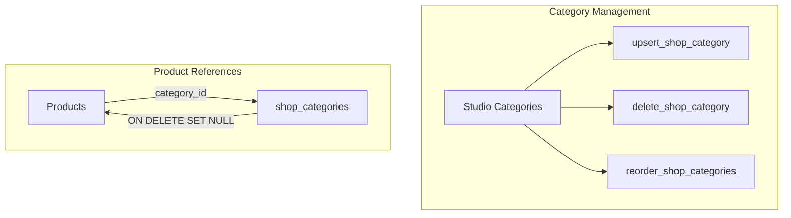

# Categories RPCs



Covers all RPCs for managing shop categories. Categories organize products and support drag-and-drop reordering in Studio.

---

## `upsert_shop_category`

```sql
public.upsert_shop_category(
  p_category_id uuid    default null,
  p_name        varchar default null,
  p_slug        varchar default null,   -- auto-generated from name if omitted
  p_sort_order  integer default null,
  p_is_visible  boolean default null
) → jsonb
```

### Parameters

| Parameter | Type | Description |
|-----------|------|-------------|
| `p_category_id` | uuid | `null` = create, uuid = edit |
| `p_name` | varchar | Required on create |
| `p_slug` | varchar | Auto-generated from name if omitted |
| `p_sort_order` | integer | Optional position |
| `p_is_visible` | boolean | Visibility toggle |

### Slug auto-generation

Slug is generated via:
```sql
lower(regexp_replace(name, '[^a-zA-Z0-9]+', '-', 'g'))
```

Unique per `(profile_id, slug)`.

### Response

```json
{ "success": true, "category_id": "uuid" }
```

### Errors

`UNAUTHENTICATED`, `MISSING_NAME`, `NOT_FOUND`, `SLUG_CONFLICT`

---

## `delete_shop_category`

```sql
public.delete_shop_category(p_category_id uuid) → jsonb
```

Hard-deletes the category. Products in the category have their `category_id` set to `NULL` automatically via `ON DELETE SET NULL`.

```json
{ "success": true }
```

---

## `reorder_shop_categories`

```sql
public.reorder_shop_categories(p_category_ids uuid[]) → jsonb
```

Reorders categories by passing IDs in the desired order. Sets `sort_order` to `index − 1` for each. Used by the drag-and-drop category list in Studio.

```json
{ "success": true }
```