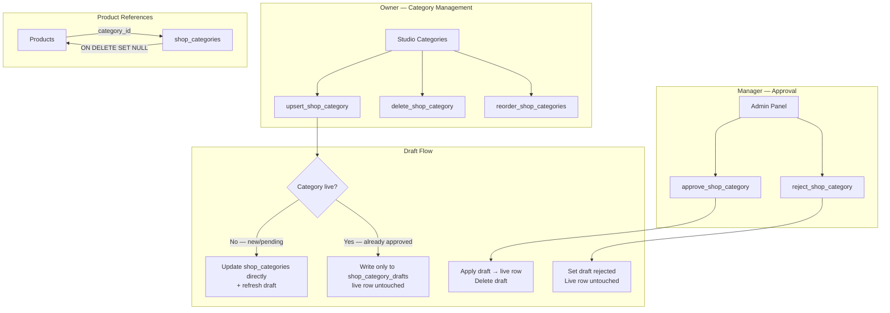

# Categories RPCs



Covers all RPCs for managing shop categories. Categories organize products and support drag-and-drop reordering in Studio.

---

## Approval workflow overview

All categories go through a manager review before (or after editing) they become publicly visible. The state lives in `shop_category_drafts`, not on the live `shop_categories` row.

| Situation | What `upsert_shop_category` does | Live category |
|---|---|---|
| Brand-new category | Writes `shop_categories` (`is_visible=false`) + inserts pending draft | Invisible until approved |
| Edit of a **live** category | Writes only to `shop_category_drafts` (ON CONFLICT overwrites) | Stays online untouched |
| Edit of a **pending/rejected** category | Updates `shop_categories` directly + refreshes draft | Still invisible |

Manager calls `approve_shop_category` → draft applied to live row, `is_visible=true`, draft deleted.
Manager calls `reject_shop_category` → draft `approval_status='rejected'` + `rejection_reason` set, live row untouched.
Owner re-edits after rejection → draft overwritten, `approval_status` reset to `'pending'`.

---

## `upsert_shop_category`

```sql
public.upsert_shop_category(
  p_category_id uuid    default null,
  p_name        varchar default null,
  p_slug        varchar default null,   -- auto-generated from name if omitted
  p_description text    default null,
  p_sort_order  integer default null
  -- p_is_visible intentionally absent — visibility is manager-controlled only
) → jsonb
```

### Parameters

| Parameter | Type | Description |
|-----------|------|-------------|
| `p_category_id` | uuid | `null` = create, uuid = edit |
| `p_name` | varchar | Required on create |
| `p_slug` | varchar | Auto-generated from name if omitted |
| `p_description` | text | Optional description |
| `p_sort_order` | integer | Optional position |

> `p_is_visible` has been **removed**. Visibility is exclusively controlled by `approve_shop_category`. Passing it will cause an error.

### Slug auto-generation

```sql
lower(regexp_replace(name, '[^a-zA-Z0-9]+', '-', 'g'))
```

Unique per `(profile_id, slug)`.

### Response

```json
{ "success": true, "category_id": "uuid" }
```

### Errors

`UNAUTHENTICATED`, `MISSING_NAME`, `NOT_FOUND`, `SLUG_CONFLICT`

---

## `delete_shop_category`

```sql
public.delete_shop_category(p_category_id uuid) → jsonb
```

Hard-deletes the category. Products in the category have their `category_id` set to `NULL` automatically via `ON DELETE SET NULL`. The corresponding `shop_category_drafts` row (if any) is also cascade-deleted.

```json
{ "success": true }
```

---

## `reorder_shop_categories`

```sql
public.reorder_shop_categories(p_category_ids uuid[]) → jsonb
```

Reorders categories by passing IDs in the desired order. Sets `sort_order` to `index − 1` for each. Used by the drag-and-drop category list in Studio. Operates on live `shop_categories` rows regardless of draft state.

```json
{ "success": true }
```

---

## `approve_shop_category` *(manager only)*

```sql
public.approve_shop_category(p_category_id uuid) → jsonb
```

Requires `content.approve` manager permission.

Loads the pending draft from `shop_category_drafts`, applies its columns to the live `shop_categories` row, sets `is_visible = true`, then deletes the draft.

**Idempotent edge case:** if no draft exists but the category does, it simply sets `is_visible = true` (handles double-approval gracefully).

### Response

```json
{ "success": true }
```

### Errors

`UNAUTHORIZED`, `NOT_FOUND`

---

## `reject_shop_category` *(manager only)*

```sql
public.reject_shop_category(
  p_category_id      uuid,
  p_rejection_reason text
) → jsonb
```

Requires `content.approve` manager permission.

Sets `approval_status = 'rejected'` and `rejection_reason` on the draft row. **The live `shop_categories` row is never touched** — if the category was already live, it stays online. The owner sees the rejection reason in Studio and can revise and resubmit.

Rejection reason is **required** and must be non-empty.

### Response

```json
{ "success": true }
```

### Errors

`UNAUTHORIZED`, `REJECTION_REASON_REQUIRED`, `DRAFT_NOT_FOUND`
