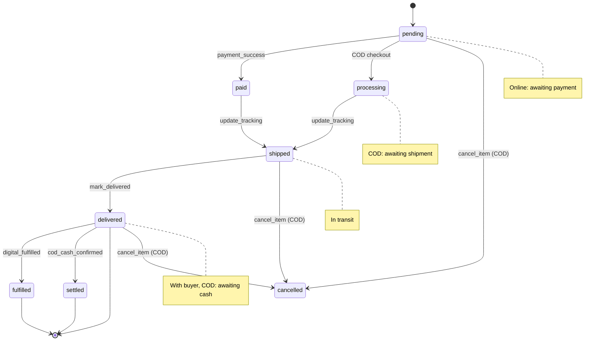

# Orders & Fulfillment RPCs



These RPCs cover reading orders (buyer and seller views) and the physical fulfillment flow (tracking, mark delivered). COD-specific RPCs (cash confirmation, cancellation) are on the [next page](./rpc-cod).

## `get_order_by_number`

```sql
public.get_order_by_number(p_order_number varchar) → jsonb
```

Returns full order detail for either the buyer or the seller. Accessible to both parties via the `(buyer_profile_id = auth.uid() OR seller_profile_id = auth.uid())` check. **Account orders only** — a guest order has no `buyer_profile_id` to match, so guests use [`get_guest_order`](#get_guest_order) below.

Both RPCs build their payload from the same internal `shop_order_detail` helper, so the two views cannot drift apart in what they return. That helper performs **no authorization of its own** — each caller must establish that the viewer may see the order before calling it, which is why it is granted to no client role.

### Key fields

- **`payment_method`** — `online` or `cod`
- **`payment_status_label`** — display string for the confirmation page: `"Online Payment · Successful via SSLCommerz"`, `"Online Payment · Pending"`, `"Online Payment · Failed"`, `"Cash on Delivery · Paid"`, `"Cash on Delivery · Pay when it arrives"`. Online orders derive it from the joined `transactions` row; COD orders have no transaction until cash is confirmed, so theirs comes from `cod_settled_at`.
- **`payment_status`** — the raw `transactions.status`, `null` for COD
- **`status`** — computed at query time from item statuses (not stored)
- **`confirmed_at`** — the "Confirmed" timeline stage. Order creation *is* confirmation in this model, so this mirrors `created_at`; there is no separate column.
- **`area_type`** — `inside_dhaka` | `outside_dhaka`, mirrored from the `shipping_address` snapshot so the timeline never re-derives the shipping band by string-matching the district
- **`items[].processing_min_days` / `processing_max_days`** — the seller's processing window snapshotted at checkout. Combined with `confirmed_at` these give the "Processing" stage its ETA; `shipped_at`/`delivered_at` give the "Delivery" stage. The whole timeline renders from one response, no extra round-trips.
- **`is_guest_order` / `guest_name` / `guest_email`** — guest checkout state
- **`download_tokens`** — only populated for the buyer, only non-expired tokens with downloads remaining. Always empty for guests, who cannot buy digital goods.
- **`items[].cancellation_reason`** — visible to both parties when status is `cancelled`
- **`items[].variant_options`** — the JSONB snapshot of `{axis: value}` at purchase time (immutable)
- **`is_gift`/`gift_recipient_name`/`gift_recipient_email`/`gift_message`/`gift_wrap_fee`** — checkout-time gift state (see [`initiate_shop_checkout`](./rpc-checkout)); all null/zero when `is_gift = false`
- **`bundle_discount`** — total extra amount saved by the bundle offer, already netted into `subtotal` (informational)

---

## `get_guest_order`

```sql
public.get_guest_order(p_order_number varchar, p_phone varchar) → jsonb
```

Granted to `anon, authenticated`. The confirmation and tracking page for a buyer with no account. Returns the same shape as `get_order_by_number`.

The phone entered at checkout is the credential. Both sides are compared through `public.normalize_bd_phone`, which strips non-digits then the optional `88` country code and leading `0` — so `01712345678`, `+8801712345678`, `8801712345678` and `017 1234 5678` all match. Without that normalisation guests get spurious `NOT_FOUND` on their own orders.

::: warning Scoped to `buyer_profile_id IS NULL`
The lookup only matches guest orders. An authenticated buyer's order is never reachable by phone alone — only through `get_order_by_number` under a JWT. A wrong phone and an unknown order number both return the same generic `NOT_FOUND`, so the RPC cannot be used to probe for valid order numbers.
:::

::: danger Not covered by Upstash rate limiting
This is reached directly over PostgREST, not through an Edge Function, so the Upstash rate limiting that fronts the edge layer does **not** apply. Order numbers are sequential (`HNC-XXXX`), which narrows the guessing space considerably. If abuse becomes a concern, the mitigation belongs here or at the gateway — adding it to the edge layer would do nothing.
:::

### Computed status logic

```sql
case
  when bool_or(status = 'cancelled')                  then 'cancelled'
  when bool_or(status = 'refunded')                   then 'refunded'
  when bool_or(status in ('pending', 'paid'))         then 'processing'
  when bool_and(status in ('fulfilled','delivered'))  then 'complete'
  when bool_or(status = 'shipped')                    then 'partially_shipped'
  else                                                     'processing'
end
```

### Response (abbreviated)

```json
{
  "success": true,
  "order": {
    "id": "...",
    "order_number": "SHOP-20240115-A3F2",
    "payment_method": "cod",
    "status": "processing",
    "subtotal": 1700.00,
    "shipping_total": 120.00,
    "platform_fee": 182.00,
    "seller_net": 1638.00,
    "is_gift": false,
    "gift_recipient_name": null,
    "gift_recipient_email": null,
    "gift_message": null,
    "gift_wrap_fee": 0,
    "bundle_discount": 0,
    "shipping_address": {
      "recipient_name": "Rafiq Ahmed",
      "phone": "01700000000",
      "address_line1": "42 Dhanmondi Road 8",
      "city": "Dhaka",
      "district": "Dhaka"
    },
    "buyer_notes": "Please double-bag the coffee.",
    "cod_settled_at": null,
    "items": [
      {
        "id": "...",
        "product_title": "Ethiopia Yirgacheffe",
        "variant_label": "Grind: Whole Bean / Weight: 250g",
        "variant_options": { "Grind": "Whole Bean", "Weight": "250g" },
        "unit_price": 850.00,
        "shipping_cost": 60.00,
        "quantity": 2,
        "status": "processing",
        "carrier": null,
        "tracking_number": null,
        "cod_settled_at": null,
        "cancellation_reason": null
      }
    ],
    "download_tokens": []
  }
}
```

**Errors:** `NOT_FOUND`

---

## `get_buyer_orders`

```sql
public.get_buyer_orders(
  p_limit  integer     default 20,
  p_cursor timestamptz default null
) → jsonb
```

Paginated order history for the authenticated buyer. Uses `created_at` as the cursor — pass the `created_at` of the last item in the previous page.

Returns lightweight order cards (not full detail). Includes a computed `status` field using the same logic as `get_order_by_number` (see [computed status logic](#computed-status-logic)):

```json
{
  "success": true,
  "orders": [
    {
      "order_number": "SHOP-20240115-A3F2",
      "payment_method": "cod",
      "status": "processing",
      "has_digital": false,
      "has_physical": true,
      "subtotal": 1700.00,
      "shipping_total": 120.00,
      "created_at": "2024-01-15T10:00:00Z",
      "item_count": 2,
      "cover_images": ["url1", "url2", "url3"],
      "seller_username": "brewco",
      "is_gift": false,
      "gift_wrap_fee": 0,
      "bundle_discount": 0
    }
  ],
  "has_more": true
}
```

**Errors:** `UNAUTHENTICATED`

---

## `get_seller_orders`

```sql
public.get_seller_orders(
  p_item_status text        default null,
  p_limit       integer     default 20,
  p_cursor      timestamptz default null
) → jsonb
```

The Studio order list. Returns seller order cards with buyer name and avatar joined in.

Guest orders appear here alongside account orders, with `is_guest_order: true`, `buyer.display_name` falling back to the checkout-time `guest_name`, and top-level `guest_phone` / `guest_email` — the seller has no account page to fall back to for contacting them.

::: danger Two NULL traps this function has already hit
**The join to `profiles` must be a LEFT join.** `buyer_profile_id` is `NULL` on guest orders, so an inner join silently drops them from the seller's list entirely — the seller would never see, let alone fulfil, an order they had been paid for.

**`v_is_cash_pending` must be `coalesce(p_item_status = 'cash_pending', false)`.** With the default `p_item_status = NULL`, the bare comparison yields `NULL`, not `false`, and that `NULL` propagates through `not v_is_cash_pending` into the three-way `OR` in the `WHERE` clause — making the whole predicate `NULL` and returning **an empty order list for every seller**. This was a live bug: the unfiltered Studio order list returned nothing, and the function had no test coverage to catch it.
:::

### Status filter

`p_item_status` accepts any `shop_order_item_status_enum` value as a string, **or** the special value `"cash_pending"`:

| Filter value | Returns |
|---|---|
| `null` (omitted) | All orders |
| `"processing"` | Orders with at least one item in `processing` |
| `"shipped"` | Orders with at least one item in `shipped` |
| `"delivered"` | Orders with at least one item in `delivered` |
| `"cash_pending"` | COD orders with a `delivered` item where `cod_settled_at IS NULL` |
| `"cancelled"` | Orders with at least one cancelled item |

::: warning Invalid filter
Passing an unrecognised string returns `INVALID_STATUS_FILTER`.
:::

### Response (abbreviated)

```json
{
  "success": true,
  "orders": [
    {
      "order_number": "SHOP-20240115-A3F2",
      "payment_method": "cod",
      "seller_net": 1638.00,
      "is_gift": false,
      "gift_recipient_name": null,
      "gift_recipient_email": null,
      "gift_message": null,
      "gift_wrap_fee": 0,
      "bundle_discount": 0,
      "buyer": {
        "username": "rafiq",
        "display_name": "Rafiq Ahmed",
        "avatar_url": "..."
      },
      "shipping_address": { ... },
      "buyer_notes": "Please double-bag.",
      "items": [
        {
          "id": "...",
          "product_title": "Ethiopia Yirgacheffe",
          "variant_label": "Grind: Whole Bean / Weight: 250g",
          "status": "processing",
          "cover_image_url": "...",
          "cod_settled_at": null
        }
      ]
    }
  ],
  "has_more": false
}
```

**Errors:** `UNAUTHENTICATED`, `INVALID_STATUS_FILTER`

---

## `update_order_tracking`

```sql
public.update_order_tracking(
  p_order_item_id   uuid,
  p_tracking_number varchar,
  p_carrier         varchar default null,
  p_tracking_url    text    default null
) → jsonb
```

Seller marks a physical item as `shipped`. Sets `status → 'shipped'`, `shipped_at = now()`, and stores the carrier + tracking info.

::: danger Every buyer-facing `activities` insert must be NULL-guarded
`activities.user_profile_id` is `NOT NULL`. `update_order_tracking`,
`mark_order_item_delivered` and `cancel_cod_order_item` all insert
`buyer_profile_id` there, so on a guest order each one raises a not-null violation
— meaning **the seller cannot ship, deliver, or cancel a guest order at all**,
which would break the entire COD guest flow.

All three delegate to a shared internal helper, `notify_shop_order_item_status()`,
which wraps the insert in `if p_buyer_profile_id is not null`. In the `else`
branch, when the order carries a `guest_email`, it queues a direct-enqueue
`public.email_notification_queue` row instead (`shop.order_shipped` /
`shop.order_delivered` / `shop.order_cancelled`), mirroring the gift-email pattern
in `handle_shop_payment_success`. A guest who gave no email has the
[`get_guest_order`](#get_guest_order) tracking page as their only channel — which
is why the confirmation page must show the order number and phone prominently.
:::

### Allowed from statuses

`processing` or `paid`. Returns `INVALID_STATUS_TRANSITION` otherwise.

### Response

```json
{
  "success": true,
  "order_number": "SHOP-20240115-A3F2",
  "buyer_profile_id": "uuid",
  "product_title": "Ethiopia Yirgacheffe",
  "carrier": "Pathao",
  "tracking_number": "PTC-20240115-001",
  "tracking_url": "https://track.pathao.com/PTC-20240115-001"
}
```

The `buyer_profile_id` and `product_title` are returned so the notification Edge Function can dispatch a "Your order has shipped" message without an extra query.

Also writes a private `order_item_shipped` activity to the buyer's feed (see [activities](../../payments-and-memberships/backend/activities.md)).

**Errors:** `NOT_FOUND`, `NOT_PHYSICAL_ITEM`, `INVALID_STATUS_TRANSITION`

---

## `mark_order_item_delivered`

```sql
public.mark_order_item_delivered(p_order_item_id uuid) → jsonb
```

Seller marks a physical item as delivered. Works for **both** online and COD orders.

What it does:
1. Validates status is `shipped`
2. Sets `status = 'delivered'`, `delivered_at = now()`
3. Increments `shop_products.sales_count += item.quantity`

::: info COD is not settled here
For COD items, marking delivered does **not** confirm cash or create a transaction. The seller must separately call `confirm_cod_cash_received`. The response includes `requires_cash_confirmation: true` as a hint.
:::

### Response

```json
{
  "success": true,
  "order_number": "SHOP-20240115-A3F2",
  "buyer_profile_id": "uuid",
  "product_title": "Ethiopia Yirgacheffe",
  "payment_method": "cod",
  "requires_cash_confirmation": true
}
```

Also writes a private `order_item_delivered` activity to the buyer's feed (see [activities](../../payments-and-memberships/backend/activities.md)).

**Errors:** `NOT_FOUND`, `NOT_PHYSICAL_ITEM`, `INVALID_STATUS_TRANSITION`

---

## `upsert_shop_settings`

See [Shop Settings - RPCs](./shop-settings#rpcs) for the full documentation including reactivation gate behavior.

::: tip Related
- [Eligibility system](./shop-settings#eligibility-system)
- [Studio settings panels](./shop-settings#studio-settings-panels)
:::
