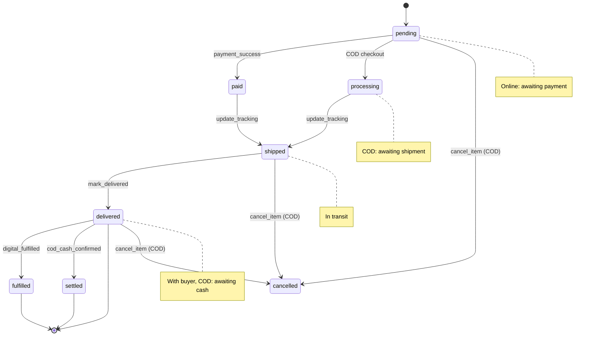

# Orders & Fulfillment RPCs



These RPCs cover reading orders (buyer and seller views) and the physical fulfillment flow (tracking, mark delivered). COD-specific RPCs (cash confirmation, cancellation) are on the [next page](./rpc-cod).

## `get_order_by_number`

```sql
public.get_order_by_number(p_order_number varchar) → jsonb
```

Returns full order detail for either the buyer or the seller. Accessible to both parties via the `(buyer_profile_id = auth.uid() OR seller_profile_id = auth.uid())` check.

### Key fields

- **`payment_method`** — `online` or `cod`
- **`status`** — computed at query time from item statuses (not stored)
- **`download_tokens`** — only populated for the buyer, only non-expired tokens with downloads remaining
- **`items[].cancellation_reason`** — visible to both parties when status is `cancelled`
- **`items[].variant_options`** — the JSONB snapshot of `{axis: value}` at purchase time (immutable)

### Computed status logic

```sql
case
  when bool_or(status = 'cancelled')                  then 'cancelled'
  when bool_or(status = 'refunded')                   then 'refunded'
  when bool_or(status in ('pending', 'paid'))         then 'processing'
  when bool_and(status in ('fulfilled','delivered'))  then 'complete'
  when bool_or(status = 'shipped')                    then 'partially_shipped'
  else                                                     'processing'
end
```

### Response (abbreviated)

```json
{
  "success": true,
  "order": {
    "id": "...",
    "order_number": "SHOP-20240115-A3F2",
    "payment_method": "cod",
    "status": "processing",
    "subtotal": 1700.00,
    "shipping_total": 120.00,
    "platform_fee": 182.00,
    "seller_net": 1638.00,
    "shipping_address": {
      "recipient_name": "Rafiq Ahmed",
      "phone": "01700000000",
      "address_line1": "42 Dhanmondi Road 8",
      "city": "Dhaka",
      "district": "Dhaka"
    },
    "buyer_notes": "Please double-bag the coffee.",
    "cod_settled_at": null,
    "items": [
      {
        "id": "...",
        "product_title": "Ethiopia Yirgacheffe",
        "variant_label": "Grind: Whole Bean / Weight: 250g",
        "variant_options": { "Grind": "Whole Bean", "Weight": "250g" },
        "unit_price": 850.00,
        "shipping_cost": 60.00,
        "quantity": 2,
        "status": "processing",
        "carrier": null,
        "tracking_number": null,
        "cod_settled_at": null,
        "cancellation_reason": null
      }
    ],
    "download_tokens": []
  }
}
```

**Errors:** `NOT_FOUND`

---

## `get_buyer_orders`

```sql
public.get_buyer_orders(
  p_limit  integer     default 20,
  p_cursor timestamptz default null
) → jsonb
```

Paginated order history for the authenticated buyer. Uses `created_at` as the cursor — pass the `created_at` of the last item in the previous page.

Returns lightweight order cards (not full detail). Includes a computed `status` field using the same logic as `get_order_by_number` (see [computed status logic](#computed-status-logic)):

```json
{
  "success": true,
  "orders": [
    {
      "order_number": "SHOP-20240115-A3F2",
      "payment_method": "cod",
      "status": "processing",
      "has_digital": false,
      "has_physical": true,
      "subtotal": 1700.00,
      "shipping_total": 120.00,
      "created_at": "2024-01-15T10:00:00Z",
      "item_count": 2,
      "cover_images": ["url1", "url2", "url3"],
      "seller_username": "brewco"
    }
  ],
  "has_more": true
}
```

**Errors:** `UNAUTHENTICATED`

---

## `get_seller_orders`

```sql
public.get_seller_orders(
  p_item_status text        default null,
  p_limit       integer     default 20,
  p_cursor      timestamptz default null
) → jsonb
```

The Studio order list. Returns seller order cards with buyer name and avatar joined in.

### Status filter

`p_item_status` accepts any `shop_order_item_status_enum` value as a string, **or** the special value `"cash_pending"`:

| Filter value | Returns |
|---|---|
| `null` (omitted) | All orders |
| `"processing"` | Orders with at least one item in `processing` |
| `"shipped"` | Orders with at least one item in `shipped` |
| `"delivered"` | Orders with at least one item in `delivered` |
| `"cash_pending"` | COD orders with a `delivered` item where `cod_settled_at IS NULL` |
| `"cancelled"` | Orders with at least one cancelled item |

::: warning Invalid filter
Passing an unrecognised string returns `INVALID_STATUS_FILTER`.
:::

### Response (abbreviated)

```json
{
  "success": true,
  "orders": [
    {
      "order_number": "SHOP-20240115-A3F2",
      "payment_method": "cod",
      "seller_net": 1638.00,
      "buyer": {
        "username": "rafiq",
        "display_name": "Rafiq Ahmed",
        "avatar_url": "..."
      },
      "shipping_address": { ... },
      "buyer_notes": "Please double-bag.",
      "items": [
        {
          "id": "...",
          "product_title": "Ethiopia Yirgacheffe",
          "variant_label": "Grind: Whole Bean / Weight: 250g",
          "status": "processing",
          "cover_image_url": "...",
          "cod_settled_at": null
        }
      ]
    }
  ],
  "has_more": false
}
```

**Errors:** `UNAUTHENTICATED`, `INVALID_STATUS_FILTER`

---

## `update_order_tracking`

```sql
public.update_order_tracking(
  p_order_item_id   uuid,
  p_tracking_number varchar,
  p_carrier         varchar default null,
  p_tracking_url    text    default null
) → jsonb
```

Seller marks a physical item as `shipped`. Sets `status → 'shipped'`, `shipped_at = now()`, and stores the carrier + tracking info.

### Allowed from statuses

`processing` or `paid`. Returns `INVALID_STATUS_TRANSITION` otherwise.

### Response

```json
{
  "success": true,
  "order_number": "SHOP-20240115-A3F2",
  "buyer_profile_id": "uuid",
  "product_title": "Ethiopia Yirgacheffe",
  "carrier": "Pathao",
  "tracking_number": "PTC-20240115-001",
  "tracking_url": "https://track.pathao.com/PTC-20240115-001"
}
```

The `buyer_profile_id` and `product_title` are returned so the notification Edge Function can dispatch a "Your order has shipped" message without an extra query.

Also writes a private `order_item_shipped` activity to the buyer's feed (see [activities](../../payments-and-memberships/backend/activities.md)).

**Errors:** `NOT_FOUND`, `NOT_PHYSICAL_ITEM`, `INVALID_STATUS_TRANSITION`

---

## `mark_order_item_delivered`

```sql
public.mark_order_item_delivered(p_order_item_id uuid) → jsonb
```

Seller marks a physical item as delivered. Works for **both** online and COD orders.

What it does:
1. Validates status is `shipped`
2. Sets `status = 'delivered'`, `delivered_at = now()`
3. Increments `shop_products.sales_count += item.quantity`

::: info COD is not settled here
For COD items, marking delivered does **not** confirm cash or create a transaction. The seller must separately call `confirm_cod_cash_received`. The response includes `requires_cash_confirmation: true` as a hint.
:::

### Response

```json
{
  "success": true,
  "order_number": "SHOP-20240115-A3F2",
  "buyer_profile_id": "uuid",
  "product_title": "Ethiopia Yirgacheffe",
  "payment_method": "cod",
  "requires_cash_confirmation": true
}
```

Also writes a private `order_item_delivered` activity to the buyer's feed (see [activities](../../payments-and-memberships/backend/activities.md)).

**Errors:** `NOT_FOUND`, `NOT_PHYSICAL_ITEM`, `INVALID_STATUS_TRANSITION`

---

## `upsert_shop_settings`

See [Shop Settings - RPCs](./shop-settings#rpcs) for the full documentation including reactivation gate behavior.

::: tip Related
- [Eligibility system](./shop-settings#eligibility-system)
- [Studio settings panels](./shop-settings#studio-settings-panels)
:::
