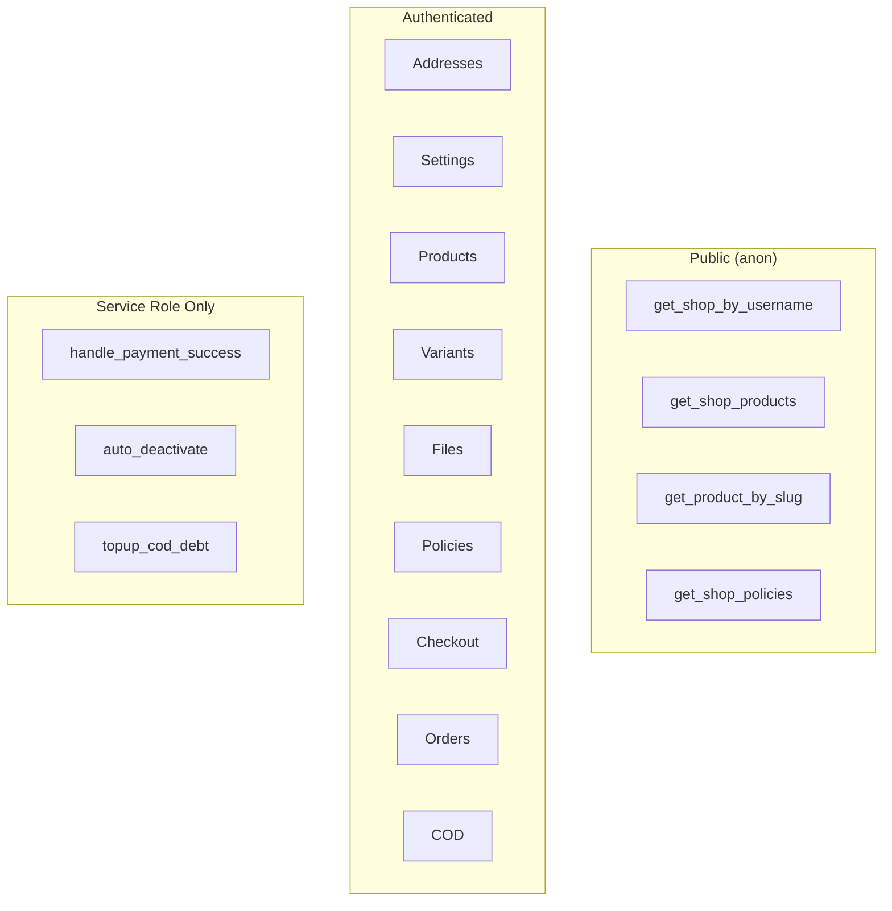

# All RPCs — Quick Reference



37 RPCs total. All are `SECURITY DEFINER` with `SET search_path = ''`. All return `jsonb` (except `get_platform_setting` which returns `numeric`, `get_user_addresses` which returns a table, and `record_shop_view` which returns `void`).

## Convention

Every write RPC returns `{ "success": true, ... }` on success or `{ "success": false, "error": "CODE" }` on failure. See the [Error Codes](#error-codes) section at the bottom.

---

## Helpers

| RPC | Auth | Returns | Detail |
|---|---|---|---|
| `get_platform_setting(p_key)` | any | `numeric` | Internal — reads `platform_settings` |
| `check_shop_active_eligibility(p_profile_id)` | any | `jsonb` | Wallet + aging eligibility check |

---

## Addresses

| RPC | Auth | Returns |
|---|---|---|
| `get_user_addresses()` | authenticated | `table` — all addresses, default first |
| `upsert_user_address(...)` | authenticated | `{ success, address_id }` |
| `delete_user_address(p_address_id)` | authenticated | `{ success }` |

---

## Shop settings

| RPC | Auth | Returns |
|---|---|---|
| [`upsert_shop_settings(...)`](./shop-settings#upsert_shop_settings) | authenticated | `{ success, shop_id }` |
| [`set_shop_active_by_manager(p_profile_id, p_is_active)`](./shop-settings#set_shop_active_by_manager) | authenticated (manager) | `{ success }` |

---

## Categories

| RPC | Auth | Returns |
|---|---|---|
| `upsert_shop_category(...)` | authenticated | `{ success, category_id }` |
| `delete_shop_category(p_category_id)` | authenticated | `{ success }` |
| `reorder_shop_categories(p_category_ids[])` | authenticated | `{ success }` |

---

## Products

| RPC | Auth | Returns |
|---|---|---|
| `upsert_shop_product(...)` | authenticated | `{ success, product_id }` |
| `delete_shop_product(p_product_id)` | authenticated | `{ success, deleted: 'soft'\|'hard' }` |
| `reorder_shop_products(p_product_ids[])` | authenticated | `{ success }` |

---

## Variants

| RPC | Auth | Returns |
|---|---|---|
| `upsert_shop_product_variant(...)` | authenticated | `{ success, variant_id }` |
| `delete_shop_product_variant(p_variant_id)` | authenticated | `{ success }` |

---

## Files

| RPC | Auth | Returns |
|---|---|---|
| `add_shop_product_file(...)` | authenticated | `{ success, file_id }` |
| `delete_shop_product_file(p_file_id)` | authenticated | `{ success }` |

---

## Policies

| RPC | Auth | Returns |
|---|---|---|
| `upsert_shop_policy(p_policy_type, p_content?, p_is_enabled?)` | authenticated | `{ success, policy_id }` |
| `delete_shop_policy(p_policy_type)` | authenticated | `{ success }` |
| `get_shop_policies(p_username)` | anon | `{ success, policies[] }` |

---

## Public reads

| RPC | Auth | Returns |
|---|---|---|
| `get_shop_by_username(p_username, p_featured_limit?)` | anon | `{ success, shop, profile, featured_products }` |
| `get_shop_products(p_username, p_category_id?, p_limit?, p_cursor_sort?, p_cursor_id?)` | anon | `{ success, products, has_more }` |
| `get_product_by_slug(p_username, p_product_slug)` | anon | `{ success, product }` |

---

## Checkout

| RPC | Auth | Returns |
|---|---|---|
| `initiate_shop_checkout(p_items, p_address_id?, p_buyer_notes?, p_payment_method?)` | authenticated | `{ success, order_id, order_number, totals... }` |
| `handle_shop_payment_success(p_order_id, p_transaction_reference_id)` | service role | `{ success, download_tokens, notification fields... }` |

---

## Orders & fulfillment

| RPC | Auth | Returns |
|---|---|---|
| `get_order_by_number(p_order_number)` | authenticated | `{ success, order }` |
| `get_buyer_orders(p_limit?, p_cursor?)` | authenticated | `{ success, orders, has_more }` |
| `get_seller_orders(p_item_status?, p_limit?, p_cursor?)` | authenticated | `{ success, orders, has_more }` |
| `update_order_tracking(p_order_item_id, p_tracking_number, p_carrier?, p_tracking_url?)` | authenticated | `{ success, notification fields... }` |
| `mark_order_item_delivered(p_order_item_id)` | authenticated | `{ success, requires_cash_confirmation }` |

---

## COD-specific

| RPC | Auth | Returns |
|---|---|---|
| `confirm_cod_cash_received(p_order_item_id)` | authenticated | `{ success, fee_amount, balance_debit, cod_debt_added, order_settled }` |
| `cancel_cod_order_item(p_order_item_id, p_reason)` | authenticated | `{ success }` |
| `topup_seller_cod_debt(p_profile_id, p_amount)` | service role | `{ success, debt_paid, remaining }` |

---

## Stats

| RPC | Auth | Returns |
|---|---|---|
| `get_shop_stats()` | authenticated | `{ success, total_views, total_sales, total_earnings, total_products }` |
| `record_shop_view(p_username)` | anon | `void` |

## Dashboard & cron

| RPC | Auth | Returns |
|---|---|---|
| `get_shop_overview()` | authenticated | `ShopOverviewData` |
| `auto_deactivate_ineligible_shops()` | service role | `{ success, shops_deactivated, ran_at }` |

---

## Edge Functions

These Deno-based Supabase Edge Functions handle operations that require service-role storage access and cannot run in a plain RPC.

| Function | Method | Auth | Purpose |
|---|---|---|---|
| `download-shop-file` | `GET ?token=<token>` | none (token = credential) | Validate download token → 302 redirect to signed Storage URL |

### `download-shop-file`

```
GET /functions/v1/download-shop-file?token=<64-char-token>
```

No `Authorization` header required. Validates the token from `shop_download_tokens`, atomically increments `download_count`, and redirects the client to a 60-second signed URL in the private `shop-product-files` bucket.

**Responses:**

| Status | Condition |
|---|---|
| `302` | Success — `Location` header is the signed download URL |
| `400` | `token` query param missing |
| `403` | `download_count >= max_downloads` |
| `404` | Token not found |
| `410` | `expires_at` has passed |
| `500` | Storage or DB error |

---

## Error Codes

All errors returned as `{ "success": false, "error": "CODE", ...optional details }`.

### Auth
| Code | Meaning |
|---|---|
| `UNAUTHENTICATED` | No `auth.uid()` found |

### Input validation
| Code | Meaning |
|---|---|
| `MISSING_REQUIRED_FIELDS` | Required parameter omitted on create |
| `MISSING_NAME` | Category name omitted |
| `MISSING_CONTENT` | Policy content omitted on first write |
| `INVALID_QUANTITY` | Cart item quantity ≤ 0 |
| `INVALID_AMOUNT` | `topup_seller_cod_debt` called with `p_amount ≤ 0` |
| `INVALID_STATUS_FILTER` | `get_seller_orders` given unrecognised status string |

### Not found
| Code | Meaning |
|---|---|
| `NOT_FOUND` | Resource doesn't exist or belongs to another user |
| `PRODUCT_NOT_FOUND` | Cart item references inactive/deleted product |
| `VARIANT_NOT_FOUND` | Cart item references unknown variant |
| `ADDRESS_NOT_FOUND` | Checkout address not found for this buyer |
| `PROFILE_NOT_FOUND` | `get_shop_policies` / `get_shop_by_username` username not found |
| `ORDER_NOT_FOUND` | `handle_shop_payment_success` order not found |

### Conflicts
| Code | Meaning |
|---|---|
| `SLUG_CONFLICT` | Product or category slug collides with existing row |
| `VARIANT_COMBINATION_CONFLICT` | Duplicate `(product_id, options)` combination |

### Product/variant rules
| Code | Meaning |
|---|---|
| `INVALID_OPTION_DEFINITIONS` | Bad shape in `option_definitions` JSON |
| `TOO_MANY_OPTION_AXES` | More than 3 axes defined |
| `UNKNOWN_OPTION_AXIS` + `axis` | Variant references axis not in `option_definitions` |
| `INVALID_OPTION_VALUE` + `axis, value` | Value not in the axis's allowed list |
| `OPTIONS_DO_NOT_COVER_ALL_AXES` + `required, provided` | Variant is missing some axes |
| `OPTIONS_IMMUTABLE` | Tried to change `options` on an existing variant |
| `VARIANT_HAS_ORDERS` | Variant can't be deleted — deactivate instead |
| `PRODUCT_HAS_NO_OPTION_AXES` | Creating variant on product with empty `option_definitions` |
| `NOT_FOUND_OR_NOT_DIGITAL` | Adding file to a physical product |
| `COD_ONLY_FOR_PHYSICAL` | `cod_enabled = true` on a digital product |

### Cart & checkout
| Code | Meaning |
|---|---|
| `EMPTY_CART` | `p_items` array is empty |
| `MIXED_SELLERS` | Cart spans multiple creators |
| `CANNOT_BUY_OWN_PRODUCT` | Buyer and seller are the same profile |
| `INSUFFICIENT_STOCK` + `product_id, available` | Requested quantity exceeds stock |
| `SHIPPING_ADDRESS_REQUIRED` | Physical items in cart but no `p_address_id` |

### COD rules
| Code | Meaning |
|---|---|
| `COD_NOT_ALLOWED_FOR_DIGITAL` + `product_id` | Digital item in a COD cart |
| `MIXED_COD_AND_NON_COD` + `product_id` | Item with `cod_enabled = false` in a COD cart |
| `SELLER_COD_BLOCKED` + `eligibility` | Seller fails eligibility check at checkout |
| `NOT_COD_ORDER` | COD RPC called on an online order |
| `COD_ORDER_INVALID_PATH` | `handle_shop_payment_success` called on a COD order |
| `CANCELLATION_REASON_REQUIRED` | `cancel_cod_order_item` called without a reason |
| `ALREADY_SETTLED` | Item already has `cod_settled_at` set |

### Fulfillment
| Code | Meaning |
|---|---|
| `NOT_PHYSICAL_ITEM` | Tracking / mark-delivered called on a digital item |
| `INVALID_STATUS_TRANSITION` + `current` | Status doesn't allow the requested action |

### Eligibility
| Code | Meaning |
|---|---|
| `SHOP_INELIGIBLE` + `eligibility` | Reactivation blocked by wallet floor or COD aging |
| `INVALID_PROCESSING_WINDOW` | `processing_min_days > processing_max_days` in `upsert_shop_settings` |

### Manager
| Code | Meaning |
|---|---|
| `UNAUTHORIZED` | Manager RPC called without required permission |
