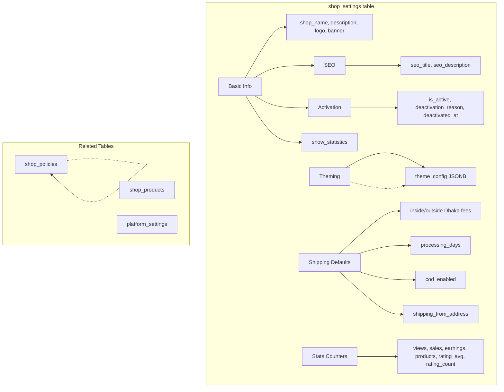

# Shop Settings



The `shop_settings` table is the central configuration hub for each seller's shop. It controls visibility, appearance, shipping defaults, and carries pre-computed stats.

## Database Schema

### `shop_settings` table

One row per creator. Controls shop visibility, appearance, shipping defaults, and cached stats counters.

```sql
create table public.shop_settings (
  id                  uuid        primary key default gen_random_uuid(),
  profile_id          uuid        not null unique references public.profiles(id) on delete cascade,

  -- Basic Info
  shop_name           varchar(100) not null,
  shop_description    text,          -- footer blurb + SEO fallback
  hero_headline       varchar(120),  -- storefront hero display heading
  hero_subtitle       varchar(300),  -- storefront hero supporting paragraph
  logo_url            text,
  banner_url          text,
  is_active           boolean      not null default false,
  deactivation_reason varchar(40),  -- 'wallet_below_floor' | 'cod_aging' | 'manual' | null
  deactivated_at      timestamptz,  -- when is_active last transitioned to false; null when active

  -- Owner opt-in: whether get_shop_by_username includes the public stats block
  show_statistics     boolean      not null default false,

  -- Theming
  theme_config        jsonb        not null default '{}',
  seo_title           varchar(60),
  seo_description     varchar(160),
  seo_custom_meta_tags jsonb,   -- [{ "name": "...", "content": "..." }, ...]

  -- Shop-level shipping defaults (null = fall through to platform_settings)
  shipping_fee_inside_dhaka   numeric(10,2),   -- null → platform default 85
  shipping_fee_outside_dhaka  numeric(10,2),   -- null → platform default 170
  processing_min_days         integer,         -- null → platform default 1
  processing_max_days         integer,         -- null → platform default 15
  requires_shipping           boolean not null default false,
  cod_enabled                 boolean not null default false,
  shipping_from_address       jsonb,   -- { "division", "district", "thana", "address" }

  -- Cached stats counters
  total_views     bigint        not null default 0,
  total_sales     bigint        not null default 0,
  total_earnings  numeric(12,2) not null default 0,
  total_products  bigint        not null default 0,
  rating_avg      numeric(3,2),         -- shop-level weighted mean over shop_products
  rating_count    integer       not null default 0,

  created_at          timestamptz  not null default now(),
  updated_at          timestamptz  not null default now(),

  constraint shop_settings_processing_window_valid
    check (processing_min_days is null or processing_max_days is null
           or processing_min_days <= processing_max_days)
);
```

### Stats Counters

Pre-computed counters maintained automatically for O(1) reads:

| Counter | Who maintains it |
|---|---|
| `total_views` | `record_shop_view()` — called by Astro SSR on every shop page render |
| `total_sales` | `handle_shop_payment_success` (digital) + `mark_order_item_delivered` (physical) |
| `total_earnings` | `trg_shop_orders_stats` trigger when `transaction_reference_id` or `cod_settled_at` is first set |
| `total_products` | `approve_shop_product` (+1) + `delete_shop_product` (−1 if was active) |
| `rating_avg` / `rating_count` | `trg_reviews_shop_product_stats` (reviews.sql) — recomputed as a weighted mean over the shop's `shop_products` rows on every review create/edit/delete/hide. Read by `get_shop_by_username`'s public `stats` block only when `show_statistics = true`; never computed on that read path. |

### Auto-provision trigger

When the `'shop'` service is first enabled on `user_services`, the `on_shop_service_enabled` trigger automatically inserts a default `shop_settings` row:

```sql
-- Fires AFTER INSERT OR UPDATE OF is_enabled, service ON user_services
INSERT INTO public.shop_settings (profile_id, shop_name, is_active, theme_config)
VALUES (new.profile_id, 'My Shop', false, '{}')
ON CONFLICT (profile_id) DO NOTHING;
```

### RLS

- `SELECT` — active shops visible to all, plus owner always sees their own
- `INSERT/UPDATE` — owner only (`profile_id = auth.uid()`)
- `DELETE` — owner only

## RPCs

### `upsert_shop_settings`

```sql
public.upsert_shop_settings(
  p_shop_name               varchar default null,
  p_shop_description        text    default null,
  p_hero_headline           varchar default null,   -- storefront hero heading
  p_hero_subtitle           varchar default null,   -- storefront hero paragraph
  p_logo_url                text    default null,
  p_banner_url              text    default null,
  p_is_active               boolean default null,
  p_show_statistics         boolean default null,
  p_theme_config            jsonb   default null,
  p_seo_title               varchar default null,
  p_seo_description         varchar default null,
  p_seo_custom_meta_tags    jsonb   default null,   -- [{ "name": "...", "content": "..." }]
  p_shipping_fee_inside_dhaka   numeric(10,2) default null,
  p_shipping_fee_outside_dhaka  numeric(10,2) default null,
  p_processing_min_days         integer        default null,
  p_processing_max_days         integer        default null,
  p_requires_shipping           boolean        default null,
  p_cod_enabled                 boolean        default null,
  p_shipping_from_address       jsonb          default null,
  p_clear_banner_url            boolean        default false,
  p_clear_logo_url              boolean        default false
) → jsonb
```

All fields are optional — only non-null values update. `theme_config` is **merged** (not replaced) via JSONB `||` operator. `p_seo_custom_meta_tags` **replaces** the entire array when non-null (pass `null` to leave unchanged).

#### Clearing image fields

Because `null` is also used to mean "leave unchanged", passing `null` for `p_banner_url` or `p_logo_url` does **not** clear the field. Use the explicit-clear flags instead:

```sql
-- remove banner
upsert_shop_settings(p_clear_banner_url := true)

-- remove logo
upsert_shop_settings(p_clear_logo_url := true)
```

Setting `p_clear_banner_url = true` takes precedence over any value in `p_banner_url`.

#### Reactivation gate

When `p_is_active = true`, the RPC runs `check_shop_active_eligibility` and returns `SHOP_INELIGIBLE` if either gate fails:

```json
{
  "success": false,
  "error": "SHOP_INELIGIBLE",
  "eligibility": {
    "eligible": false,
    "reasons": ["cod_aging"],
    "aged_cod_orders": 2,
    "settlement_max_days": 30
  }
}
```

When `p_is_active = false`, `deactivation_reason` is set to `'manual'` and `deactivated_at` is stamped to `now()`. When `p_is_active = true` and eligibility passes, both `deactivation_reason` and `deactivated_at` are cleared to `null`.

**Errors:** `UNAUTHENTICATED`, `SHOP_INELIGIBLE`

#### Statistics visibility

`p_show_statistics` (boolean, default leaves unchanged; `false` on first insert) independently controls whether `get_shop_by_username` includes the public `stats` block. It has no eligibility gate and is unrelated to `p_is_active` — a shop can be active with stats hidden, or show stats while active. See [Public Storefront — hero stats](../frontend/storefront#hero) for the frontend contract.

### `set_shop_active_by_manager`

```sql
public.set_shop_active_by_manager(
  p_profile_id uuid,
  p_is_active  boolean
) → jsonb
```

Manager-only toggle for `shop_settings.is_active`. Requires `content.moderate` permission. **Bypasses** the seller eligibility check that `upsert_shop_settings` enforces.

Sets `deactivation_reason = 'manual'` and stamps `deactivated_at = now()` when deactivating; clears both when reactivating.

**Errors:** `UNAUTHORIZED`, `NOT_FOUND`

### `get_shop_stats`

```sql
public.get_shop_stats() → jsonb
```

Returns the four cached stats counters for Studio stats cards. Single PK lookup — no aggregation at call time.

```json
{
  "success": true,
  "total_views": 1240,
  "total_sales": 87,
  "total_earnings": 48200.00,
  "total_products": 6
}
```

### `get_shop_overview`

```sql
public.get_shop_overview() → jsonb
```

Returns full shop data including eligibility for the Studio dashboard. See [Dashboard & Cron](./rpc-dashboard).

## Eligibility System

Two independent gates block shop activation and COD acceptance:

### Gate A: Wallet floor

```
(wallet.balance - wallet.cod_debt) < cod_wallet_floor
```

Default `cod_wallet_floor` is `-500`. If the seller's effective balance goes below this threshold, the shop is blocked from being active and cannot accept COD orders.

### Gate B: COD aging

Any COD order with unsettled `shipped`/`delivered` items older than `cod_settlement_max_days` (default 30 days) triggers the block.

### Checked at three points

| Point | Action |
|---|---|
| **Checkout (COD)** | Buyer's COD order rejected with `SELLER_COD_BLOCKED` |
| **Reactivation** | Seller flipping `is_active = true` rejected with `SHOP_INELIGIBLE` |
| **Daily cron** | `auto_deactivate_ineligible_shops()` deactivates failing shops |

### `check_shop_active_eligibility`

```sql
public.check_shop_active_eligibility(p_profile_id uuid) → jsonb
```

Returns:

```json
{
  "eligible": true,
  "reasons": [],
  "wallet_balance": 1200.00,
  "cod_debt": 0.00,
  "wallet_floor": -500,
  "aged_cod_orders": 0,
  "settlement_max_days": 30
}
```

When ineligible:

```json
{
  "eligible": false,
  "reasons": ["wallet_below_floor", "cod_aging"],
  "wallet_balance": 200.00,
  "cod_debt": 800.00,
  "wallet_floor": -500,
  "aged_cod_orders": 3,
  "settlement_max_days": 30
}
```

## Custom Meta Tags

`shop_settings.seo_custom_meta_tags` stores an optional JSONB array of extra `<meta>` tags injected by Astro SSR into the shop page `<head>`:

```json
[
  { "name": "theme-color", "content": "#1a1a1a" },
  { "name": "robots",      "content": "index, follow" }
]
```

- Tags are ordered as stored — first tag wins if names collide.
- Maximum 10 tags enforced by the Studio UI (not the DB).
- Tags with an empty `name` are stripped before saving.
- Pass `null` for `p_seo_custom_meta_tags` to leave the stored value unchanged. Pass an empty array `[]` to clear all tags.

## Shipping Defaults

Shop-level defaults are inherited by new products via `upsert_shop_product` when no explicit value is passed. The fallback chain is:

```
product param → shop_settings value → platform_settings default → hardcoded sentinel
```

### Fields

| Field | Default | Purpose |
|---|---|---|
| `shipping_fee_inside_dhaka` | platform default `85` | Rate for buyers in Dhaka district |
| `shipping_fee_outside_dhaka` | platform default `170` | Rate for buyers outside Dhaka |
| `processing_min_days` | platform default `1` | Minimum days to prepare order |
| `processing_max_days` | platform default `15` | Maximum days to prepare order |
| `requires_shipping` | `false` | Whether products require shipping |
| `cod_enabled` | `false` | Whether COD is available for new products |
| `shipping_from_address` | `null` | Seller's pickup location `{ division, district, thana, address }` |

### Platform defaults

These are stored in `platform_settings` and read via `get_platform_setting`:

| Key | Default | Purpose |
|---|---|---|
| `default_shipping_fee_inside_dhaka` | `85` | Fallback inside-Dhaka fee |
| `default_shipping_fee_outside_dhaka` | `170` | Fallback outside-Dhaka fee |
| `default_processing_min_days` | `1` | Fallback minimum processing |
| `default_processing_max_days` | `15` | Fallback maximum processing |

## Theming

`shop_settings.theme_config` is a JSONB blob of type `ShopThemeConfig`. Astro SSR converts it to CSS custom properties at render time.

### `ShopThemeConfig` shape

```typescript
export interface ShopThemeConfig {
  // Colors (hex or hsl strings)
  primary?: string;
  primary_foreground?: string;
  accent?: string;
  accent_foreground?: string;
  background?: string;
  foreground?: string;
  muted?: string;
  muted_foreground?: string;
  border?: string;

  // Typography
  font_heading?: 'inter' | 'playfair' | 'merriweather' | 'space-grotesk' | 'manrope';
  font_body?: 'inter' | 'merriweather' | 'lora' | 'manrope';

  // Layout
  border_radius?: 'sharp' | 'soft' | 'pill';
  layout_density?: 'compact' | 'comfortable' | 'spacious';

  // Hero style
  hero_style?: 'banner' | 'minimal' | 'split';
}
```

### How it works

1. **CSS variable builder** — `buildShopCssVars(config)` converts `ShopThemeConfig` to CSS custom properties
2. **Astro injection** — `<style is:inline>` in the shop layout inlines the variables in `<head>`
3. **Component usage** — Components reference via Tailwind: `bg-[var(--shop-primary)]`

### Partial updates

`upsert_shop_settings` merges `theme_config` using JSONB `||` operator — it does **not** replace. Sending `{ primary: "#ff0000" }` only changes primary color.

### Preset themes

```typescript
export const THEME_PRESETS = {
  earthy: {
    label: 'Earthy',
    config: {
      primary: '#6f4e37',
      primary_foreground: '#ffffff',
      background: '#fdf8f4',
      foreground: '#2d1f14',
      accent: '#c8956c',
      font_heading: 'merriweather',
      font_body: 'inter',
      border_radius: 'soft',
    },
  },
  minimal: { ... },
  warm: { ... },
};
```

### AI generation

`generate-shop-theme` Edge Function accepts a text prompt, calls `gpt-4o-mini`, returns a `ShopThemeConfig`. Output is merged into current config as a suggestion.

## Shop Policies

`shop_policies` stores only the creator's custom overrides. For any `policy_type` with no row (or `is_enabled = false`), the public policies page falls back to static default templates.

### Policy types

```sql
create type public.shop_policy_type_enum as enum (
  'return_refund', 'digital_products', 'shipping', 'privacy', 'terms_of_service'
);
```

### Table

```sql
create table public.shop_policies (
  id          uuid    primary key default gen_random_uuid(),
  profile_id  uuid    not null references public.profiles(id) on delete cascade,
  policy_type shop_policy_type_enum not null,
  content     text    not null,
  is_enabled  boolean not null default true,
  created_at  timestamptz not null default now(),
  updated_at   timestamptz not null default now(),
  constraint shop_policies_profile_type_unique unique (profile_id, policy_type)
);
```

### Policy labels and descriptions

```typescript
export const POLICY_LABELS: Record<ShopPolicyType, string> = {
  return_refund:    'Return & refund',
  digital_products: 'Digital products',
  shipping:         'Shipping',
  privacy:          'Privacy',
  terms_of_service: 'Terms of service',
};

export const POLICY_DESCRIPTIONS: Record<ShopPolicyType, string> = {
  return_refund:    'How buyers can return items and get refunds',
  digital_products: 'Rules for digital file downloads',
  shipping:         'Delivery timeframes and methods',
  privacy:          'How you handle buyer data',
  terms_of_service: 'General terms buyers agree to when ordering',
};
```

### Policy RPCs

| RPC | Auth | Purpose |
|---|---|---|
| `upsert_shop_policy(p_policy_type, p_content?, p_is_enabled?)` | authenticated | Create/update policy override |
| `delete_shop_policy(p_policy_type)` | authenticated | Reset to default template |
| `get_shop_policies(p_username)` | anon | Get public policies for a shop |

## Studio Settings Panels

Settings panels under `/studio/shop/settings/*`:

| Sub-route | Panel | RPC |
|---|---|---|
| `basic` | Shop name, description, logo, banner, active toggle, public stats visibility toggle | `upsert_shop_settings` |
| `seo` | Meta title, description, banner image, favicon, custom meta tags | `upsert_shop_settings` |
| `shipping` | Shop-level shipping defaults + per-product overrides | `upsert_shop_settings`, `upsert_shop_product` |
| `policies` | Per-type markdown overrides | `upsert_shop_policy`, `delete_shop_policy` |
| `theme` | Color, typography, layout | `upsert_shop_settings` |

### Active toggle error handling

When reactivating while ineligible, the RPC returns `SHOP_INELIGIBLE`:

```typescript
const toggleMutation = useMutation({
  mutationFn: (active: boolean) => upsertShopSettings({ p_is_active: active }),
  onError: (err) => {
    if (err instanceof ShopError && err.code === 'SHOP_INELIGIBLE') {
      openEligibilityModal(err.details.eligibility);
    } else {
      toast.error(err.message);
    }
  },
});
```

### Deactivation banner

The `deactivation_reason` field is set automatically by the cron job. Frontend uses it to render the Studio banner with actionable copy:

| Reason | Banner message |
|---|---|
| `wallet_below_floor` | "Your shop is paused. Top up your wallet to continue." |
| `cod_aging` | "Your shop is paused. Confirm cash for aged COD orders." |
| `manual` | "Your shop is paused. Click to resume when ready." |

## Platform Settings Reference

The `platform_settings` table stores platform-wide defaults that shops fall through to:

```sql
create table public.platform_settings (
  key         varchar(64)  primary key,
  value       jsonb        not null,
  description text,
  updated_at  timestamptz  not null default now()
);
```

| Key | Default | Meaning |
|---|---|---|
| `platform_fee_rate_shop_digital` | `0.10` | Fee rate for digital product orders (10%) |
| `platform_fee_rate_shop_physical` | `0.05` | Fee rate for physical product orders (5%) |
| `cod_wallet_floor` | `-500` | Minimum `(balance − cod_debt)` before shop auto-deactivates |
| `cod_settlement_max_days` | `30` | Days a COD order can age before triggering deactivation |
| `default_shipping_fee_inside_dhaka` | `85` | Fallback inside-Dhaka shipping fee |
| `default_shipping_fee_outside_dhaka` | `170` | Fallback outside-Dhaka shipping fee |
| `default_processing_min_days` | `1` | Fallback minimum processing days |
| `default_processing_max_days` | `15` | Fallback maximum processing days |

**RLS:** Fully locked — `REVOKE ALL from anon, authenticated`. Only service role can write. Rates are resolved by `get_creator_effective_fee_rate()` (returns `0` for sellers on a flat-fee platform subscription).

## Manager Permissions

Content managers (`content.moderate`) can update `shop_settings`:

| Table | Operation | Permission |
|---|---|---|
| `shop_settings` | UPDATE | `content.moderate` |

Use `set_shop_active_by_manager()` to toggle shop status from the admin panel — it bypasses eligibility checks so managers can force-suspend or reinstate shops without requiring sellers to resolve COD issues.
