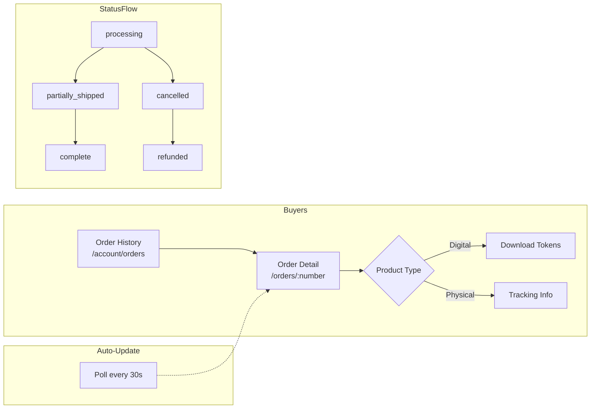

# Order Detail & Downloads



Buyer-facing order pages: order history list, order detail, and digital file downloads.

## Order history (`/account/orders`)

```tsx
// app/src/pages/account/OrderHistory.tsx
export function OrderHistory() {
  const { data, fetchNextPage, hasNextPage } = useInfiniteQuery({
    queryKey: ['shop', 'orders', 'buyer'],
    queryFn: ({ pageParam }) => getBuyerOrders({ p_cursor: pageParam }),
    getNextPageParam: (last) =>
      last.has_more ? last.orders[last.orders.length - 1]?.created_at : undefined,
    initialPageParam: null,
  });

  const orders = data?.pages.flatMap((p) => p.orders) ?? [];

  return (
    <div className="space-y-4">
      <h1 className="text-2xl font-semibold">Your orders</h1>

      {orders.map((o) => (
        <Link key={o.order_number} to={`/orders/${o.order_number}`}>
          <Card className="p-4 hover:bg-muted/40 transition">
            <div className="flex items-center gap-4">
              {/* Thumbnails strip */}
              <div className="flex -space-x-2">
                {o.cover_images.slice(0, 3).map((url, i) => (
                  
                ))}
              </div>

              <div className="flex-1 min-w-0">
                <div className="flex items-center gap-2">
                  <span className="font-medium">{o.order_number}</span>
                  <OrderStatusBadge status={o.status} />
                </div>
                <div className="text-sm text-muted-foreground">
                  {o.item_count} item{o.item_count !== 1 ? 's' : ''} ·{' '}
                  ৳{(o.subtotal + o.shipping_total).toLocaleString()} ·{' '}
                  {formatDate(o.created_at)}
                </div>
              </div>

              <PaymentBadge method={o.payment_method} />
            </div>
          </Card>
        </Link>
      ))}

      <InfiniteScrollSentinel hasNextPage={hasNextPage} fetchNextPage={fetchNextPage} />
    </div>
  );
}
```

---

## Order detail (`/orders/:order_number`)

Polls every 30 seconds so the status updates automatically as the seller fulfills the order.

```tsx
// app/src/pages/orders/OrderDetail.tsx
export function OrderDetail() {
  const { order_number } = useParams();

  const { data } = useQuery({
    queryKey: ['order', order_number],
    queryFn: () => getOrderByNumber(order_number!),
    refetchInterval: 30_000,
    enabled: !!order_number,
  });

  if (!data?.success) return <ErrorState code={data?.error} />;
  const { order } = data;

  return (
    <article className="container max-w-3xl mx-auto py-8 space-y-6">
      {/* Header */}
      <header className="flex items-start justify-between">
        <div>
          <h1 className="text-2xl font-semibold">{order.order_number}</h1>
          <p className="text-sm text-muted-foreground mt-1">
            Placed {formatDate(order.created_at)}
          </p>
        </div>
        <OrderStatusBadge status={order.status} />
      </header>

      {/* COD notice */}
      {order.payment_method === 'cod' && (
        <Alert>
          <CashIcon className="h-4 w-4" />
          <AlertTitle>Cash on delivery</AlertTitle>
          <AlertDescription>
            You'll pay ৳{(order.subtotal + order.shipping_total).toLocaleString()} in cash
            when your order arrives.
            {order.cod_settled_at && ' Payment confirmed.'}
          </AlertDescription>
        </Alert>
      )}

      {/* Order placed confirmation for COD */}
      {order.payment_method === 'cod' && order.status === 'processing' && (
        <Alert variant="info">
          <CheckCircleIcon className="h-4 w-4" />
          <AlertTitle>Order confirmed!</AlertTitle>
          <AlertDescription>
            Your order is being prepared. You'll pay when it's delivered.
          </AlertDescription>
        </Alert>
      )}

      {/* Items */}
      <section className="space-y-3">
        {order.items.map((item) => (
          <BuyerItemCard key={item.id} item={item} />
        ))}
      </section>

      {/* Shipping address */}
      {order.shipping_address && (
        <section>
          <h2 className="font-medium mb-2">Delivery address</h2>
          <AddressBlock address={order.shipping_address} />
        </section>
      )}

      {/* Price summary */}
      <PriceSummary
        subtotal={order.subtotal}
        shippingTotal={order.shipping_total}
        paymentMethod={order.payment_method}
      />

      {/* Downloads (digital products) */}
      {order.download_tokens.length > 0 && (
        <DownloadList tokens={order.download_tokens} />
      )}
    </article>
  );
}
```

---

## Buyer item card

```tsx
function BuyerItemCard({ item }: { item: ShopOrderItem }) {
  return (
    <Card className="p-4">
      <div className="flex items-start justify-between gap-4">
        <div className="space-y-1">
          <div className="font-medium">{item.product_title}</div>
          {item.variant_label && (
            <div className="text-sm text-muted-foreground">{item.variant_label}</div>
          )}
          <div className="text-sm text-muted-foreground">
            Qty {item.quantity} · ৳{item.unit_price.toLocaleString()}
            {item.shipping_cost > 0 && ` + ৳${item.shipping_cost} shipping`}
          </div>
        </div>
        <ItemStatusBadge status={item.status} />
      </div>

      {/* Tracking info */}
      {item.tracking_number && (
        <div className="mt-3 rounded-md bg-muted p-3 text-sm">
          <div className="flex items-center gap-2 flex-wrap">
            <PackageIcon className="h-4 w-4 shrink-0" />
            {item.carrier && <span className="font-medium">{item.carrier}</span>}
            <span className="font-mono">{item.tracking_number}</span>
            {item.tracking_url && (
              <a
                href={item.tracking_url}
                target="_blank"
                rel="noopener noreferrer"
                className="ml-auto text-sm underline"
              >
                Track package →
              </a>
            )}
          </div>
        </div>
      )}

      {/* Cancellation reason — always visible to buyer */}
      {item.cancellation_reason && (
        <Alert variant="destructive" className="mt-3">
          <AlertTitle>Item cancelled</AlertTitle>
          <AlertDescription>{item.cancellation_reason}</AlertDescription>
        </Alert>
      )}
    </Card>
  );
}
```

---

## Order status badge

Maps computed status to a readable label:

```tsx
const STATUS_CONFIG: Record<ShopOrderDetail['status'], { label: string; variant: BadgeVariant }> = {
  processing:       { label: 'Processing',       variant: 'secondary' },
  partially_shipped: { label: 'Partially shipped', variant: 'secondary' },
  complete:         { label: 'Complete',          variant: 'default'   },
  cancelled:        { label: 'Cancelled',         variant: 'destructive' },
  refunded:         { label: 'Refunded',          variant: 'outline'   },
};

function OrderStatusBadge({ status }: { status: ShopOrderDetail['status'] }) {
  const { label, variant } = STATUS_CONFIG[status] ?? { label: status, variant: 'secondary' };
  return <Badge variant={variant}>{label}</Badge>;
}
```

---

## Download list

```tsx
function DownloadList({ tokens }: { tokens: BuyerDownloadToken[] }) {
  return (
    <section>
      <h2 className="font-medium mb-3">Your downloads</h2>
      <div className="space-y-2">
        {tokens.map((t) => {
          const expired = new Date(t.expires_at) < new Date();
          const exhausted = t.download_count >= t.max_downloads;
          const unavailable = expired || exhausted;
          const remaining = t.max_downloads - t.download_count;

          return (
            <div key={t.token} className="flex items-center justify-between p-3 rounded-md border">
              <div className="min-w-0">
                <div className="font-medium truncate">{t.file_name}</div>
                <div className="text-xs text-muted-foreground">
                  {expired
                    ? 'Link expired'
                    : exhausted
                    ? 'Download limit reached'
                    : `${remaining} download${remaining !== 1 ? 's' : ''} left · expires ${formatDate(t.expires_at)}`}
                </div>
              </div>
              <Button
                size="sm"
                variant={unavailable ? 'outline' : 'default'}
                disabled={unavailable}
                onClick={() => {
                  window.location.href = `/api/shop/download?token=${t.token}`;
                }}
              >
                {unavailable ? 'Unavailable' : 'Download'}
              </Button>
            </div>
          );
        })}
      </div>
    </section>
  );
}
```

The download button navigates to the `shop-download` Edge Function endpoint. The function:

1. Validates the token exists and is not expired / exhausted
2. Increments `download_count`
3. Generates a short-lived Supabase Storage signed URL
4. Returns `302 Redirect` to the signed URL

```typescript
// supabase/functions/shop-download/index.ts (Edge Function)
import { AuthMiddleware } from '../_shared/jwt/default.ts';

Deno.serve(async (req) => {
  const url = new URL(req.url);
  const token = url.searchParams.get('token');
  if (!token) return Response.json({ error: 'MISSING_TOKEN' }, { status: 400 });

  // Validate + increment in one RPC call (or do it directly here via service key)
  const supabase = createClient(Deno.env.get('SUPABASE_URL')!, Deno.env.get('SUPABASE_SERVICE_ROLE_KEY')!);

  const { data: tokenRow } = await supabase
    .from('shop_download_tokens')
    .select('*, shop_product_files(storage_path)')
    .eq('token', token)
    .single();

  if (!tokenRow) return Response.json({ error: 'INVALID_TOKEN' }, { status: 404 });
  if (new Date(tokenRow.expires_at) < new Date()) return Response.json({ error: 'EXPIRED' }, { status: 410 });
  if (tokenRow.download_count >= tokenRow.max_downloads) return Response.json({ error: 'EXHAUSTED' }, { status: 410 });

  // Increment
  await supabase.from('shop_download_tokens')
    .update({ download_count: tokenRow.download_count + 1 })
    .eq('id', tokenRow.id);

  // Generate signed URL (storage_path never leaves the Edge Function)
  const { data: signedUrl } = await supabase.storage
    .from('shop-product-files')
    .createSignedUrl(tokenRow.shop_product_files.storage_path, 60);  // 60 second expiry

  return Response.redirect(signedUrl!.signedUrl, 302);
});
```

---

## COD order confirmation page

When the buyer lands on the order detail page immediately after placing a COD order (the `?placed=cod` query param), show a clear confirmation that no payment was needed:

```tsx
const { order_number } = useParams();
const [searchParams] = useSearchParams();
const justPlacedCod = searchParams.get('placed') === 'cod';

{justPlacedCod && (
  <Alert variant="info" className="mb-6">
    <CheckCircleIcon className="h-4 w-4" />
    <AlertTitle>Order placed!</AlertTitle>
    <AlertDescription>
      Your order is confirmed. No payment needed now — you'll pay ৳
      {(order.subtotal + order.shipping_total).toLocaleString()} in cash when it's delivered.
    </AlertDescription>
  </Alert>
)}
```
