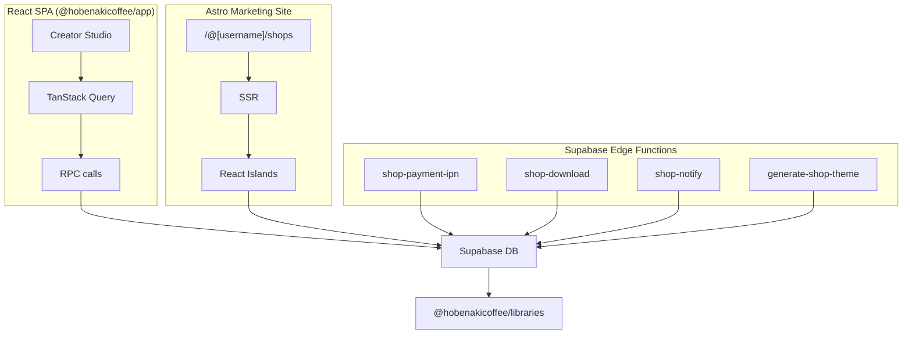

# Frontend — Architecture & Types

## Three runtime surfaces



The shop service runs across three codebases that share types via `@hobenakicoffee/libraries`:

**React SPA (`@hobenakicoffee/app`)** — Creator Studio (seller management) and authenticated buyer flows (cart, checkout, address book, order history). Data via TanStack Query. Routing via TanStack Router. URL state via `nuqs`. Forms via shadcn + RHF.

**Astro marketing site** — Public SSR-rendered pages at `/@username/shops`, `/@username/shops/[slug]`, `/@username/shops/policies`. Deployed as Cloudflare Workers. React islands hydrate interactive elements (variant picker, cart button).

**Supabase Edge Functions** — `shop-payment-ipn` (SSLCommerz IPN), `shop-download` (token → signed URL), `shop-notify` (COD + fulfillment notifications), `generate-shop-theme` (AI theme generation).

### Two invariants

::: warning Never trust config values from the client
`platform_fee_rate`, `cod_wallet_floor`, and `cod_settlement_max_days` are always read server-side from `platform_settings`. The client may **display** them (they come back inside `get_shop_overview().eligibility`) but must never **send** them to an RPC.
:::

::: warning Order status is computed, not stored
`shop_orders` has no status column. The `status` field returned by `get_order_by_number` is computed from item statuses inside the RPC. Treat it as a read-only label.
:::

---

## RPC calling convention

Every shop RPC returns `{ success: true, ... }` or `{ success: false, error: string, ...details }`. Wrap each call in a typed helper so components never see the raw Supabase response.

```typescript
// app/src/api/shop/orders.ts
import { supabase } from '@/lib/supabase';
import { ShopError } from './error';

export async function getOrderByNumber(orderNumber: string) {
  const { data, error } = await supabase.rpc('get_order_by_number', {
    p_order_number: orderNumber,
  });

  if (error) throw error;
  if (!data.success) throw new ShopError(data.error, data);
  return data as { success: true; order: ShopOrderDetail };
}
```

```typescript
// app/src/api/shop/error.ts
export class ShopError extends Error {
  constructor(
    public code: string,
    public details: Record<string, unknown>
  ) {
    super(code);
    this.name = 'ShopError';
  }
}
```

Use `instanceof ShopError` in `onError` callbacks to branch on specific error codes:

```typescript
useMutation({
  mutationFn: initiateShopCheckout,
  onError: (err) => {
    if (err instanceof ShopError && err.code === 'MIXED_COD_AND_NON_COD') {
      toast.error("One of your items doesn't support cash on delivery.");
    } else {
      toast.error('Something went wrong. Please try again.');
    }
  },
});
```

### Query key conventions

Keep query keys structured so mutations can invalidate cleanly:

```typescript
['shop', 'overview']                     // get_shop_overview
['shop', 'orders', 'seller', filter]     // get_seller_orders
['shop', 'orders', 'buyer']              // get_buyer_orders
['order', orderNumber]                   // get_order_by_number
['shop', 'products']                     // studio product list
['shop', 'settings']                     // shop_settings row
['shop', 'policies', 'mine']             // seller's policy overrides
['user', 'addresses']                    // get_user_addresses
```

After mutations, invalidate broadly:

```typescript
// After confirm_cod_cash_received:
qc.invalidateQueries({ queryKey: ['shop', 'orders'] });
qc.invalidateQueries({ queryKey: ['shop', 'overview'] });
qc.invalidateQueries({ queryKey: ['wallet'] });
```

---

## TypeScript Types

All types live in `app/src/types/shop.ts` and mirror the SQL schema one-to-one.

### Enums

```typescript
export type ShopProductType = 'digital' | 'physical';

export type ShopOrderItemStatus =
  | 'pending' | 'paid' | 'fulfilled' | 'processing'
  | 'shipped'  | 'delivered' | 'cancelled' | 'refunded';

export type ShopPaymentMethod = 'online' | 'cod';

export type ShopPolicyType =
  | 'return_refund' | 'digital_products' | 'shipping'
  | 'privacy'       | 'terms_of_service';

export type ShopDeactivationReason =
  | 'wallet_below_floor' | 'cod_aging' | 'manual';
```

### Variants

```typescript
/**
 * One axis definition stored on the product.
 * Example: { name: "Size", values: ["S","M","L"] }
 */
export interface ShopProductOptionDefinition {
  name: string;
  values: string[];
}

/**
 * The selected combination for a variant row or order snapshot.
 * Example: { "Size": "M", "Color": "Red" }
 */
export type ShopVariantOptions = Record<string, string>;

export interface ShopProductVariant {
  id: string;
  options: ShopVariantOptions;
  price_adjustment: number;
  stock_count: number | null;   // null = inherit product-level stock
  sku: string | null;
  image_url: string | null;     // variant-specific photo
  sort_order: number;
}
```

### Products

```typescript
export interface ShopProductCard {
  id: string;
  title: string;
  slug: string;
  cover_image_url: string | null;
  product_type: ShopProductType;
  price: number;
  compare_at_price: number | null;
  stock_count: number | null;
  tags?: string[];
  sort_order: number;
  category_id?: string | null;
}

export interface ShopProductDetail extends ShopProductCard {
  description: string | null;
  images: string[];
  sku: string | null;
  option_definitions: ShopProductOptionDefinition[];

  // Physical
  weight_grams: number | null;
  shipping_fee_inside_dhaka: number;
  shipping_fee_outside_dhaka: number;
  processing_min_days: number | null;
  processing_max_days: number | null;
  requires_shipping: boolean;
  cod_enabled: boolean;

  // Digital
  max_downloads: number;

  variants: ShopProductVariant[];
  files: ShopProductFileMeta[];
}

export interface ShopProductFileMeta {
  id: string;
  file_name: string;
  file_size_bytes: number | null;
  mime_type: string | null;
  sort_order: number;
  // storage_path is NEVER returned to clients
}
```

### Orders

```typescript
export interface ShopOrderItem {
  id: string;
  product_title: string;
  product_type: ShopProductType;
  variant_label: string | null;             // "Size: M / Color: Red"
  variant_options: ShopVariantOptions | null; // structured snapshot
  unit_price: number;
  shipping_cost: number;
  quantity: number;
  status: ShopOrderItemStatus;
  carrier: string | null;
  tracking_number: string | null;
  tracking_url: string | null;
  shipped_at: string | null;
  delivered_at: string | null;
  cod_settled_at: string | null;
  cancellation_reason: string | null;
  cover_image_url?: string | null;          // present on seller order cards
}

export interface ShopOrderDetail {
  id: string;
  order_number: string;
  payment_method: ShopPaymentMethod;
  status: 'processing' | 'partially_shipped' | 'complete' | 'cancelled' | 'refunded';
  has_digital: boolean;
  has_physical: boolean;
  subtotal: number;
  shipping_total: number;
  platform_fee: number;
  seller_net: number;
  shipping_address: ShippingAddressSnapshot | null;
  buyer_notes: string | null;
  cod_settled_at: string | null;
  created_at: string;
  items: ShopOrderItem[];
  download_tokens: BuyerDownloadToken[];
}

export interface ShippingAddressSnapshot {
  label: string | null;
  recipient_name: string;
  phone: string;
  address_line1: string;
  address_line2: string | null;
  city: string;
  district: string;
  postal_code: string | null;
}

export interface BuyerDownloadToken {
  file_name: string;
  file_size_bytes: number | null;
  token: string;
  download_count: number;
  max_downloads: number;
  expires_at: string;
}
```

### Seller order card

```typescript
export interface SellerOrderCard {
  order_number: string;
  payment_method: ShopPaymentMethod;
  created_at: string;
  subtotal: number;
  shipping_total: number;
  seller_net: number;
  has_digital: boolean;
  has_physical: boolean;
  shipping_address: ShippingAddressSnapshot | null;
  buyer_notes: string | null;
  cod_settled_at: string | null;
  buyer: {
    username: string;
    display_name: string | null;
    avatar_url: string | null;
  };
  items: ShopOrderItem[];
}
```

### Dashboard

```typescript
export interface EligibilityResult {
  eligible: boolean;
  reasons: ShopDeactivationReason[];
  wallet_balance: number;
  cod_debt: number;
  wallet_floor: number;           // typically -500
  aged_cod_orders: number;
  settlement_max_days: number;    // typically 30
}

export interface ShopOverviewData {
  revenue: {
    all_time: number;
    last_30_days: number;
    prev_30_days: number;
  };
  orders: {
    all_time: number;
    last_30_days: number;
    prev_30_days: number;
  };
  products: { published: number };
  pending_count: number;          // physical items in 'processing'
  cash_pending_count: number;     // COD items delivered but unsettled
  top_selling: Array<{
    id: string; title: string; cover_image_url: string | null;
    product_type: ShopProductType; price: number; sales_count: number;
  }>;
  recent_orders: Array<{
    order_number: string; created_at: string; item_count: number;
    subtotal: number; shipping_total: number; seller_net: number;
    payment_method: ShopPaymentMethod;
    status: 'processing' | 'partially_shipped' | 'complete' | 'cancelled' | 'refunded';
  }>;
  eligibility: EligibilityResult;
}
```

### Policies

```typescript
export interface ShopPolicy {
  policy_type: ShopPolicyType;
  content: string;      // markdown
  is_enabled: boolean;
  updated_at: string;
}
```
