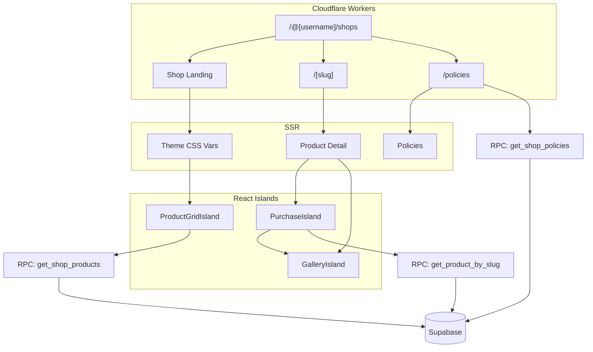

# Public Pages (Astro SSR)



Three public routes render server-side via Cloudflare Workers:

| Route | RPC | Page |
|---|---|---|
| `/@[username]/shops` | `get_shop_by_username` | Shop landing |
| `/@[username]/shops/[slug]` | `get_product_by_slug` | Product detail |
| `/@[username]/shops/policies` | `get_shop_policies` | Policies |

All three inject `theme_config` as CSS variables and set Cloudflare cache headers.

---

## Shop landing page

```astro
---
// pages/@[username]/shops/index.astro
import Layout from '@/layouts/Layout.astro';
import { buildShopCssVars } from '@/lib/shop-theme';
import { getShopByUsername } from '@/lib/shop-api';
import ProductGridIsland from '@/islands/ProductGridIsland';

const { username } = Astro.params;
const result = await getShopByUsername(username, 6);

if (!result?.success) return Astro.redirect('/404');
const { shop, profile, featured_products } = result;

Astro.response.headers.set(
  'Cache-Control',
  'public, max-age=60, s-maxage=300, stale-while-revalidate=86400'
);
---

<Layout
  title={shop.seo_title ?? shop.shop_name}
  description={shop.seo_description ?? shop.shop_description}
>
  <style is:inline set:html={buildShopCssVars(shop.theme_config ?? {})} />

  <!-- Banner / logo -->
  {shop.banner_url && (
    <div class="relative h-48 md:h-64 w-full overflow-hidden">
      
    </div>
  )}

  <div class="container mx-auto max-w-6xl px-4 py-10">
    <header class="mb-10">
      {shop.logo_url && }
      <h1 class="font-[family-name:var(--shop-font-heading)] text-4xl">{shop.shop_name}</h1>
      {shop.shop_description && <p class="mt-2 text-lg text-muted-foreground">{shop.shop_description}</p>}
    </header>

    <!-- Featured strip (SSR) -->
    {featured_products.length > 0 && (
      <section class="mb-12">
        <h2 class="text-xl font-semibold mb-4">Featured</h2>
        <div class="grid grid-cols-2 md:grid-cols-3 gap-4">
          {featured_products.map((p) => (
            <a href={`/@${username}/shops/${p.slug}`} class="group block">
              <div class="aspect-square overflow-hidden rounded-[var(--shop-radius)]">
                
              </div>
              <div class="mt-2">
                <div class="font-medium line-clamp-2">{p.title}</div>
                <div class="text-sm text-muted-foreground">৳{p.price.toLocaleString()}</div>
              </div>
            </a>
          ))}
        </div>
      </section>
    )}

    <!-- Full product grid (React island — paginated, filterable) -->
    <ProductGridIsland client:visible username={username} />
  </div>
</Layout>
```

The `client:visible` directive means the island doesn't hydrate until it scrolls into view. The SSR featured strip is always visible on first paint.

---

## Product detail page

```astro
---
// pages/@[username]/shops/[slug].astro
import { buildShopCssVars } from '@/lib/shop-theme';
import { getProductBySlug, getShopByUsername } from '@/lib/shop-api';
import PurchaseIsland from '@/islands/PurchaseIsland';
import GalleryIsland from '@/islands/GalleryIsland';

const { username, slug } = Astro.params;
const [shopResult, productResult] = await Promise.all([
  getShopByUsername(username, 0),
  getProductBySlug(username, slug),
]);

if (!productResult?.success) return Astro.redirect('/404');

const { product } = productResult;
const shopTheme = shopResult?.success ? shopResult.shop.theme_config ?? {} : {};

Astro.response.headers.set(
  'Cache-Control',
  'public, max-age=60, s-maxage=300, stale-while-revalidate=86400'
);
---

<Layout title={product.title} description={product.description?.slice(0, 160)}>
  <style is:inline set:html={buildShopCssVars(shopTheme)} />

  <div class="container mx-auto max-w-5xl px-4 py-10">
    <div class="grid md:grid-cols-2 gap-12">

      <!-- Gallery (interactive, React island) -->
      <GalleryIsland
        client:load
        images={product.images}
        cover={product.cover_image_url}
      />

      <!-- Product info (SSR) -->
      <div class="space-y-6">
        <h1 class="font-[family-name:var(--shop-font-heading)] text-3xl md:text-4xl">
          {product.title}
        </h1>

        <!-- Price -->
        <div class="flex items-baseline gap-3">
          <span class="text-2xl font-semibold">৳{product.price.toLocaleString()}</span>
          {product.compare_at_price && (
            <span class="text-lg text-muted-foreground line-through">
              ৳{product.compare_at_price.toLocaleString()}
            </span>
          )}
        </div>

        <!-- Shipping info (physical only — SSR) -->
        {product.product_type === 'physical' && (
          <div class="rounded-[var(--shop-radius)] border p-4 text-sm space-y-1.5">
            <div class="flex justify-between">
              <span>Delivery inside Dhaka</span>
              <span class="font-medium">৳{product.shipping_fee_inside_dhaka.toLocaleString()}</span>
            </div>
            <div class="flex justify-between">
              <span>Delivery outside Dhaka</span>
              <span class="font-medium">৳{product.shipping_fee_outside_dhaka.toLocaleString()}</span>
            </div>
            {(product.processing_min_days || product.processing_max_days) && (
              <div class="flex justify-between pt-1 border-t">
                <span>Processing time</span>
                <span class="font-medium">
                  {product.processing_min_days === product.processing_max_days
                    ? `${product.processing_min_days} day(s)`
                    : `${product.processing_min_days}–${product.processing_max_days} days`}
                </span>
              </div>
            )}
            {product.cod_enabled && (
              <div class="flex items-center gap-2 pt-1 border-t text-[var(--shop-primary)]">
                <svg .../>
                <span>Cash on delivery available</span>
              </div>
            )}
          </div>
        )}

        <!-- Variant picker + Add to cart (React island, loads eagerly) -->
        <PurchaseIsland client:load product={product} username={username} />
      </div>
    </div>

    <!-- Description (SSR, rendered markdown) -->
    {product.description && (
      <article
        class="prose lg:prose-lg max-w-none mt-12"
        set:html={renderMarkdown(product.description)}
      />
    )}
  </div>
</Layout>
```

---

## Variant picker (React island)

The variant picker receives `option_definitions` and `variants[]` from SSR. It resolves a selected combination to a variant row, handles sparse combinations, and updates the gallery when a variant has its own image.

```tsx
// app/src/islands/PurchaseIsland.tsx
import { useMemo, useState } from 'react';
import type { ShopProductDetail, ShopProductVariant } from '@hobenakicoffee/libraries';

export function PurchaseIsland({ product }: { product: ShopProductDetail }) {
  const hasAxes = product.option_definitions.length > 0;

  // Pre-select first value for each axis
  const [selection, setSelection] = useState<Record<string, string>>(() => {
    if (!hasAxes) return {};
    return Object.fromEntries(
      product.option_definitions.map((axis) => [axis.name, axis.values[0]])
    );
  });

  // Resolve to a variant row — null when the combination is sparse (doesn't exist)
  const matchedVariant: ShopProductVariant | null = useMemo(() => {
    if (!hasAxes) return null;
    return (
      product.variants.find((v) =>
        Object.entries(selection).every(([k, val]) => v.options[k] === val)
      ) ?? null
    );
  }, [product.variants, selection, hasAxes]);

  // Returns false if the value would lead to a non-existent combination
  const isValueAvailable = (axisName: string, value: string): boolean => {
    const trial = { ...selection, [axisName]: value };
    return product.variants.some((v) =>
      Object.entries(trial).every(([k, val]) => v.options[k] === val)
    );
  };

  const effectivePrice = product.price + (matchedVariant?.price_adjustment ?? 0);
  const effectiveStock = matchedVariant?.stock_count ?? product.stock_count;

  return (
    <div className="space-y-5">
      {product.option_definitions.map((axis) => (
        <div key={axis.name}>
          <p className="text-sm font-medium mb-2">{axis.name}</p>
          <div className="flex flex-wrap gap-2">
            {axis.values.map((value) => {
              const available = isValueAvailable(axis.name, value);
              const selected = selection[axis.name] === value;
              return (
                <button
                  key={value}
                  disabled={!available}
                  onClick={() => setSelection({ ...selection, [axis.name]: value })}
                  className={cn(
                    'rounded-[var(--shop-radius)] border px-4 py-2 text-sm transition',
                    selected
                      ? 'border-[var(--shop-primary)] bg-[var(--shop-primary)] text-[var(--shop-primary-foreground)]'
                      : 'border-border hover:border-[var(--shop-primary)]',
                    !available && 'opacity-40 line-through cursor-not-allowed',
                  )}
                >
                  {value}
                </button>
              );
            })}
          </div>
        </div>
      ))}

      {/* Warn about sparse combination — selection is valid but variant doesn't exist */}
      {hasAxes && !matchedVariant && (
        <p className="text-sm text-destructive">
          This combination isn't available. Try a different selection.
        </p>
      )}

      <AddToCartButton
        product={product}
        variant={matchedVariant}
        disabled={hasAxes && !matchedVariant}
        price={effectivePrice}
        stock={effectiveStock}
      />
    </div>
  );
}
```

::: tip Sparse variants
Not every cartesian-product combination needs a variant row. `isValueAvailable` returns `false` for values that would lead to non-existent combinations, disabling them in the UI. When a combination is selected but no variant row exists, the UI shows an "unavailable" message.
:::

### Variant image update

When the matched variant has an `image_url`, surface it as the gallery hero. The simplest way is to pass `matchedVariant?.image_url` as a prop to the `GalleryIsland` and make the gallery respond to prop changes.

---

## Public policies page

```astro
---
// pages/@[username]/shops/policies.astro
import { POLICY_DEFAULTS, POLICY_LABELS } from '@/lib/shop-policy-defaults';

const { username } = Astro.params;
const result = await getShopPolicies(username);
if (!result?.success) return Astro.redirect('/404');

// Merge: custom overrides take precedence over defaults
const customMap = new Map(result.policies.map((p) => [p.policy_type, p]));
const ALL_TYPES = ['return_refund', 'digital_products', 'shipping', 'privacy', 'terms_of_service'];

const sections = ALL_TYPES
  .map((type) => ({
    type,
    label: POLICY_LABELS[type],
    content: customMap.get(type)?.content ?? POLICY_DEFAULTS[type],
  }))
  .filter((s) => s.content);   // omit types with no default and no custom
---

<Layout title={`Policies — ${username}`}>
  <article class="prose lg:prose-lg mx-auto max-w-3xl py-12 px-4">
    <h1>Shop policies</h1>

    {sections.map((s) => (
      <section id={s.type}>
        <h2>{s.label}</h2>
        <Fragment set:html={renderMarkdown(s.content)} />
      </section>
    ))}
  </article>
</Layout>
```

The `POLICY_DEFAULTS` and `POLICY_LABELS` maps live in `app/src/lib/shop-policy-defaults.ts`. If a policy type has no row in the DB and no default template, it's omitted from the page entirely.

---

## Profile card widget

The profile card is the compact shop preview shown on the creator's main profile page. Loads `get_shop_by_username` with `p_featured_limit: 6`.

```tsx
// app/src/components/profile/ShopProfileCard.tsx
export function ShopProfileCard({ username }: { username: string }) {
  const { data, isLoading } = useQuery({
    queryKey: ['shop', 'profile-card', username],
    queryFn: () => getShopByUsername(username, 6),
  });

  if (isLoading) return <ShopProfileCardSkeleton />;
  if (!data?.success) return null;   // shop inactive → hide the card

  const { shop, featured_products } = data;

  return (
    <Card className="overflow-hidden">
      {shop.banner_url && (
        
      )}
      <CardHeader>
        <CardTitle>{shop.shop_name}</CardTitle>
        {shop.shop_description && (
          <CardDescription className="line-clamp-2">{shop.shop_description}</CardDescription>
        )}
      </CardHeader>

      <CardContent>
        <div className="grid grid-cols-3 gap-2">
          {featured_products.slice(0, 6).map((p) => (
            <Link key={p.id} to={`/@${username}/shops/${p.slug}`}>
              
              <p className="mt-1 text-xs font-medium line-clamp-1">{p.title}</p>
              <p className="text-xs text-muted-foreground">৳{p.price.toLocaleString()}</p>
            </Link>
          ))}
        </div>
        <Link
          to={`/@${username}/shops`}
          className="mt-4 block text-center text-sm font-medium underline underline-offset-2"
        >
          Visit shop →
        </Link>
      </CardContent>
    </Card>
  );
}
```
