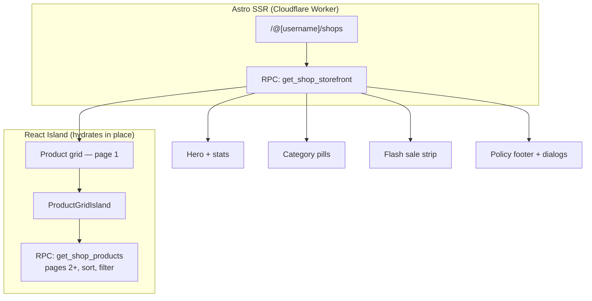

# Public Storefront — Frontend Guide

This page maps the creator storefront design onto the RPCs that feed it. Read it
next to the mockups: every visual element below names the exact field it comes from.



## One call boots the page

`get_shop_storefront` composes five RPCs server-side and returns them in a single
payload. Use it for the initial SSR render — it collapses five Worker→Postgres
round-trips into one, and every inner query runs in the same transaction so the
page renders from one consistent snapshot.

```ts
const result = await supabase.rpc('get_shop_storefront', {
  p_username: username,
  p_product_limit: 12,     // page 1 of the grid
  p_featured_limit: 6,
  p_flash_limit: 12,
  p_include_policies: true,
});
```

```ts
type ShopStorefront = {
  success: true;
  shop: {
    shop_name: string;
    shop_description: string | null;   // footer blurb + SEO fallback
    hero_headline: string | null;      // the large display heading
    hero_subtitle: string | null;      // the supporting paragraph
    logo_url: string | null;
    banner_url: string | null;
    theme_config: ShopThemeConfig;
    seo_title: string | null;
    seo_description: string | null;
    seo_custom_meta_tags: { name: string; content: string }[] | null;
    cod_enabled: boolean;
    requires_shipping: boolean;
  };
  profile: { username: string; display_name: string | null; avatar_url: string | null };
  stats: {
    total_products: number;
    total_sales: number;
    rating_avg: number | null;         // 1–5 scale, null when no reviews
    rating_count: number;
  };
  featured_products: ShopProductCard[];
  categories: ShopCategoryPill[];
  total_product_count: number;
  flash_sale: ShopFlashSale;
  products: ShopProductCard[];         // page 1 of the grid
  has_more: boolean;
  next_cursor: ShopCursor | null;
  policies: ShopPolicy[] | null;       // null when p_include_policies = false
};
```

::: tip Seed the island — don't re-fetch page 1
Pass `products` / `has_more` / `next_cursor` into `ProductGridIsland` as
`initialData`. Without this the island renders an empty grid until it hydrates and
issues its own request, which is a visible blank flash on first paint.
:::

::: warning `get_shop_storefront` is for the first render only
Sorting, filtering and infinite scroll all go through `get_shop_products`. Never
re-call `get_shop_storefront` to change a filter — you would refetch the hero, the
categories, the flash sale and the policies to change one query parameter.
:::

---

## Hero

| Design element | Field |
|---|---|
| Shop name in header | `shop.shop_name` |
| `@handle` | `profile.username` |
| Avatar / logo | `shop.logo_url` (fall back to `profile.avatar_url`) |
| Large heading | `shop.hero_headline` |
| Paragraph beneath it | `shop.hero_subtitle` |
| Background image | `shop.banner_url` |
| "29 products" | `stats.total_products` |
| "3,420+ sold" | `stats.total_sales` |
| "★ 4.8 avg rating" | `stats.rating_avg` (hide the whole stat when `rating_count === 0`) |

### Payment badges

bKash / Nagad / Card are **static** — they are what SSLCommerz offers on every
shop, so hardcode them. The only data-driven badge is cash on delivery:

```tsx
{shop.cod_enabled && <Badge icon={Truck}>ক্যাশ অন ডেলিভারি</Badge>}
```

---

## Category pills

```ts
type ShopCategoryPill = {
  id: string;
  name: string;
  slug: string;
  description: string | null;
  sort_order: number;
  product_count: number;
};
```

The "All" pill uses `total_product_count`; each other pill uses its own
`product_count`. Selecting a pill sets `p_category_id`; "All" sets it to `null`.

::: tip These counts are computed live, on purpose
`shop_categories.product_count` exists in the database but is **not
approval-aware** — its trigger fires only on `category_id` / `is_deleted`, and
`approve_shop_product()` never fires it. `get_shop_categories` therefore counts
published products itself, so a pill can never claim 8 items while the filtered
grid shows 5. Do not read `product_count` off the table directly.
:::

### The category badge on each product card

Product payloads carry `category_id` but **not** the category name — adding it
would mean a join on every grid query for data the page already has. Build a Map
once and look the badge up:

```ts
const categoryById = new Map(categories.map((c) => [c.id, c]));
// on the card:
const label = product.category_id ? categoryById.get(product.category_id)?.name : null;
```

(`get_product_by_slug` is the exception — the standalone product page has no
category list loaded, so it returns `category_name` / `category_slug` directly.)

---

## Flash sale strip

```ts
type ShopFlashSale = {
  is_active: boolean;
  ends_at: string | null;          // ISO — the countdown target
  max_discount_percent: number | null;
  products: ShopProductCard[];     // ordered deepest discount first
};
```

- Render the whole section only when `is_active` is true.
- The `05 : 23 : 03` countdown counts down to `ends_at` — this is the **earliest**
  `sale_ends_at` among the products shown, so the timer never outlives the first
  product to drop out.
- The "up to 60% off" subtitle is `max_discount_percent`.

::: tip The strip is shop-wide and does not react to the category pills
That is deliberate: it is an editorial section, and keeping it filter-independent
lets it stay in the SSR-cached payload instead of refetching on every pill click.
:::

---

## Sort dropdown

```ts
type ShopSort = 'curated' | 'popular' | 'newest' | 'price_asc' | 'price_desc';
```

| Menu item | `p_sort` |
|---|---|
| জনপ্রিয় (Popular) | `popular` |
| নতুন আগে (Newest first) | `newest` |
| দাম: কম → বেশি | `price_asc` |
| দাম: বেশি → কম | `price_desc` |
| *(creator's own ordering — the default)* | `curated` |

Price sorts are **sale-aware**: a product listed at ৳3,500 but selling at ৳1,000
sorts at ৳1,000, which is what the shopper sees on the card.

---

## Product grid & infinite scroll

`get_shop_products` is revoked from `anon`, so the island cannot call it directly.
Go through the `shopProducts.getPage` Astro action, which runs the RPC on the
service-role client behind rate limiting:

```ts
// server side — service-role client only
const { data } = await supabase.rpc('get_shop_products', {
  p_username: username,
  p_category_id: categoryId,   // null = All
  p_sort: sort,                // default 'curated'
  p_limit: 12,
  p_cursor: cursor,            // null for page 1
});
```

Response: `{ success, products, has_more, next_cursor }`.

### Cursor rules

```ts
type ShopCursor = { sort: ShopSort; v: number | string; id: string };
```

1. **Pass `next_cursor` back verbatim.** Never construct or edit one client-side —
   `v` is a typed sort key (an integer, an ISO timestamp, or a decimal depending on
   the mode) and the server casts it back to that exact type.
2. **Reset the cursor whenever sort or category changes.** With TanStack Query, put
   both in the `queryKey` and this happens for free:

```tsx
useInfiniteQuery({
  queryKey: ['shop-products', username, categoryId, sort],   // ← both in the key
  queryFn: ({ pageParam }) =>
    getShopProducts({ username, categoryId, sort, cursor: pageParam ?? null }),
  initialPageParam: null,
  getNextPageParam: (last) => (last.has_more ? last.next_cursor : undefined),
  initialData: ssr.products.length                            // ← seed from SSR
    ? { pages: [{ products: ssr.products, has_more: ssr.has_more, next_cursor: ssr.next_cursor }],
        pageParams: [null] }
    : undefined,
});
```

3. **Handle `CURSOR_SORT_MISMATCH`.** If a cursor minted under one sort is sent with
   another, the server rejects it rather than silently returning a wrong page. It is
   a bug signal, not a user-facing error: reset to page 1 and refetch.

| Error | Meaning |
|---|---|
| `INVALID_SORT` | `p_sort` is not one of the five modes |
| `CURSOR_SORT_MISMATCH` | cursor was minted under a different sort — reset pagination |
| `INVALID_CURSOR` | cursor is missing `v` or `id` |
| `PROFILE_NOT_FOUND` / `SHOP_NOT_FOUND` | no such creator, or the shop is not published |

---

## Product card

```ts
type ShopProductCard = {
  id: string;
  title: string;
  slug: string;
  cover_image_url: string | null;
  product_type: 'digital' | 'physical';
  category_id: string | null;
  tags: string[];
  sort_order: number;
  created_at: string;

  price: number;                        // list price — see the warning below
  compare_at_price: number | null;

  // resolved pricing — the only fields you should render
  is_on_sale: boolean;
  effective_price: number;
  strikethrough_price: number | null;
  discount_percent: number | null;
  sale_ends_at: string | null;

  stock_count: number | null;           // null = unlimited
  low_stock_threshold: number;
  sales_count: number;
  rating_avg: number | null;
  rating_count: number;
};
```

::: danger Never render `price` directly
`price` is the list price. Render `effective_price` as the amount and
`strikethrough_price` as the struck-out comparison. During a flash sale those two
differ, and showing `price` would display an amount the buyer will not be charged.
The same helper (`shop_product_pricing`) backs both these fields and
`initiate_shop_checkout`, so what is displayed is exactly what is charged.
:::

| Design element | Expression |
|---|---|
| `-৬০%` badge | `discount_percent` (render only when non-null) |
| `৳৬০০` | `effective_price` |
| `৳১,৫০০` struck through | `strikethrough_price` |
| `★ 8.8` | `rating_avg` — **see the scale note below** |
| `১২ বিক্রি` | `sales_count` |
| `৪টি স্টক` | `stock_count` (hide entirely when `null`) |
| stock text turns red | `stock_count !== null && stock_count <= low_stock_threshold` |
| stock progress bar | `sales_count / (sales_count + stock_count)` — hide when `stock_count === null` |

::: warning Rating scale
`rating_avg` is on a **1–5** scale (`reviews.rating` is constrained to 1–5). The
mockup shows `8.8`, which is a 10-point rendering. Pick one and apply it
consistently — if the design is authoritative, display `rating_avg * 2`, and keep
that transform in a single formatter rather than at each call site.
:::

### Add to cart

The cart is entirely client-side; there is no cart table. Persist it in
localStorage and materialise it only at checkout, as the `p_items` array:

```ts
await supabase.rpc('initiate_shop_checkout', {
  p_items: [{ product_id, variant_id: variantId ?? undefined, quantity }],
  p_address_id: addressId,       // required when any item is physical
  p_payment_method: 'online',    // or 'cod'
});
```

Prices are re-resolved server-side, so a stale cart never locks in an expired sale
price — nor misses a newly started one.

---

## Policy footer

`policies` arrives preloaded in the storefront payload, so the pill buttons open a
dialog instantly with no spinner and no loading state to build.

```ts
type ShopPolicy = {
  policy_type: 'return_refund' | 'digital_products' | 'shipping' | 'privacy' | 'terms_of_service';
  content: string;      // markdown
  is_enabled: boolean;
  updated_at: string;
};
```

Only creator-authored overrides come back. Merge them with the frontend defaults in
`app/src/lib/shop-policy-defaults.ts` — a type absent from the response falls back
to `POLICY_DEFAULTS`, and is omitted entirely when there is no default either:

```ts
const custom = new Map((policies ?? []).map((p) => [p.policy_type, p]));
const sections = POLICY_TYPES
  .map((t) => ({ type: t, label: POLICY_LABELS[t], content: custom.get(t)?.content ?? POLICY_DEFAULTS[t] }))
  .filter((s) => s.content);
```

If a creator's policy markdown ever grows large enough to bloat the page, pass
`p_include_policies: false` and call `get_shop_policies(p_username)` when a dialog
first opens.

---

## Creator-side: running a flash sale

Sales bypass the product approval flow — they are time-sensitive, and a creator
cannot wait for a manager to be online. Use the dedicated RPC rather than
`upsert_shop_product`, which would create a pending draft instead:

```ts
await supabase.rpc('set_shop_product_sale', {
  p_product_id: productId,
  p_sale_price: 600,
  p_sale_starts_at: null,                 // null = start immediately
  p_sale_ends_at: endsAt.toISOString(),
});

// end a sale early
await supabase.rpc('set_shop_product_sale', { p_product_id: productId, p_clear: true });
```

| Error | Meaning |
|---|---|
| `SALE_PRICE_NOT_BELOW_PRICE` | sale price must be strictly below the list price |
| `SALE_WINDOW_REQUIRED` | `p_sale_ends_at` is mandatory — a sale must expire |
| `INVALID_SALE_WINDOW` | the window is inverted or already closed |
| `NOT_FOUND` | not the owner, or the product is deleted |

This is safe to run without moderation because the RPC can only ever *lower* the
price for a bounded window. A running sale also survives a manager approving an
unrelated product edit, since the sale columns live only on the live row.

---

## Number formatting

Bengali numerals and the ৳ symbol throughout:

```ts
const bn = new Intl.NumberFormat('bn-BD');
const taka = (n: number) => `৳${bn.format(n)}`;

taka(1500);          // ৳১,৫০০
bn.format(3420);     // ৩,৪২০
```

Keep this in one formatter module — the design uses Bengali digits in prices,
stat counters, stock counts, discount badges and the countdown alike.
