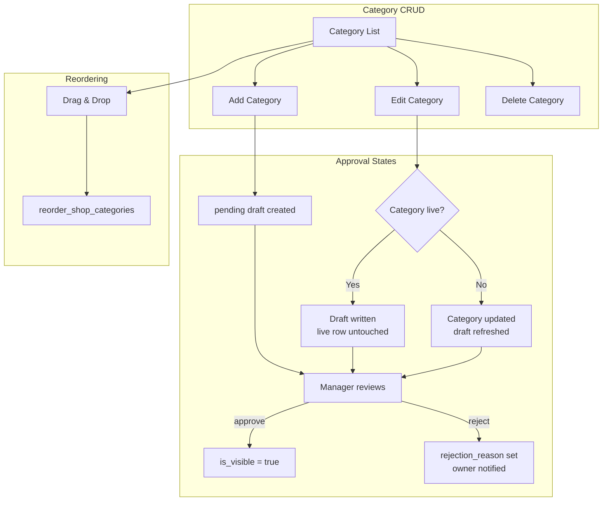

# Studio — Categories



The category management page at `/studio/shop/categories` provides a table view with add, edit, delete, and drag-and-drop reordering.

> **Approval workflow:** Categories are never made visible directly by owners. After every create or edit, a draft is submitted for manager review. Live categories stay online while a new edit awaits review.

---

## Types

```typescript
// Mirrors shop_category_drafts columns
export type ApprovalStatus = 'pending' | 'rejected';

export interface ShopCategory {
  id: string;
  profile_id: string;
  name: string;
  slug: string;
  description: string | null;
  sort_order: number;
  is_visible: boolean;       // true = approved and live
  product_count: number;
  created_at: string;
  updated_at: string;
}

export interface ShopCategoryDraft {
  id: string;
  category_id: string;
  profile_id: string;
  name: string;
  slug: string;
  description: string | null;
  sort_order: number;
  approval_status: ApprovalStatus;
  rejection_reason: string | null;
  created_at: string;
  updated_at: string;
}
```

---

## Category service

```typescript
// app/src/services/category.service.ts
import { supabase } from '@/lib/supabase';

export async function getStudioCategories() {
  const { data, error } = await supabase
    .from('shop_categories')
    .select('*')
    .order('sort_order', { ascending: true });

  if (error) throw error;
  return data as ShopCategory[];
}

// Fetch the owner's pending/rejected drafts so Studio can show approval state
export async function getCategoryDrafts() {
  const { data, error } = await supabase
    .from('shop_category_drafts')
    .select('*');

  if (error) throw error;
  return data as ShopCategoryDraft[];
}

export async function upsertShopCategory(args: {
  p_category_id?: string;
  p_name: string;
  p_slug?: string;
  p_description?: string;
  p_sort_order?: number;
  // NOTE: p_is_visible is intentionally absent — visibility is manager-controlled
}) {
  const { data, error } = await supabase.rpc('upsert_shop_category', args);
  if (error) throw error;
  return data;
}

export async function deleteShopCategory(args: { p_category_id: string }) {
  const { data, error } = await supabase.rpc('delete_shop_category', args);
  if (error) throw error;
  return data;
}

export async function reorderShopCategories(args: { p_category_ids: string[] }) {
  const { data, error } = await supabase.rpc('reorder_shop_categories', args);
  if (error) throw error;
  return data;
}
```

---

## Category hooks

```typescript
// app/src/hooks/use-categories.ts
import { useQuery, useMutation, useQueryClient } from '@tanstack/react-query';
import {
  getStudioCategories,
  getCategoryDrafts,
  upsertShopCategory,
  deleteShopCategory,
  reorderShopCategories,
} from '@/services/category.service';

export function useCategories() {
  return useQuery({
    queryKey: ['shop', 'categories'],
    queryFn: getStudioCategories,
  });
}

// Returns a map of category_id → draft for quick lookup in the table
export function useCategoryDrafts() {
  return useQuery({
    queryKey: ['shop', 'category-drafts'],
    queryFn: async () => {
      const drafts = await getCategoryDrafts();
      return Object.fromEntries(drafts.map((d) => [d.category_id, d]));
    },
  });
}

export function useUpsertCategory() {
  const qc = useQueryClient();

  return useMutation({
    mutationFn: upsertShopCategory,
    onSuccess: () => {
      // Invalidate both — draft row is created/updated on every upsert
      qc.invalidateQueries({ queryKey: ['shop', 'categories'] });
      qc.invalidateQueries({ queryKey: ['shop', 'category-drafts'] });
    },
  });
}

export function useDeleteCategory() {
  const qc = useQueryClient();

  return useMutation({
    mutationFn: deleteShopCategory,
    onSuccess: () => {
      qc.invalidateQueries({ queryKey: ['shop', 'categories'] });
      qc.invalidateQueries({ queryKey: ['shop', 'category-drafts'] });
    },
  });
}

export function useReorderCategories() {
  const qc = useQueryClient();

  return useMutation({
    mutationFn: reorderShopCategories,
    onSuccess: () => {
      qc.invalidateQueries({ queryKey: ['shop', 'categories'] });
    },
  });
}
```

---

## Approval status badge

Use a single helper to render the right badge based on whether a draft exists and its status:

```tsx
// app/src/components/studio/category-approval-badge.tsx
import { Badge } from '@/components/ui/badge';
import type { ShopCategory, ShopCategoryDraft } from '@/types/shop';

interface CategoryApprovalBadgeProps {
  category: ShopCategory;
  draft: ShopCategoryDraft | undefined;
}

export function CategoryApprovalBadge({ category, draft }: CategoryApprovalBadgeProps) {
  if (draft?.approval_status === 'rejected') {
    return (
      <Badge variant="destructive" title={draft.rejection_reason ?? undefined}>
        Rejected
      </Badge>
    );
  }

  if (draft?.approval_status === 'pending') {
    return <Badge variant="secondary">Pending review</Badge>;
  }

  // No draft — state is determined by the live row
  if (category.is_visible) {
    return <Badge className="bg-green-500 hover:bg-green-600">Live</Badge>;
  }

  // is_visible=false and no draft means this should never happen in practice,
  // but guard anyway (e.g. draft was somehow deleted before approval)
  return <Badge variant="outline">Not live</Badge>;
}
```

---

## Rejection reason tooltip

When a category is rejected, show the reason inline so the creator knows what to fix:

```tsx
// app/src/components/studio/category-rejection-banner.tsx
import { ExclamationTriangleIcon } from '@radix-ui/react-icons';
import type { ShopCategoryDraft } from '@/types/shop';

interface CategoryRejectionBannerProps {
  draft: ShopCategoryDraft;
}

export function CategoryRejectionBanner({ draft }: CategoryRejectionBannerProps) {
  if (draft.approval_status !== 'rejected' || !draft.rejection_reason) return null;

  return (
    <div className="flex items-start gap-2 rounded-md border border-destructive/50 bg-destructive/10 p-3 text-sm text-destructive">
      <ExclamationTriangleIcon className="mt-0.5 h-4 w-4 shrink-0" />
      <p>
        <span className="font-medium">Review feedback: </span>
        {draft.rejection_reason}
      </p>
    </div>
  );
}
```

---

## Add category dialog

```tsx
// app/src/components/studio/category-dialog.tsx
import { useForm } from 'react-hook-form';
import { zodResolver } from '@hookform/resolvers/zod';
import { z } from 'zod';
import { useUpsertCategory } from '@/hooks/use-categories';

const categorySchema = z.object({
  name: z.string().min(1).max(100),
  description: z.string().max(500).optional(),
});

type CategoryFormValues = z.infer<typeof categorySchema>;

interface AddCategoryDialogProps {
  open: boolean;
  onOpenChange: (open: boolean) => void;
  onSuccess?: () => void;
}

export function AddCategoryDialog({ open, onOpenChange, onSuccess }: AddCategoryDialogProps) {
  const form = useForm<CategoryFormValues>({
    resolver: zodResolver(categorySchema),
    defaultValues: { name: '', description: '' },
  });

  const upsertMutation = useUpsertCategory();

  const onSubmit = form.handleSubmit(async (values) => {
    await upsertMutation.mutateAsync({
      p_name: values.name,
      p_description: values.description,
    });
    form.reset();
    onOpenChange(false);
    onSuccess?.();
  });

  return (
    <Dialog open={open} onOpenChange={onOpenChange}>
      <DialogContent>
        <DialogHeader>
          <DialogTitle>Add Category</DialogTitle>
          <DialogDescription>
            Your category will be reviewed by our team before it goes live.
          </DialogDescription>
        </DialogHeader>

        <form onSubmit={onSubmit} className="space-y-4">
          <div className="space-y-2">
            <Label htmlFor="name">Name</Label>
            <Input id="name" placeholder="e.g. Coffee Beans" {...form.register('name')} />
            {form.formState.errors.name && (
              <p className="text-sm text-destructive">{form.formState.errors.name.message}</p>
            )}
          </div>

          <div className="space-y-2">
            <Label htmlFor="description">Description (optional)</Label>
            <Textarea
              id="description"
              placeholder="Brief description of this category"
              {...form.register('description')}
            />
          </div>

          <div className="flex justify-end gap-2">
            <Button type="button" variant="outline" onClick={() => onOpenChange(false)}>
              Cancel
            </Button>
            <Button type="submit" disabled={upsertMutation.isPending}>
              {upsertMutation.isPending ? 'Submitting...' : 'Submit for Review'}
            </Button>
          </div>
        </form>
      </DialogContent>
    </Dialog>
  );
}
```

---

## Edit category dialog

When editing, the draft (with any rejection reason) is passed in so it can be shown above the form:

```tsx
interface EditCategoryDialogProps {
  open: boolean;
  onOpenChange: (open: boolean) => void;
  category: ShopCategory | null;
  draft: ShopCategoryDraft | undefined;
  onSuccess?: () => void;
}

export function EditCategoryDialog({
  open,
  onOpenChange,
  category,
  draft,
  onSuccess,
}: EditCategoryDialogProps) {
  const form = useForm<CategoryFormValues>({
    resolver: zodResolver(categorySchema),
    defaultValues: { name: '', description: '' },
  });

  useEffect(() => {
    if (category) {
      // Pre-fill from draft if rejected (so owner edits from their last submission),
      // otherwise from the live category row.
      const source = draft?.approval_status === 'rejected' ? draft : category;
      form.reset({ name: source.name, description: source.description ?? '' });
    }
  }, [category, draft, form]);

  const upsertMutation = useUpsertCategory();

  const onSubmit = form.handleSubmit(async (values) => {
    await upsertMutation.mutateAsync({
      p_category_id: category!.id,
      p_name: values.name,
      p_description: values.description,
    });
    form.reset();
    onOpenChange(false);
    onSuccess?.();
  });

  const isLive = category?.is_visible;

  return (
    <Dialog open={open} onOpenChange={onOpenChange}>
      <DialogContent>
        <DialogHeader>
          <DialogTitle>Edit Category</DialogTitle>
          {isLive && (
            <DialogDescription>
              This category is currently live. Your changes will be submitted for review — the live
              version stays online until a manager approves the update.
            </DialogDescription>
          )}
        </DialogHeader>

        {draft && <CategoryRejectionBanner draft={draft} />}

        <form onSubmit={onSubmit} className="space-y-4">
          <div className="space-y-2">
            <Label htmlFor="name">Name</Label>
            <Input id="name" placeholder="e.g. Coffee Beans" {...form.register('name')} />
          </div>

          <div className="space-y-2">
            <Label htmlFor="description">Description (optional)</Label>
            <Textarea
              id="description"
              placeholder="Brief description of this category"
              {...form.register('description')}
            />
          </div>

          <div className="flex justify-end gap-2">
            <Button type="button" variant="outline" onClick={() => onOpenChange(false)}>
              Cancel
            </Button>
            <Button type="submit" disabled={upsertMutation.isPending}>
              {upsertMutation.isPending ? 'Submitting...' : 'Submit for Review'}
            </Button>
          </div>
        </form>
      </DialogContent>
    </Dialog>
  );
}
```

---

## Category list with approval state

```tsx
// app/src/pages/studio/shop/categories/CategoryList.tsx
import { useState } from 'react';
import { useCategories, useCategoryDrafts, useDeleteCategory } from '@/hooks/use-categories';
import { CategoryApprovalBadge } from '@/components/studio/category-approval-badge';

export function CategoryList() {
  const { data: categories, isLoading } = useCategories();
  const { data: draftsMap } = useCategoryDrafts();

  const [addDialogOpen, setAddDialogOpen] = useState(false);
  const [editCategory, setEditCategory] = useState<ShopCategory | null>(null);
  const [deleteCategory, setDeleteCategory] = useState<ShopCategory | null>(null);

  const deleteMutation = useDeleteCategory();

  const handleDelete = async () => {
    if (!deleteCategory) return;
    await deleteMutation.mutateAsync({ p_category_id: deleteCategory.id });
    setDeleteCategory(null);
  };

  if (isLoading) return <div>Loading...</div>;

  return (
    <div className="space-y-4">
      <div className="flex justify-end">
        <Button onClick={() => setAddDialogOpen(true)}>
          <PlusIcon className="mr-2 h-4 w-4" />
          Add Category
        </Button>
      </div>

      <div className="rounded-lg border">
        <Table>
          <TableHeader>
            <TableRow>
              <TableHead>Name</TableHead>
              <TableHead>Slug</TableHead>
              <TableHead>Status</TableHead>
              <TableHead>Products</TableHead>
              <TableHead className="w-[100px]">Actions</TableHead>
            </TableRow>
          </TableHeader>
          <TableBody>
            {categories?.map((category) => {
              const draft = draftsMap?.[category.id];
              return (
                <TableRow key={category.id}>
                  <TableCell className="font-medium">{category.name}</TableCell>
                  <TableCell className="font-mono text-muted-foreground">
                    {category.slug}
                  </TableCell>
                  <TableCell>
                    <CategoryApprovalBadge category={category} draft={draft} />
                  </TableCell>
                  <TableCell>
                    <Badge variant="secondary">
                      {category.product_count} product{category.product_count !== 1 ? 's' : ''}
                    </Badge>
                  </TableCell>
                  <TableCell>
                    <div className="flex items-center gap-1">
                      <Button
                        variant="ghost"
                        size="icon"
                        onClick={() => setEditCategory(category)}
                      >
                        <Pencil1Icon className="h-4 w-4" />
                      </Button>
                      <Button
                        variant="ghost"
                        size="icon"
                        onClick={() => setDeleteCategory(category)}
                      >
                        <TrashIcon className="h-4 w-4" />
                      </Button>
                    </div>
                  </TableCell>
                </TableRow>
              );
            })}
          </TableBody>
        </Table>
      </div>

      <AddCategoryDialog open={addDialogOpen} onOpenChange={setAddDialogOpen} />

      <EditCategoryDialog
        open={!!editCategory}
        onOpenChange={(open) => !open && setEditCategory(null)}
        category={editCategory}
        draft={editCategory ? draftsMap?.[editCategory.id] : undefined}
      />

      <ToggleAlertDialog
        open={!!deleteCategory}
        onOpenChange={(open) => !open && setDeleteCategory(null)}
        onConfirm={handleDelete}
        title="Delete Category"
        description={`Are you sure you want to delete "${deleteCategory?.name}"? Products in this category will no longer be associated with any category.`}
        confirmText="Delete"
        variant="destructive"
      />
    </div>
  );
}
```

---

## Drag and drop reordering

Using `@dnd-kit/core`. Reordering operates on live rows and does not affect draft state.

```tsx
// app/src/components/studio/category-draggable-list.tsx
import {
  DndContext, closestCenter, KeyboardSensor, PointerSensor,
  useSensor, useSensors, DragEndEvent,
} from '@dnd-kit/core';
import {
  arrayMove, SortableContext, sortableKeyboardCoordinates,
  verticalListSortingStrategy, useSortable,
} from '@dnd-kit/sortable';
import { CSS } from '@dnd-kit/utilities';

function SortableRow({ category }: { category: ShopCategory }) {
  const { attributes, listeners, setNodeRef, transform, transition } = useSortable({
    id: category.id,
  });

  return (
    <div
      ref={setNodeRef}
      style={{ transform: CSS.Transform.toString(transform), transition }}
      {...attributes}
      {...listeners}
    >
      <div className="flex items-center gap-2 p-3 bg-background border rounded-lg">
        <GripIcon className="h-4 w-4 text-muted-foreground" />
        <span>{category.name}</span>
      </div>
    </div>
  );
}

export function CategoryDraggableList({
  items,
  onReorder,
}: {
  items: ShopCategory[];
  onReorder: (ids: string[]) => void;
}) {
  const sensors = useSensors(
    useSensor(PointerSensor),
    useSensor(KeyboardSensor, { coordinateGetter: sortableKeyboardCoordinates })
  );

  const handleDragEnd = (event: DragEndEvent) => {
    const { active, over } = event;
    if (over && active.id !== over.id) {
      const oldIndex = items.findIndex((i) => i.id === active.id);
      const newIndex = items.findIndex((i) => i.id === over.id);
      onReorder(arrayMove(items, oldIndex, newIndex).map((i) => i.id));
    }
  };

  return (
    <DndContext sensors={sensors} collisionDetection={closestCenter} onDragEnd={handleDragEnd}>
      <SortableContext items={items.map((i) => i.id)} strategy={verticalListSortingStrategy}>
        <div className="space-y-2">
          {items.map((category) => (
            <SortableRow key={category.id} category={category} />
          ))}
        </div>
      </SortableContext>
    </DndContext>
  );
}
```

---

## Key patterns summary

| Feature | Implementation |
|---------|----------------|
| Add category | Dialog → `upsert_shop_category` → pending draft created |
| Edit live category | Dialog → `upsert_shop_category` → draft updated, live row untouched |
| Edit pending/rejected | Dialog → `upsert_shop_category` → category + draft both updated |
| Delete category | `ToggleAlertDialog` → `delete_shop_category` (cascade-deletes draft) |
| Approval status badge | `CategoryApprovalBadge` reads both `category.is_visible` and `draft.approval_status` |
| Rejection feedback | `CategoryRejectionBanner` shown in edit dialog when draft is rejected |
| Reordering | `@dnd-kit` + `reorder_shop_categories` (unrelated to approval state) |
| Visibility toggle | **Removed** — visibility is manager-controlled only |
| Draft query key | `['shop', 'category-drafts']` — invalidated on every upsert |
