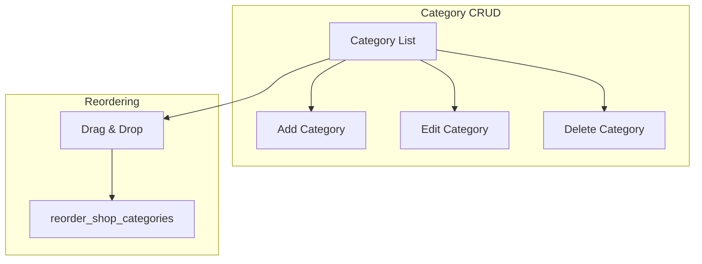

# Studio — Categories



The category management page at `/studio/shop/categories` provides a table view with add, edit, delete, and drag-and-drop reordering.

---

## Category service

```typescript
// app/src/services/category.service.ts
import { supabase } from '@/lib/supabase';

export async function getStudioCategories() {
  const { data, error } = await supabase
    .from('shop_categories')
    .select('*')
    .order('sort_order', { ascending: true });
  
  if (error) throw error;
  return data;
}

export async function upsertShopCategory(args: {
  p_category_id?: string;
  p_name: string;
  p_slug?: string;
  p_description?: string;
  p_sort_order?: number;
  p_is_visible?: boolean;
}) {
  const { data, error } = await supabase.rpc('upsert_shop_category', args);
  if (error) throw error;
  return data;
}

export async function deleteShopCategory(args: {
  p_category_id: string;
}) {
  const { data, error } = await supabase.rpc('delete_shop_category', args);
  if (error) throw error;
  return data;
}

export async function reorderShopCategories(args: {
  p_category_ids: string[];
}) {
  const { data, error } = await supabase.rpc('reorder_shop_categories', args);
  if (error) throw error;
  return data;
}
```

---

## Category hooks

```typescript
// app/src/hooks/use-categories.ts
import { useQuery, useMutation, useQueryClient } from '@tanstack/react-query';
import { getStudioCategories, upsertShopCategory, deleteShopCategory, reorderShopCategories } from '@/services/category.service';

export function useCategories() {
  return useQuery({
    queryKey: ['shop', 'categories'],
    queryFn: getStudioCategories,
  });
}

export function useUpsertCategory() {
  const qc = useQueryClient();
  
  return useMutation({
    mutationFn: upsertShopCategory,
    onSuccess: () => {
      qc.invalidateQueries({ queryKey: ['shop', 'categories'] });
    },
  });
}

export function useDeleteCategory() {
  const qc = useQueryClient();
  
  return useMutation({
    mutationFn: deleteShopCategory,
    onSuccess: () => {
      qc.invalidateQueries({ queryKey: ['shop', 'categories'] });
    },
  });
}

export function useReorderCategories() {
  const qc = useQueryClient();
  
  return useMutation({
    mutationFn: reorderShopCategories,
    onSuccess: () => {
      qc.invalidateQueries({ queryKey: ['shop', 'categories'] });
    },
  });
}
```

---

## Add category dialog

Name and optional description form following the create product dialog pattern:

```tsx
// app/src/components/studio/category-dialog.tsx
import { useForm } from 'react-hook-form';
import { zodResolver } from '@hookform/resolvers/zod';
import { z } from 'zod';

const categorySchema = z.object({
  name: z.string().min(1).max(100),
  description: z.string().max(500).optional(),
});

type CategoryFormValues = z.infer<typeof categorySchema>;

interface AddCategoryDialogProps {
  open: boolean;
  onOpenChange: (open: boolean) => void;
  onSuccess?: () => void;
}

export function AddCategoryDialog({ open, onOpenChange, onSuccess }: AddCategoryDialogProps) {
  const form = useForm<CategoryFormValues>({
    resolver: zodResolver(categorySchema),
    defaultValues: { name: '', description: '' },
  });

  const upsertMutation = useUpsertCategory();

  const onSubmit = form.handleSubmit(async (values) => {
    await upsertMutation.mutateAsync({
      p_name: values.name,
      p_description: values.description,
    });
    form.reset();
    onOpenChange(false);
    onSuccess?.();
  });

  return (
    <Dialog open={open} onOpenChange={onOpenChange}>
      <DialogContent>
        <DialogHeader>
          <DialogTitle>Add Category</DialogTitle>
        </DialogHeader>
        
        <form onSubmit={onSubmit} className="space-y-4">
          <div className="space-y-2">
            <Label htmlFor="name">Name</Label>
            <Input
              id="name"
              placeholder="e.g. Coffee Beans"
              {...form.register('name')}
            />
            {form.formState.errors.name && (
              <p className="text-sm text-destructive">
                {form.formState.errors.name.message}
              </p>
            )}
          </div>

          <div className="space-y-2">
            <Label htmlFor="description">Description (optional)</Label>
            <Textarea
              id="description"
              placeholder="Brief description of this category"
              {...form.register('description')}
            />
          </div>

          <div className="flex justify-end gap-2">
            <Button type="button" variant="outline" onClick={() => onOpenChange(false)}>
              Cancel
            </Button>
            <Button type="submit" disabled={upsertMutation.isPending}>
              {upsertMutation.isPending ? 'Adding...' : 'Add Category'}
            </Button>
          </div>
        </form>
      </DialogContent>
    </Dialog>
  );
}
```

---

## Edit category dialog

Pre-filled form for editing:

```tsx
// app/src/components/studio/category-dialog.tsx
interface EditCategoryDialogProps {
  open: boolean;
  onOpenChange: (open: boolean) => void;
  category: ShopCategory | null;
  onSuccess?: () => void;
}

export function EditCategoryDialog({ open, onOpenChange, category, onSuccess }: EditCategoryDialogProps) {
  const form = useForm<CategoryFormValues>({
    resolver: zodResolver(categorySchema),
    defaultValues: { name: '', description: '' },
  });

  // Reset form when category changes
  useEffect(() => {
    if (category) {
      form.reset({ name: category.name, description: category.description || '' });
    }
  }, [category, form]);

  const upsertMutation = useUpsertCategory();

  const onSubmit = form.handleSubmit(async (values) => {
    await upsertMutation.mutateAsync({
      p_category_id: category!.id,
      p_name: values.name,
      p_description: values.description,
    });
    form.reset();
    onOpenChange(false);
    onSuccess?.();
  });

  return (
    <Dialog open={open} onOpenChange={onOpenChange}>
      <DialogContent>
        <DialogHeader>
          <DialogTitle>Edit Category</DialogTitle>
        </DialogHeader>
        
        <form onSubmit={onSubmit} className="space-y-4">
          <div className="space-y-2">
            <Label htmlFor="name">Name</Label>
            <Input
              id="name"
              placeholder="e.g. Coffee Beans"
              {...form.register('name')}
            />
          </div>

          <div className="space-y-2">
            <Label htmlFor="description">Description (optional)</Label>
            <Textarea
              id="description"
              placeholder="Brief description of this category"
              {...form.register('description')}
            />
          </div>

          <div className="flex justify-end gap-2">
            <Button type="button" variant="outline" onClick={() => onOpenChange(false)}>
              Cancel
            </Button>
            <Button type="submit" disabled={upsertMutation.isPending}>
              {upsertMutation.isPending ? 'Saving...' : 'Save Changes'}
            </Button>
          </div>
        </form>
      </DialogContent>
    </Dialog>
  );
}
```

---

## Category list with table

Table with status toggle and actions, following the products table pattern:

```tsx
// app/src/pages/studio/shop/categories/CategoryList.tsx
import { useState } from 'react';
import { useQueryClient } from '@tanstack/react-query';
import { useCategories, useUpsertCategory, useDeleteCategory } from '@/hooks/use-categories';
import { ToggleAlertDialog } from '@/components/ui/toggle-alert-dialog';
import { Badge } from '@/components/ui/badge';
import { Button } from '@/components/ui/button';
import { Textarea } from '@/components/ui/textarea';
import { PlusIcon, Pencil1Icon, TrashIcon } from '@radix-ui/react-icons';

export function CategoryList() {
  const qc = useQueryClient();
  const { data: categories, isLoading } = useCategories();
  
  const [addDialogOpen, setAddDialogOpen] = useState(false);
  const [editCategory, setEditCategory] = useState<ShopCategory | null>(null);
  const [deleteCategory, setDeleteCategory] = useState<ShopCategory | null>(null);

  const upsertMutation = useUpsertCategory();
  const deleteMutation = useDeleteCategory();

  const handleToggleVisibility = async (category: ShopCategory) => {
    await upsertMutation.mutateAsync({
      p_category_id: category.id,
      p_is_visible: !category.is_visible,
    });
  };

  const handleDelete = async () => {
    if (!deleteCategory) return;
    await deleteMutation.mutateAsync({ p_category_id: deleteCategory.id });
    setDeleteCategory(null);
  };

  if (isLoading) return <div>Loading...</div>;

  return (
    <div className="space-y-4">
      <div className="flex justify-end">
        <Button onClick={() => setAddDialogOpen(true)}>
          <PlusIcon className="mr-2 h-4 w-4" />
          Add Category
        </Button>
      </div>

      <div className="rounded-lg border">
        <Table>
          <TableHeader>
            <TableRow>
              <TableHead>Name</TableHead>
              <TableHead>Slug</TableHead>
              <TableHead>Status</TableHead>
              <TableHead>Products</TableHead>
              <TableHead className="w-[100px]">Actions</TableHead>
            </TableRow>
          </TableHeader>
          <TableBody>
            {categories?.map((category) => (
              <TableRow key={category.id}>
                <TableCell className="font-medium">{category.name}</TableCell>
                <TableCell className="font-mono text-muted-foreground">
                  {category.slug}
                </TableCell>
                <TableCell>
                  <Badge
                    variant={category.is_visible ? 'default' : 'secondary'}
                    className={category.is_visible ? 'bg-green-500' : ''}
                  >
                    {category.is_visible ? 'Visible' : 'Hidden'}
                  </Badge>
                </TableCell>
                <TableCell>
                  <Badge variant="secondary">
                    {category.product_count} product{category.product_count !== 1 ? 's' : ''}
                  </Badge>
                </TableCell>
                <TableCell>
                  <div className="flex items-center gap-1">
                    <Button
                      variant="ghost"
                      size="icon"
                      onClick={() => setEditCategory(category)}
                    >
                      <Pencil1Icon className="h-4 w-4" />
                    </Button>
                    <Button
                      variant="ghost"
                      size="icon"
                      onClick={() => setDeleteCategory(category)}
                    >
                      <TrashIcon className="h-4 w-4" />
                    </Button>
                  </div>
                </TableCell>
              </TableRow>
            ))}
          </TableBody>
        </Table>
      </div>

      <AddCategoryDialog
        open={addDialogOpen}
        onOpenChange={setAddDialogOpen}
      />

      <EditCategoryDialog
        open={!!editCategory}
        onOpenChange={(open) => !open && setEditCategory(null)}
        category={editCategory}
      />

      <ToggleAlertDialog
        open={!!deleteCategory}
        onOpenChange={(open) => !open && setDeleteCategory(null)}
        onConfirm={handleDelete}
        title="Delete Category"
        description={`Are you sure you want to delete "${deleteCategory?.name}"? Products in this category will no longer be associated with any category.`}
        confirmText="Delete"
        variant="destructive"
      />
    </div>
  );
}
```

---

## Status toggle with proper type

Use the `is_visible` field with colored badges:

```tsx
<Badge
  variant={category.is_visible ? 'default' : 'secondary'}
  className={category.is_visible ? 'bg-green-500 hover:bg-green-600' : ''}
>
  {category.is_visible ? 'Visible' : 'Hidden'}
</Badge>
```

---

## Delete confirmation with ToggleAlertDialog

Following the products table pattern:

```tsx
<ToggleAlertDialog
  open={!!deleteCategory}
  onOpenChange={(open) => !open && setDeleteCategory(null)}
  onConfirm={handleDelete}
  title="Delete Category"
  description={`Are you sure you want to delete "${deleteCategory?.name}"? Products in this category will no longer be associated with any category.`}
  confirmText="Delete"
  variant="destructive"
/>
```

---

## Table header with sorting and filters

Using nuqs for sorting/filters:

```tsx
// In the table header
<TableHead>
  <NuqsSort value="name" direction="asc">
    <button className="flex items-center gap-1">
      Name
      <SortIcon className="h-4 w-4" />
    </button>
  </NuqsSort>
</TableHead>

<TableHead>
  <NuqsSort value="sort_order" direction="asc">
    <button className="flex items-center gap-1">
      Order
      <SortIcon className="h-4 w-4" />
    </button>
  </NuqsSort>
</TableHead>
```

---

## Drag and drop reordering

Using `@dnd-kit/core` for accessible drag-and-drop:

```tsx
// app/src/components/studio/category-draggable-list.tsx
import {
  DndContext,
  closestCenter,
  KeyboardSensor,
  PointerSensor,
  useSensor,
  useSensors,
  DragEndEvent,
} from '@dnd-kit/core';
import {
  arrayMove,
  SortableContext,
  sortableKeyboardCoordinates,
  verticalListSortingStrategy,
  useSortable,
} from '@dnd-kit/sortable';
import { CSS } from '@dnd-kit/utilities';

interface Category {
  id: string;
  name: string;
  description?: string;
  is_visible: boolean;
  product_count: number;
}

interface CategoryDraggableListProps {
  items: Category[];
  onReorder: (ids: string[]) => void;
}

function SortableRow({ category }: { category: Category }) {
  const {
    attributes,
    listeners,
    setNodeRef,
    transform,
    transition,
  } = useSortable({ id: category.id });

  const style = {
    transform: CSS.Transform.toString(transform),
    transition,
  };

  return (
    <div ref={setNodeRef} style={style} {...attributes} {...listeners}>
      {/* Category row content */}
      <div className="flex items-center gap-2 p-3 bg-background border rounded-lg">
        <GripIcon className="h-4 w-4 text-muted-foreground" />
        <span>{category.name}</span>
      </div>
    </div>
  );
}

export function CategoryDraggableList({ items, onReorder }: CategoryDraggableListProps) {
  const sensors = useSensors(
    useSensor(PointerSensor),
    useSensor(KeyboardSensor, {
      coordinateGetter: sortableKeyboardCoordinates,
    })
  );

  const handleDragEnd = (event: DragEndEvent) => {
    const { active, over } = event;

    if (over && active.id !== over.id) {
      const oldIndex = items.findIndex((item) => item.id === active.id);
      const newIndex = items.findIndex((item) => item.id === over.id);
      const newItems = arrayMove(items, oldIndex, newIndex);
      onReorder(newItems.map((item) => item.id));
    }
  };

  return (
    <DndContext
      sensors={sensors}
      collisionDetection={closestCenter}
      onDragEnd={handleDragEnd}
    >
      <SortableContext
        items={items.map((item) => item.id)}
        strategy={verticalListSortingStrategy}
      >
        <div className="space-y-2">
          {items.map((category) => (
            <SortableRow key={category.id} category={category} />
          ))}
        </div>
      </SortableContext>
    </DndContext>
  );
}
```

Usage in the page:

```tsx
// In CategoryList.tsx
const reorderMutation = useReorderCategories();

<CategoryDraggableList
  items={categories ?? []}
  onReorder={(ids) => reorderMutation.mutate({ p_category_ids: ids })}
/>
```

---

## Infinite pagination (if needed for large lists)

For studios with many categories:

```tsx
// Using the same pattern as products table
function CategoryList() {
  const [pagination, setPagination] = useState({ limit: 20, offset: 0 });
  
  const { data, isLoading } = useInfiniteQuery({
    queryKey: ['shop', 'categories', pagination],
    queryFn: () => getStudioCategories({ ...pagination }),
    getNextPageParam: (lastPage, allPages) => 
      lastPage.length === pagination.limit ? pagination.offset + pagination.limit : undefined,
  });

  const categories = useMemo(
    () => data?.pages.flat() ?? [],
    [data]
  );
}
```

---

## Key patterns summary

| Feature | Implementation |
|---------|-----------------|
| Add category | Dialog with name-only form |
| Edit category | Dialog with pre-filled form |
| Delete category | ToggleAlertDialog with confirmation |
| Visibility toggle | `upsert_shop_category({ p_is_visible: ... })` |
| Reordering | `@dnd-kit` + `reorder_shop_categories` |
| Status badge | Green for visible, gray for hidden |
| Error handling | Via ShopError codes from RPC response |