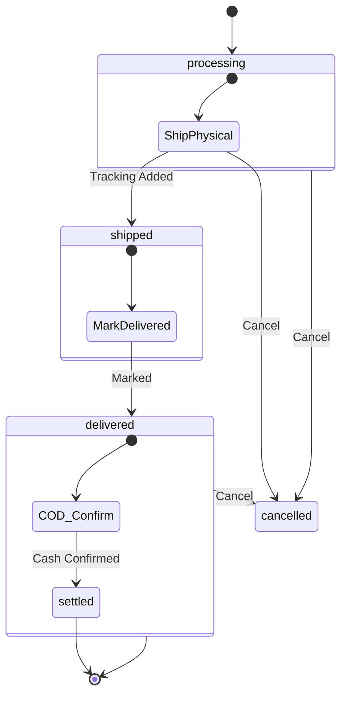

# Studio — Order Management



The orders tab at `/studio/shop/orders` shows the seller's order list with status filtering. Each order card includes buyer info, per-item fulfillment actions, and COD-specific controls.

## Overview dashboard

Before diving into the order list, here's the overview dashboard that drives the top-level numbers:

```tsx
// app/src/pages/studio/ShopOverview.tsx
export function ShopOverview() {
  const { data, isLoading } = useQuery({
    queryKey: ['shop', 'overview'],
    queryFn: getShopOverview,
    refetchOnWindowFocus: true,
  });

  if (isLoading) return <ShopOverviewSkeleton />;
  if (!data?.success) return <ErrorState />;

  const { revenue, orders, products, pending_count, pending_last_30,
          pending_prev_30, cash_pending_count, top_selling,
          recent_orders, eligibility } = data;

  return (
    <div className="space-y-8">
      {/* Deactivation banner — rendered at the top if ineligible */}
      {!eligibility.eligible && <ShopDeactivationBanner eligibility={eligibility} />}

      {/* Metric cards */}
      <div className="grid grid-cols-2 md:grid-cols-4 gap-4">
        <MetricCard
          label="Revenue (30d)"
          value={`৳${revenue.last_30_days.toLocaleString()}`}
          delta={percentDelta(revenue.last_30_days, revenue.prev_30_days)}
        />
        <MetricCard
          label="Orders (30d)"
          value={String(orders.last_30_days)}
          delta={percentDelta(orders.last_30_days, orders.prev_30_days)}
        />
        <MetricCard
          label="Published products"
          value={String(products.published)}
        />
        <MetricCard
          label="To ship"
          value={String(pending_count)}
          variant={pending_count > 0 ? 'warning' : 'default'}
        />
      </div>

      {/* COD alert */}
      {cash_pending_count > 0 && (
        <Alert variant="warning">
          <AlertTitle>{cash_pending_count} COD order{cash_pending_count > 1 ? 's' : ''} awaiting cash confirmation</AlertTitle>
          <AlertDescription>
            <Link to="/studio/shop/orders?status=cash_pending">Review →</Link>
          </AlertDescription>
        </Alert>
      )}

      <TopSellersList items={top_selling} />
      <RecentOrdersList items={recent_orders} />
    </div>
  );
}

function percentDelta(current: number, previous: number): number | null {
  if (previous === 0) return current > 0 ? 100 : null;
  return ((current - previous) / previous) * 100;
}
```

---

## Order list

```tsx
// app/src/pages/studio/shop/orders/SellerOrderList.tsx
import { useQueryState } from 'nuqs';

const FILTER_TABS = [
  { value: 'all',          label: 'All' },
  { value: 'processing',   label: 'To ship' },
  { value: 'shipped',      label: 'Shipped' },
  { value: 'delivered',    label: 'Delivered' },
  { value: 'cash_pending', label: 'Cash pending' },
  { value: 'cancelled',    label: 'Cancelled' },
];

export function SellerOrderList() {
  const [filter, setFilter] = useQueryState('status', { defaultValue: 'all' });
  const qc = useQueryClient();

  const { data, fetchNextPage, hasNextPage, isFetchingNextPage } = useInfiniteQuery({
    queryKey: ['shop', 'orders', 'seller', filter],
    queryFn: ({ pageParam }) =>
      getSellerOrders({ p_item_status: filter === 'all' ? null : filter, p_cursor: pageParam }),
    getNextPageParam: (last) =>
      last.has_more ? last.orders[last.orders.length - 1]?.created_at : undefined,
    initialPageParam: null,
  });

  const orders = data?.pages.flatMap((p) => p.orders) ?? [];

  return (
    <div className="space-y-6">
      <Tabs value={filter} onValueChange={setFilter}>
        <TabsList>
          {FILTER_TABS.map((t) => (
            <TabsTrigger key={t.value} value={t.value}>{t.label}</TabsTrigger>
          ))}
        </TabsList>
      </Tabs>

      <div className="space-y-4">
        {orders.map((o) => <SellerOrderCard key={o.order_number} order={o} />)}
      </div>

      <InfiniteScrollSentinel hasNextPage={hasNextPage} fetchNextPage={fetchNextPage} />
    </div>
  );
}
```

---

## Seller order card

```tsx
function SellerOrderCard({ order }: { order: SellerOrderCard }) {
  return (
    <Card className="p-5">
      <header className="flex items-start justify-between mb-4">
        <div className="flex gap-3">
          <Avatar src={order.buyer.avatar_url} fallback={order.buyer.username[0].toUpperCase()} />
          <div>
            <div className="font-medium">{order.buyer.display_name ?? order.buyer.username}</div>
            <div className="text-sm text-muted-foreground">@{order.buyer.username}</div>
            <div className="text-xs text-muted-foreground mt-0.5">
              {order.order_number} · {formatDate(order.created_at)}
            </div>
          </div>
        </div>
        <PaymentBadge method={order.payment_method} settled={!!order.cod_settled_at} />
      </header>

      {order.shipping_address && (
        <AddressBlock address={order.shipping_address} className="mb-3" />
      )}

      {order.buyer_notes && (
        <Alert className="mb-3">
          <AlertTitle className="text-sm font-medium">Note from buyer</AlertTitle>
          <AlertDescription className="text-sm">{order.buyer_notes}</AlertDescription>
        </Alert>
      )}

      <div className="space-y-2 divide-y">
        {order.items.map((item) => (
          <SellerItemRow key={item.id} item={item} paymentMethod={order.payment_method} />
        ))}
      </div>

      <footer className="mt-4 pt-3 border-t flex justify-between text-sm">
        <span className="text-muted-foreground">
          Total: ৳{(order.subtotal + order.shipping_total).toLocaleString()}
        </span>
        <span className="font-medium">
          Your net: ৳{order.seller_net.toLocaleString()}
        </span>
      </footer>
    </Card>
  );
}
```

---

## Per-item actions

Actions are determined by `item.status` and `paymentMethod`:

```tsx
function SellerItemRow({ item, paymentMethod }: { item: ShopOrderItem; paymentMethod: ShopPaymentMethod }) {
  const [trackingOpen, setTrackingOpen] = useState(false);
  const [cashOpen, setCashOpen] = useState(false);
  const [cancelOpen, setCancelOpen] = useState(false);

  const canCancel = paymentMethod === 'cod'
    && !item.cod_settled_at
    && ['processing', 'shipped', 'delivered'].includes(item.status);

  return (
    <div className="flex items-center justify-between gap-3 py-3">
      <div className="flex items-center gap-3 flex-1 min-w-0">
        {item.cover_image_url && (
          
        )}
        <div className="min-w-0">
          <div className="font-medium truncate">{item.product_title}</div>
          {item.variant_label && (
            <div className="text-sm text-muted-foreground">{item.variant_label}</div>
          )}
          <div className="text-sm text-muted-foreground">
            Qty {item.quantity} · ৳{item.unit_price.toLocaleString()}
          </div>
          {item.cancellation_reason && (
            <div className="mt-1 text-sm text-destructive">
              Cancelled: {item.cancellation_reason}
            </div>
          )}
        </div>
      </div>

      <div className="flex items-center gap-2 shrink-0">
        <ItemStatusBadge status={item.status} />

        {/* Ship */}
        {['processing', 'paid'].includes(item.status) && item.product_type === 'physical' && (
          <Button size="sm" onClick={() => setTrackingOpen(true)}>Ship</Button>
        )}

        {/* Mark delivered */}
        {item.status === 'shipped' && (
          <MarkDeliveredButton itemId={item.id} />
        )}

        {/* Confirm cash (COD only) */}
        {item.status === 'delivered' && paymentMethod === 'cod' && !item.cod_settled_at && (
          <Button size="sm" variant="default" onClick={() => setCashOpen(true)}>
            Confirm cash
          </Button>
        )}

        {/* Cancel */}
        {canCancel && (
          <Button size="sm" variant="ghost" onClick={() => setCancelOpen(true)}>
            Cancel
          </Button>
        )}
      </div>

      {trackingOpen && <TrackingModal item={item} onClose={() => setTrackingOpen(false)} />}
      {cashOpen && <CashConfirmModal item={item} onClose={() => setCashOpen(false)} />}
      {cancelOpen && <CancelModal item={item} onClose={() => setCancelOpen(false)} />}
    </div>
  );
}
```

---

## Tracking modal

```tsx
function TrackingModal({ item, onClose }: { item: ShopOrderItem; onClose: () => void }) {
  const qc = useQueryClient();
  const form = useForm({ defaultValues: { carrier: '', tracking_number: '', tracking_url: '' } });

  const mutation = useMutation({
    mutationFn: (v: typeof form.defaultValues) =>
      updateOrderTracking({
        p_order_item_id:   item.id,
        p_tracking_number: v.tracking_number,
        p_carrier:         v.carrier || null,
        p_tracking_url:    v.tracking_url || null,
      }),
    onSuccess: () => {
      qc.invalidateQueries({ queryKey: ['shop', 'orders'] });
      toast.success('Marked as shipped');
      onClose();
    },
  });

  return (
    <Dialog open onOpenChange={(o) => !o && onClose()}>
      <DialogContent>
        <DialogHeader><DialogTitle>Ship: {item.product_title}</DialogTitle></DialogHeader>

        <form onSubmit={form.handleSubmit((v) => mutation.mutate(v))} className="space-y-4">
          <FormField name="carrier" label="Carrier" optional>
            <Input {...form.register('carrier')} placeholder="e.g. Pathao, RedX, Sundarban" />
          </FormField>
          <FormField name="tracking_number" label="Tracking number" required>
            <Input {...form.register('tracking_number', { required: true })} />
          </FormField>
          <FormField name="tracking_url" label="Tracking URL" optional>
            <Input type="url" {...form.register('tracking_url')} />
          </FormField>
          <DialogFooter>
            <Button type="submit" disabled={mutation.isPending}>Mark as shipped</Button>
          </DialogFooter>
        </form>
      </DialogContent>
    </Dialog>
  );
}
```

---

## Cash confirmation modal

Shows a fee breakdown before the seller confirms. The actual fee is computed server-side.

```tsx
function CashConfirmModal({ item, onClose }: { item: ShopOrderItem; onClose: () => void }) {
  const qc = useQueryClient();

  const itemTotal = (item.unit_price + item.shipping_cost) * item.quantity;
  const estimatedFee = Math.round(itemTotal * 0.10 * 100) / 100;  // informational only

  const mutation = useMutation({
    mutationFn: () => confirmCodCashReceived({ p_order_item_id: item.id }),
    onSuccess: (result) => {
      qc.invalidateQueries({ queryKey: ['shop', 'orders'] });
      qc.invalidateQueries({ queryKey: ['shop', 'overview'] });
      qc.invalidateQueries({ queryKey: ['wallet'] });

      if (result.cod_debt_added > 0) {
        toast.warning(
          `Cash confirmed — ৳${result.cod_debt_added.toLocaleString()} added to your COD debt. Top up your wallet to clear it.`,
          { duration: 8000 }
        );
      } else {
        toast.success(`Done. ৳${result.fee_amount.toLocaleString()} platform fee deducted.`);
      }
      onClose();
    },
  });

  return (
    <Dialog open onOpenChange={(o) => !o && onClose()}>
      <DialogContent>
        <DialogHeader>
          <DialogTitle>Confirm cash received</DialogTitle>
          <DialogDescription>
            Confirm you've collected ৳{itemTotal.toLocaleString()} for this item.
          </DialogDescription>
        </DialogHeader>

        <div className="rounded-lg border bg-muted p-4 text-sm space-y-1">
          <div className="flex justify-between">
            <span>Item total</span><span>৳{itemTotal.toLocaleString()}</span>
          </div>
          <div className="flex justify-between text-muted-foreground">
            <span>Platform fee (~10%)</span><span>~৳{estimatedFee.toLocaleString()}</span>
          </div>
          <div className="flex justify-between font-medium pt-2 border-t">
            <span>You keep</span><span>৳{(itemTotal - estimatedFee).toLocaleString()}</span>
          </div>
        </div>

        <p className="text-xs text-muted-foreground">
          If your wallet balance is insufficient, the fee will be added to your COD debt.
        </p>

        <DialogFooter>
          <Button variant="ghost" onClick={onClose}>Not yet</Button>
          <Button onClick={() => mutation.mutate()} disabled={mutation.isPending}>
            Yes, I received the cash
          </Button>
        </DialogFooter>
      </DialogContent>
    </Dialog>
  );
}
```

---

## Cancel modal

Reason is mandatory and shown to the buyer verbatim.

```tsx
function CancelModal({ item, onClose }: { item: ShopOrderItem; onClose: () => void }) {
  const [reason, setReason] = useState('');
  const qc = useQueryClient();

  const mutation = useMutation({
    mutationFn: () => cancelCodOrderItem({ p_order_item_id: item.id, p_reason: reason.trim() }),
    onSuccess: () => {
      qc.invalidateQueries({ queryKey: ['shop', 'orders'] });
      toast.success('Order item cancelled');
      onClose();
    },
    onError: (err) => {
      if (err instanceof ShopError && err.code === 'CANCELLATION_REASON_REQUIRED') {
        toast.error('Please enter a reason before cancelling.');
      } else {
        toast.error(err.message);
      }
    },
  });

  return (
    <Dialog open onOpenChange={(o) => !o && onClose()}>
      <DialogContent>
        <DialogHeader>
          <DialogTitle>Cancel: {item.product_title}</DialogTitle>
          <DialogDescription>
            The buyer will see this reason. Be specific so they know what happened.
          </DialogDescription>
        </DialogHeader>

        <Textarea
          value={reason}
          onChange={(e) => setReason(e.target.value)}
          placeholder='e.g. "Out of stock — we expect to restock in 2 weeks"'
          rows={4}
        />

        <DialogFooter>
          <Button variant="ghost" onClick={onClose}>Keep order</Button>
          <Button
            variant="destructive"
            disabled={!reason.trim() || mutation.isPending}
            onClick={() => mutation.mutate()}
          >
            Cancel order
          </Button>
        </DialogFooter>
      </DialogContent>
    </Dialog>
  );
}
```

---

## Shop deactivation banner

Rendered at the top of the overview page (and the settings page) when `eligibility.eligible = false`.

```tsx
function ShopDeactivationBanner({ eligibility }: { eligibility: EligibilityResult }) {
  const { reasons, wallet_balance, cod_debt, wallet_floor, aged_cod_orders, settlement_max_days } = eligibility;

  return (
    <Alert variant="destructive">
      <AlertCircleIcon className="h-4 w-4" />
      <AlertTitle>Your shop is paused</AlertTitle>
      <AlertDescription className="space-y-3 mt-2">

        {reasons.includes('wallet_below_floor') && (
          <div>
            <p className="font-medium">Wallet balance is below the limit.</p>
            <p className="text-sm">
              Available: ৳{(wallet_balance - cod_debt).toLocaleString()} · Limit: ৳{wallet_floor}
              {cod_debt > 0 && ` · COD debt: ৳${cod_debt.toLocaleString()}`}
            </p>
            <Button asChild size="sm" variant="outline" className="mt-2">
              <Link to="/studio/wallet">Top up wallet</Link>
            </Button>
          </div>
        )}

        {reasons.includes('cod_aging') && (
          <div>
            <p className="font-medium">
              {aged_cod_orders} COD order{aged_cod_orders > 1 ? 's' : ''} older than {settlement_max_days} days
              are waiting for cash confirmation.
            </p>
            <Button asChild size="sm" variant="outline" className="mt-2">
              <Link to="/studio/shop/orders?status=cash_pending">Review orders</Link>
            </Button>
          </div>
        )}

        <p className="text-sm border-t pt-2">
          Resolve the above, then reactivate your shop in{' '}
          <Link to="/studio/shop/settings" className="underline">settings</Link>.
        </p>
      </AlertDescription>
    </Alert>
  );
}
```
