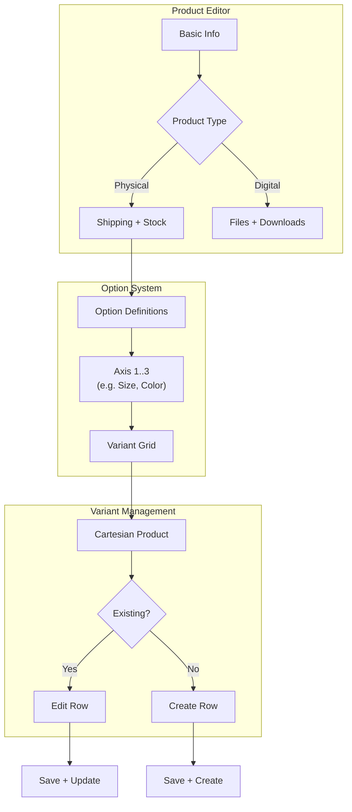

# Studio — Products & Variants



The product editor at `/studio/shop/products/[id]` (or `/new`) is one form with conditional sections gated on `product_type`. Variant management lives in a sub-section that becomes available once `option_definitions` is set.

## Product list

```tsx
// app/src/pages/studio/shop/products/ProductList.tsx
export function ProductList() {
  const { data: products } = useQuery({
    queryKey: ['shop', 'products'],
    queryFn: getStudioProducts,  // includes soft-deleted + inactive
  });

  const reorderMutation = useMutation({
    mutationFn: (ids: string[]) => reorderShopProducts({ p_product_ids: ids }),
    onSuccess: () => qc.invalidateQueries({ queryKey: ['shop', 'products'] }),
  });

  return (
    <DraggableList
      items={products ?? []}
      keyFn={(p) => p.id}
      onReorder={(ids) => reorderMutation.mutate(ids)}
      renderItem={(p) => <ProductRow product={p} />}
    />
  );
}
```

Soft-deleted products show a "Deleted" badge and no edit controls.

> **Approval workflow:** Products do not have an owner-side active/inactive toggle. `is_active` is exclusively controlled by managers via `approve_shop_product`. The product lifecycle is:
> - **New product / any edit** → `upsert_shop_product` sets `approval_status = 'draft'` on `shop_product_drafts`. The product is saved but **not yet in the manager queue**.
> - **Submit for review** → seller explicitly calls `submit_shop_product_for_review(product_id)` → `approval_status = 'pending'`. This is what puts the product in the manager queue.
> - **Edit of a live product** → live row stays online untouched; only `shop_product_drafts` is written as `'draft'`. Seller must submit again to queue the change.
> - **After rejection** → re-editing resets to `'draft'`; seller must submit again.
>
> Display the product's approval state by joining `shop_product_drafts` (query key `['shop', 'product-drafts']`):
> - `approval_status = 'draft'` → show a "Draft" badge + "Submit for review" button
> - `approval_status = 'pending'` → show a "Pending review" badge (no submit button)
> - `approval_status = 'rejected'` → show a "Rejected" badge and surface `rejection_reason` in the edit form so the creator knows what to fix

---

## Draft service & hook

Fetch the owner's product drafts alongside the product list to display approval state:

```typescript
// app/src/services/product.service.ts (additions)
// ApprovalStatus = 'draft' | 'pending' | 'approved' | 'rejected'
import type { ApprovalStatus } from '@/types/shop';

export interface ShopProductDraft {
  id: string;
  product_id: string;
  profile_id: string;
  approval_status: ApprovalStatus;
  rejection_reason: string | null;
  // ... mirrors all editable product columns
  updated_at: string;
}

export async function getProductDrafts(): Promise<ShopProductDraft[]> {
  const { data, error } = await supabase.from('shop_product_drafts').select('*');
  if (error) throw error;
  return data;
}
```

```typescript
// app/src/hooks/use-products.ts (additions)
// Returns a map of product_id → draft for O(1) lookup in the product list
export function useProductDrafts() {
  return useQuery({
    queryKey: ['shop', 'product-drafts'],
    queryFn: async () => {
      const drafts = await getProductDrafts();
      return Object.fromEntries(drafts.map((d) => [d.product_id, d]));
    },
  });
}
```

Invalidate `['shop', 'product-drafts']` alongside `['shop', 'products']` on every upsert mutation `onSuccess`.

### Product approval badge

```tsx
// app/src/components/studio/product-approval-badge.tsx
interface ProductApprovalBadgeProps {
  isActive: boolean;
  draft: ShopProductDraft | undefined;
}

export function ProductApprovalBadge({ isActive, draft }: ProductApprovalBadgeProps) {
  if (draft?.approval_status === 'rejected') {
    return (
      <Badge variant="destructive" title={draft.rejection_reason ?? undefined}>
        Rejected
      </Badge>
    );
  }

  if (draft?.approval_status === 'pending') {
    return <Badge variant="secondary">Pending review</Badge>;
  }

  if (draft?.approval_status === 'draft') {
    return <Badge variant="outline">Draft</Badge>;
  }

  if (isActive) {
    return <Badge className="bg-green-500 hover:bg-green-600">Live</Badge>;
  }

  return <Badge variant="outline">Inactive</Badge>;
}
```

Show the rejection reason in the product edit form the same way as categories — a `ProductRejectionBanner` component above the form fields when `draft?.approval_status === 'rejected'`. Pre-fill the form from the draft fields (not the live row) so the creator edits from their last submission.

---

## Product form

The top of the form has a `product_type` selector that gates which sections appear below.

```tsx
const schema = z.discriminatedUnion('product_type', [
  z.object({
    product_type: z.literal('physical'),
    title:                      z.string().min(1).max(200),
    description:                z.string().optional(),
    sku:                        z.string().max(100).optional(),
    price:                      z.number().nonnegative(),
    compare_at_price:           z.number().nonnegative().nullable().optional(),
    cover_image_url:            z.string().url().optional(),
    images:                     z.array(z.string().url()).default([]),
    category_id:                z.string().uuid().nullable().optional(),
    option_definitions:         z.array(OptionAxisSchema).max(3).default([]),
    weight_grams:               z.number().int().nonnegative().optional(),
    shipping_fee_inside_dhaka:  z.number().nonnegative().default(0),
    shipping_fee_outside_dhaka: z.number().nonnegative().default(0),
    processing_min_days:        z.number().int().nonnegative().nullable().optional(),
    processing_max_days:        z.number().int().nonnegative().nullable().optional(),
    cod_enabled:                z.boolean().default(false),
    stock_count:                z.number().int().nonnegative().nullable().optional(),
    low_stock_threshold:        z.number().int().nonnegative().default(5),
    is_active:                  z.boolean().default(true),
    is_featured:                z.boolean().default(false),
    tags:                       z.array(z.string()).default([]),
  }),
  z.object({
    product_type: z.literal('digital'),
    // ... same shared fields, minus shipping and cod, plus:
    max_downloads:          z.number().int().positive().default(5),
    download_expires_hours: z.number().int().positive().default(72),
  }),
]);

const OptionAxisSchema = z.object({
  name:   z.string().min(1),
  values: z.array(z.string().min(1)).min(1),
});
```

### Form sections by type

```tsx
function ProductForm({ product }: { product?: ShopProductDetail }) {
  const form = useForm({ resolver: zodResolver(schema) });
  const productType = form.watch('product_type');

  return (
    <form onSubmit={...}>
      {/* Always shown */}
      <BasicInfoSection form={form} />
      <PricingSection form={form} />
      <ImagesSection form={form} />
      <OptionsSection form={form} />   {/* option_definitions editor */}

      {/* Physical only */}
      {productType === 'physical' && <ShippingSection form={form} />}
      {productType === 'physical' && <StockSection form={form} />}

      {/* Digital only */}
      {productType === 'digital' && <FilesSection productId={product?.id} />}
      {productType === 'digital' && <DownloadSettingsSection form={form} />}

      {/* Variants — available when option_definitions has at least one axis */}
      {product?.id && optionDefs.length > 0 && (
        <VariantGridSection product={product} />
      )}

      <Button type="submit">Save product</Button>
    </form>
  );
}
```

---

## Option definitions editor

Up to 3 axes. Each axis has a name and a list of values (like tags).

```tsx
// app/src/components/studio/OptionDefinitionsEditor.tsx
export function OptionDefinitionsEditor({
  value,
  onChange,
}: {
  value: ShopProductOptionDefinition[];
  onChange: (axes: ShopProductOptionDefinition[]) => void;
}) {
  const addAxis = () => {
    if (value.length >= 3) return;
    onChange([...value, { name: '', values: [] }]);
  };

  return (
    <div className="space-y-3">
      {value.map((axis, index) => (
        <Card key={index} className="p-4">
          <div className="flex items-start gap-3">
            <div className="flex-1 space-y-3">
              <div>
                <Label>Option name</Label>
                <Input
                  value={axis.name}
                  placeholder="e.g. Size, Color, Grind"
                  onChange={(e) => {
                    const next = [...value];
                    next[index] = { ...axis, name: e.target.value };
                    onChange(next);
                  }}
                />
              </div>
              <div>
                <Label>Values</Label>
                <TagInput
                  tags={axis.values}
                  placeholder="Type a value and press Enter"
                  onChange={(values) => {
                    const next = [...value];
                    next[index] = { ...axis, values };
                    onChange(next);
                  }}
                />
              </div>
            </div>
            <Button
              variant="ghost"
              size="icon"
              onClick={() => onChange(value.filter((_, i) => i !== index))}
            >
              <TrashIcon />
            </Button>
          </div>
        </Card>
      ))}

      {value.length < 3 ? (
        <Button type="button" variant="outline" onClick={addAxis}>
          + Add option
        </Button>
      ) : (
        <p className="text-sm text-muted-foreground">Maximum 3 option axes reached.</p>
      )}
    </div>
  );
}
```

::: info When to show the variant grid
The variant grid only appears when the **product already exists in the database** (i.e., edit mode, not create mode). On create, save the product first (which persists `option_definitions`), then the variant grid becomes available.

This is by design — variant rows reference `product_id`, so the product row must exist first.
:::

---

## Variant grid editor

The grid enumerates the cartesian product of all axis values and shows one row per combination. Existing variants are pre-filled; missing ones are empty rows.

```tsx
// Helper: build all combinations from option_definitions
function buildCartesian(axes: ShopProductOptionDefinition[]): ShopVariantOptions[] {
  if (axes.length === 0) return [];
  return axes.reduce<ShopVariantOptions[]>(
    (acc, axis) =>
      acc.length === 0
        ? axis.values.map((v) => ({ [axis.name]: v }))
        : acc.flatMap((combo) => axis.values.map((v) => ({ ...combo, [axis.name]: v }))),
    [],
  );
}

// Stable key for a combination
const comboKey = (opts: ShopVariantOptions) =>
  Object.entries(opts)
    .sort(([a], [b]) => a.localeCompare(b))
    .map(([k, v]) => `${k}:${v}`)
    .join('|');
```

```tsx
// app/src/components/studio/VariantGrid.tsx
export function VariantGrid({ product, variants }: VariantGridProps) {
  const [editingId, setEditingId] = useState<string | null>(null);
  const qc = useQueryClient();

  const cartesian = useMemo(
    () => buildCartesian(product.option_definitions),
    [product.option_definitions]
  );

  const existingMap = new Map(variants.map((v) => [comboKey(v.options), v]));

  return (
    <div className="rounded-lg border">
      <Table>
        <TableHeader>
          <TableRow>
            {product.option_definitions.map((ax) => (
              <TableHead key={ax.name}>{ax.name}</TableHead>
            ))}
            <TableHead>Adjustment</TableHead>
            <TableHead>Stock</TableHead>
            <TableHead>SKU</TableHead>
            <TableHead>Image</TableHead>
            <TableHead>Active</TableHead>
            <TableHead />
          </TableRow>
        </TableHeader>
        <TableBody>
          {cartesian.map((combo) => {
            const existing = existingMap.get(comboKey(combo));
            return (
              <VariantRow
                key={comboKey(combo)}
                productId={product.id}
                combo={combo}
                variant={existing}
                isEditing={editingId === comboKey(combo)}
                onEdit={() => setEditingId(comboKey(combo))}
                onDone={() => {
                  setEditingId(null);
                  qc.invalidateQueries({ queryKey: ['shop', 'product', product.id] });
                }}
              />
            );
          })}
        </TableBody>
      </Table>
    </div>
  );
}
```

```tsx
function VariantRow({ productId, combo, variant, isEditing, onEdit, onDone }: VariantRowProps) {
  const qc = useQueryClient();

  const saveMutation = useMutation({
    mutationFn: (values: VariantFormValues) =>
      upsertShopProductVariant(
        variant
          ? { p_variant_id: variant.id, ...values }         // edit (no p_options)
          : { p_product_id: productId, p_options: combo, ...values }  // create
      ),
    onSuccess: () => { toast.success('Saved'); onDone(); },
    onError: (err) => {
      if (err instanceof ShopError && err.code === 'VARIANT_COMBINATION_CONFLICT') {
        toast.error('This combination already exists.');
      } else {
        toast.error(err.message);
      }
    },
  });

  const deleteMutation = useMutation({
    mutationFn: () => deleteShopProductVariant({ p_variant_id: variant!.id }),
    onSuccess: () => {
      toast.success('Deleted');
      qc.invalidateQueries({ queryKey: ['shop', 'product', productId] });
    },
    onError: (err) => {
      if (err instanceof ShopError && err.code === 'VARIANT_HAS_ORDERS') {
        toast.error("Can't delete — this variant has been ordered. Deactivate it instead.");
      }
    },
  });

  // Option columns (read-only — immutable after creation)
  const optionCells = Object.values(combo).map((val, i) => (
    <TableCell key={i} className="font-mono text-sm">{val}</TableCell>
  ));

  if (!isEditing) {
    return (
      <TableRow className={!variant ? 'opacity-50' : undefined}>
        {optionCells}
        <TableCell>{variant ? `+৳${variant.price_adjustment}` : '—'}</TableCell>
        <TableCell>{variant?.stock_count ?? '—'}</TableCell>
        <TableCell className="font-mono text-sm">{variant?.sku ?? '—'}</TableCell>
        <TableCell>
          {variant?.image_url && (
            
          )}
        </TableCell>
        <TableCell>
          {variant ? (variant.is_active ? '✓' : '—') : '—'}
        </TableCell>
        <TableCell>
          <Button size="sm" variant="outline" onClick={onEdit}>
            {variant ? 'Edit' : 'Create'}
          </Button>
        </TableCell>
      </TableRow>
    );
  }

  return (
    <VariantEditRow
      combo={combo}
      variant={variant}
      onSave={(values) => saveMutation.mutate(values)}
      onDelete={variant ? () => deleteMutation.mutate() : undefined}
      onCancel={onDone}
    />
  );
}
```

### Key rules for the variant grid UI

| Rule | Why |
|---|---|
| Option columns are read-only in edit mode | `options` is immutable — changing the combination requires delete + create |
| Disable delete when `VARIANT_HAS_ORDERS` | Show "deactivate" as the alternative |
| Gray out rows with no variant | Shows the cartesian product; sparse combinations are valid |
| Show variant `image_url` as thumbnail | High value for physical products with color/style variants |

---

## Files (digital products)

```tsx
// app/src/components/studio/FilesSection.tsx
export function FilesSection({ productId }: { productId?: string }) {
  const qc = useQueryClient();

  const { data: files } = useQuery({
    queryKey: ['shop', 'product', productId, 'files'],
    queryFn: () => getProductFiles(productId!),
    enabled: !!productId,
  });

  const addMutation = useMutation({
    mutationFn: async (file: File) => {
      // 1. Upload to private Supabase Storage bucket
      const path = `products/${productId}/${crypto.randomUUID()}-${file.name}`;
      const { error: uploadError } = await supabase.storage
        .from('shop-product-files')
        .upload(path, file);
      if (uploadError) throw uploadError;

      // 2. Register the file via RPC (storage_path stays server-side)
      return addShopProductFile({
        p_product_id:      productId!,
        p_file_name:       file.name,
        p_storage_path:    path,
        p_file_size_bytes: file.size,
        p_mime_type:       file.type,
      });
    },
    onSuccess: () => {
      qc.invalidateQueries({ queryKey: ['shop', 'product', productId, 'files'] });
      toast.success('File added');
    },
  });

  const deleteMutation = useMutation({
    mutationFn: (fileId: string) => deleteShopProductFile({ p_file_id: fileId }),
    onSuccess: () => qc.invalidateQueries({ queryKey: ['shop', 'product', productId, 'files'] }),
  });

  return (
    <div className="space-y-3">
      <h3 className="font-medium">Downloadable files</h3>

      {files?.map((f) => (
        <div key={f.id} className="flex items-center justify-between p-3 rounded-md border">
          <div>
            <div className="font-medium">{f.file_name}</div>
            <div className="text-xs text-muted-foreground">
              {f.mime_type} · {formatBytes(f.file_size_bytes)}
            </div>
          </div>
          <Button
            variant="ghost"
            size="icon"
            onClick={() => deleteMutation.mutate(f.id)}
          >
            <TrashIcon />
          </Button>
        </div>
      ))}

      <FileDropzone onFile={(file) => addMutation.mutate(file)} />
    </div>
  );
}
```

::: danger Private bucket
Upload files to a **private** Supabase Storage bucket (not public). The `storage_path` is stored in `shop_product_files.storage_path` and never returned to clients. The `shop-download` Edge Function generates a short-lived signed URL at download time.
:::
