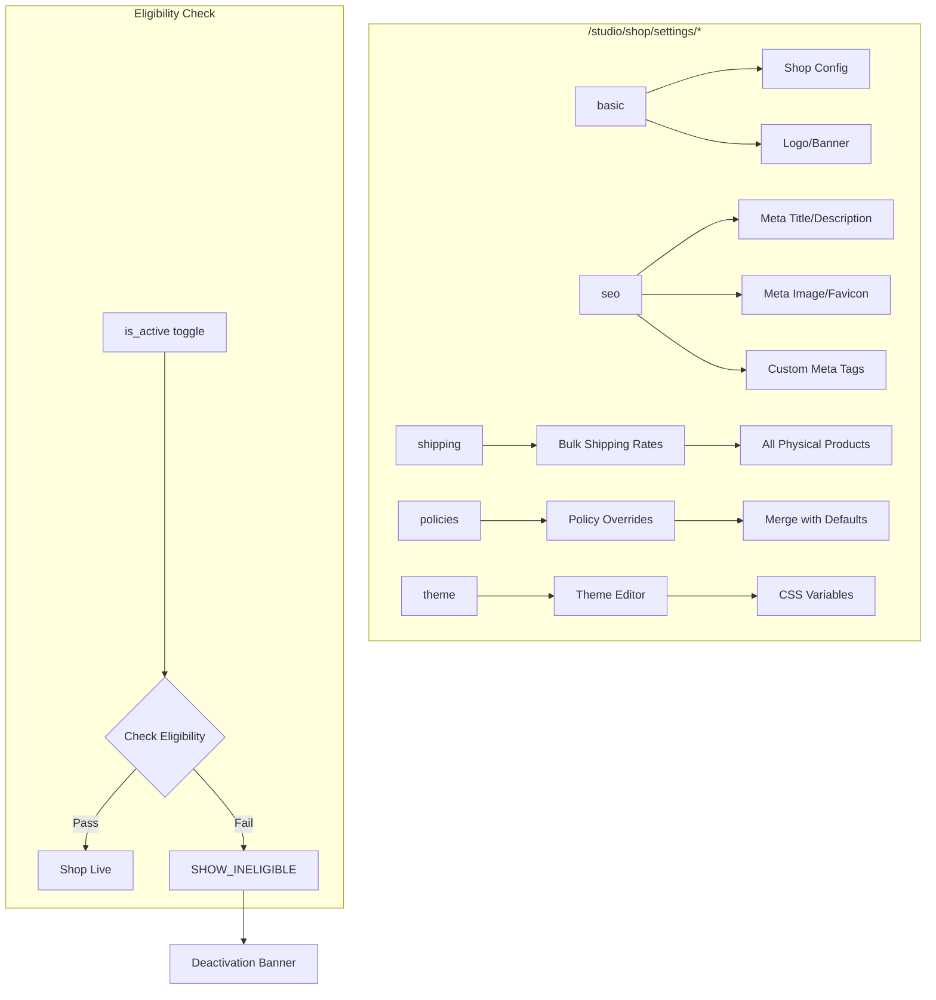

# Studio — Settings, Shipping & Policies

::: tip See also
The [Shop Settings](../backend/shop-settings) page has complete documentation on the eligibility system, shipping defaults, theming config, and platform settings that power these Studio panels.
:::



Settings panels under `/studio/shop/settings/*`:

| Sub-route | Panel | RPC |
|---|---|---|
| `basic` | Shop name, description, logo, banner, active toggle, public stats visibility toggle | `upsert_shop_settings` |
| `seo` | Meta title, description, banner image, favicon, custom meta tags | `upsert_shop_settings` |
| `shipping` | Shop-level shipping defaults + per-product overrides | `upsert_shop_settings`, `upsert_shop_product` |
| `policies` | Per-type markdown overrides | `upsert_shop_policy`, `delete_shop_policy` |
| `theme` | Color, typography, layout — see [Theming](./theming) | `upsert_shop_settings` |

### Removing logo or banner

Passing `null` for `p_logo_url` / `p_banner_url` is treated as "leave unchanged" by the RPC (coalesce semantics). To actually clear an image, pass the explicit-clear flag:

```ts
// remove banner
mutate({ clearBannerUrl: true })

// remove logo
mutate({ clearLogoUrl: true })
```

The `UpsertShopSettingsParams` interface exposes `clearBannerUrl?: boolean` and `clearLogoUrl?: boolean` which map to `p_clear_banner_url` / `p_clear_logo_url` in the RPC.

---

## Basic info form

Standard form with shadcn + react-hook-form + zod.

```tsx
// app/src/pages/studio/shop/settings/BasicInfoForm.tsx
const schema = z.object({
  shop_name:        z.string().min(1).max(100),
  shop_description: z.string().max(500).optional(),
  logo_url:         z.string().url().or(z.literal('')).optional(),
  banner_url:       z.string().url().or(z.literal('')).optional(),
  seo_title:        z.string().max(60).optional(),
  seo_description:  z.string().max(160).optional(),
});

export function BasicInfoForm({ initial }: { initial: Partial<ShopSettings> }) {
  const qc = useQueryClient();
  const form = useForm({ resolver: zodResolver(schema), defaultValues: initial });

  const mutation = useMutation({
    mutationFn: (values: z.infer<typeof schema>) =>
      upsertShopSettings(values),
    onSuccess: () => {
      toast.success('Settings saved');
      qc.invalidateQueries({ queryKey: ['shop', 'settings'] });
    },
    onError: (err) => toast.error(err.message),
  });

  return (
    <Form {...form}>
      <form onSubmit={form.handleSubmit((v) => mutation.mutate(v))} className="space-y-6">
        <FormField name="shop_name" control={form.control} render={({ field }) => (
          <FormItem>
            <FormLabel>Shop name</FormLabel>
            <FormControl><Input {...field} maxLength={100} /></FormControl>
            <FormMessage />
          </FormItem>
        )} />
        {/* shop_description, logo_url, banner_url, seo_title, seo_description ... */}
        <Button type="submit" disabled={mutation.isPending}>Save changes</Button>
      </form>
    </Form>
  );
}
```

### Active toggle

The active toggle needs special error handling because reactivating while ineligible returns `SHOP_INELIGIBLE`:

```tsx
const toggleMutation = useMutation({
  mutationFn: (active: boolean) => upsertShopSettings({ p_is_active: active }),
  onSuccess: () => {
    qc.invalidateQueries({ queryKey: ['shop'] });
    toast.success(wasActive ? 'Shop paused' : 'Shop is live!');
  },
  onError: (err) => {
    if (err instanceof ShopError && err.code === 'SHOP_INELIGIBLE') {
      // Show the same deactivation banner — see shop-deactivation section
      openEligibilityModal(err.details.eligibility as EligibilityResult);
    } else {
      toast.error(err.message);
    }
  },
});
```

When `p_is_active = false`, the RPC sets `deactivation_reason = 'manual'` and stamps `deactivated_at = now()`. When `p_is_active = true` and eligibility passes, it clears both `deactivation_reason` and `deactivated_at`. The same pairing is stamped by `set_shop_active_by_manager` (admin panel) and the nightly `auto_deactivate_ineligible_shops` cron job.

### Statistics visibility toggle

`show_statistics` (boolean, default `false`) is a separate owner opt-in controlling whether the public shop page's `stats` block (`total_products`, `total_sales`, `rating_avg`, `rating_count`) is shown at all. Pass `p_show_statistics: true/false` to `upsert_shop_settings` to toggle it — independent of `p_is_active`. When off, `get_shop_by_username` returns `stats: null` and skips exposing the (cached) rating columns; the underlying counters keep incrementing regardless, they're just not surfaced publicly. See [Public Pages](./public-pages) for the storefront-side contract.

---

## SEO settings

The `seo` sub-route manages all `<head>` metadata for the public shop page.

### Fields

| Field | DB column | Max |
|---|---|---|
| Meta title | `seo_title` | 60 chars |
| Meta description | `seo_description` | 160 chars |
| Meta image (OG banner) | `banner_url` | — |
| Favicon | `logo_url` | — |
| Custom meta tags | `seo_custom_meta_tags` | 10 tags |

### Custom meta tags (Advanced section)

An array of `{ name, content }` pairs stored as JSONB. Injected verbatim as `<meta name="…" content="…">` by Astro SSR.

```ts
// Shape stored in seo_custom_meta_tags
type CustomMetaTag = { name: string; content: string };
```

UI behaviour:
- Tags with an empty `name` are stripped before the mutation is called.
- Maximum 10 tags — the "Add tag" button is hidden once the limit is reached.
- Saving passes the full array to `p_seo_custom_meta_tags`; passing `null` leaves the stored value unchanged.

```ts
// In the form submit handler:
await upsertSettings.mutateAsync({
  seoTitle:        value.metaTitle,
  seoDescription:  value.metaDescription,
  customMetaTags:  localCustomTags.filter((t) => t.name.trim()),
  // ...image change flags
});
```

### SEO score checklist

The live SEO score panel (`SeoScore`) and search preview (`SeoPreview`) include a checklist. Items and their point values:

| Checklist item | Points | Controlled by |
|---|---|---|
| Meta Title | 25 | Seller |
| Meta Description | 25 | Seller |
| Meta Image | 20 | Seller |
| Favicon | 10 | Seller |
| Robots.txt | 8 | Platform |
| Sitemap | 8 | Platform |
| Structured Data | 4 | Platform |
| Custom Meta Tags | 0 (informational) | Seller |

---

## Shipping settings

The shipping tab has two sections:

1. **Shop defaults** — stored on `shop_settings`, inherited by new products automatically.
2. **Per-product overrides** — bulk editor over existing physical products.

### Shop-level shipping defaults

```tsx
// app/src/pages/studio/shop/settings/ShopShippingDefaults.tsx
const schema = z.object({
  p_shipping_fee_inside_dhaka:  z.coerce.number().min(0).optional(),
  p_shipping_fee_outside_dhaka: z.coerce.number().min(0).optional(),
  p_processing_min_days:        z.coerce.number().int().min(0).optional(),
  p_processing_max_days:        z.coerce.number().int().min(0).optional(),
  p_requires_shipping:          z.boolean().optional(),
  p_cod_enabled:                z.boolean().optional(),
  p_shipping_from_address:      z.object({
    division: z.string().min(1),
    district: z.string().min(1),
    thana:    z.string().min(1),
    address:  z.string().min(1),
  }).optional(),
}).refine(
  (v) =>
    v.p_processing_min_days == null ||
    v.p_processing_max_days == null ||
    v.p_processing_min_days <= v.p_processing_max_days,
  { message: 'Min days must be ≤ max days', path: ['p_processing_max_days'] }
);

const mutation = useMutation({
  mutationFn: (values: z.infer<typeof schema>) => upsertShopSettings(values),
  onSuccess: () => {
    toast.success('Shipping defaults saved');
    qc.invalidateQueries({ queryKey: ['shop', 'settings'] });
  },
});
```

These values pre-populate shipping fields when a seller creates a new product without explicitly setting them. The fallback chain is:

```
product param → shop_settings value → platform_settings default → hardcoded sentinel
```

So a seller who configures shop defaults never has to re-enter rates product by product.

::: tip COD enabled
The `p_cod_enabled` flag on shop settings is separate from `cod_enabled` on individual products. Shop-level `cod_enabled = true` means "new products should default to accepting COD". Existing products are not retroactively changed.
:::

### Per-product overrides

The per-product table is a **bulk editor** over all physical products' shipping rates and processing times. It exists alongside the per-product shipping fields in the product editor — use this when updating rates across the whole catalogue at once.

```tsx
// app/src/pages/studio/shop/settings/ShippingSettings.tsx
export function ShippingSettings() {
  const qc = useQueryClient();

  const { data: products } = useQuery({
    queryKey: ['shop', 'products', 'physical'],
    queryFn: () => getStudioProducts({ product_type: 'physical' }),
  });

  const updateMutation = useMutation({
    mutationFn: ({ productId, updates }: { productId: string; updates: Partial<ShippingFields> }) =>
      upsertShopProduct({ p_product_id: productId, ...updates }),
    onSuccess: () => qc.invalidateQueries({ queryKey: ['shop', 'products'] }),
  });

  return (
    <div className="space-y-4">
      <header>
        <h1 className="text-xl font-semibold">Shipping rates</h1>
        <p className="text-sm text-muted-foreground">
          Rates are applied per item at checkout based on the buyer's district.
          Buyers in Dhaka pay the inside-Dhaka rate; everyone else pays the outside-Dhaka rate.
        </p>
      </header>

      <Table>
        <TableHeader>
          <TableRow>
            <TableHead>Product</TableHead>
            <TableHead>Inside Dhaka (৳)</TableHead>
            <TableHead>Outside Dhaka (৳)</TableHead>
            <TableHead>Processing time</TableHead>
            <TableHead />
          </TableRow>
        </TableHeader>
        <TableBody>
          {products?.map((p) => (
            <ShippingRow key={p.id} product={p} onSave={updateMutation.mutate} />
          ))}
        </TableBody>
      </Table>
    </div>
  );
}
```

```tsx
function ShippingRow({ product, onSave }: ShippingRowProps) {
  const [edits, setEdits] = useState<Partial<ShippingFields>>({});
  const dirty = Object.keys(edits).length > 0;

  return (
    <TableRow>
      <TableCell className="font-medium">{product.title}</TableCell>
      <TableCell>
        <Input
          type="number"
          min={0}
          defaultValue={product.shipping_fee_inside_dhaka}
          onBlur={(e) =>
            setEdits({ ...edits, p_shipping_fee_inside_dhaka: Math.max(0, +e.target.value) })
          }
          className="w-28"
        />
      </TableCell>
      <TableCell>
        <Input
          type="number"
          min={0}
          defaultValue={product.shipping_fee_outside_dhaka}
          onBlur={(e) =>
            setEdits({ ...edits, p_shipping_fee_outside_dhaka: Math.max(0, +e.target.value) })
          }
          className="w-28"
        />
      </TableCell>
      <TableCell>
        <div className="flex items-center gap-1.5">
          <Input
            type="number"
            min={0}
            placeholder="min"
            defaultValue={product.processing_min_days ?? ''}
            onBlur={(e) =>
              setEdits({ ...edits, p_processing_min_days: +e.target.value || null })
            }
            className="w-16"
          />
          <span className="text-muted-foreground">–</span>
          <Input
            type="number"
            min={0}
            placeholder="max"
            defaultValue={product.processing_max_days ?? ''}
            onBlur={(e) =>
              setEdits({ ...edits, p_processing_max_days: +e.target.value || null })
            }
            className="w-16"
          />
          <span className="text-sm text-muted-foreground">days</span>
        </div>
      </TableCell>
      <TableCell>
        <Button
          size="sm"
          disabled={!dirty}
          onClick={() => onSave({ productId: product.id, updates: edits })}
        >
          Save
        </Button>
      </TableCell>
    </TableRow>
  );
}
```

::: warning Validate before saving
The SQL enforces `processing_min_days <= processing_max_days` via a check constraint. Validate on the client too, or the RPC will return a constraint violation error.
:::

---

## Policies editor

```tsx
// app/src/pages/studio/shop/settings/PoliciesEditor.tsx
const POLICY_TYPES: ShopPolicyType[] = [
  'return_refund', 'digital_products', 'shipping', 'privacy', 'terms_of_service',
];

export function PoliciesEditor({ username }: { username: string }) {
  const qc = useQueryClient();
  const { data } = useQuery({
    queryKey: ['shop', 'policies', 'mine'],
    queryFn: () => getShopPolicies(username),
  });

  const customs = useMemo(() => {
    const map = new Map<ShopPolicyType, ShopPolicy>();
    data?.policies?.forEach((p) => map.set(p.policy_type, p));
    return map;
  }, [data]);

  return (
    <div className="space-y-8">
      <header>
        <h1 className="text-xl font-semibold">Shop policies</h1>
        <p className="text-sm text-muted-foreground">
          These are shown publicly at <code>/@{username}/shops/policies</code>.
          Each policy falls back to a platform default if not customised.
        </p>
      </header>

      {POLICY_TYPES.map((type) => (
        <PolicySection key={type} policyType={type} existing={customs.get(type)} />
      ))}
    </div>
  );
}
```

```tsx
function PolicySection({
  policyType,
  existing,
}: {
  policyType: ShopPolicyType;
  existing?: ShopPolicy;
}) {
  const qc = useQueryClient();
  const [content, setContent] = useState(existing?.content ?? POLICY_DEFAULTS[policyType]);
  const [enabled, setEnabled] = useState(existing?.is_enabled ?? true);

  const saveMutation = useMutation({
    mutationFn: () =>
      upsertShopPolicy({ p_policy_type: policyType, p_content: content, p_is_enabled: enabled }),
    onSuccess: () => {
      qc.invalidateQueries({ queryKey: ['shop', 'policies'] });
      toast.success(`${POLICY_LABELS[policyType]} saved`);
    },
  });

  const resetMutation = useMutation({
    mutationFn: () => deleteShopPolicy({ p_policy_type: policyType }),
    onSuccess: () => {
      setContent(POLICY_DEFAULTS[policyType]);
      setEnabled(true);
      qc.invalidateQueries({ queryKey: ['shop', 'policies'] });
      toast.success('Reset to default');
    },
  });

  return (
    <Card className="p-6">
      <div className="flex items-start justify-between mb-3">
        <div>
          <h2 className="text-lg font-medium">{POLICY_LABELS[policyType]}</h2>
          <p className="text-sm text-muted-foreground">{POLICY_DESCRIPTIONS[policyType]}</p>
        </div>
        <div className="flex items-center gap-2 shrink-0">
          <Label htmlFor={`${policyType}-enabled`} className="text-sm">Show on shop</Label>
          <Switch
            id={`${policyType}-enabled`}
            checked={enabled}
            onCheckedChange={setEnabled}
          />
        </div>
      </div>

      <Textarea
        value={content}
        onChange={(e) => setContent(e.target.value)}
        rows={10}
        className="font-mono text-sm"
        placeholder="Write in Markdown..."
      />

      <div className="mt-3 flex justify-between">
        <Button
          variant="ghost"
          disabled={!existing || resetMutation.isPending}
          onClick={() => resetMutation.mutate()}
        >
          Reset to default
        </Button>
        <Button onClick={() => saveMutation.mutate()} disabled={saveMutation.isPending}>
          Save
        </Button>
      </div>
    </Card>
  );
}
```

### Default templates file

```typescript
// app/src/lib/shop-policy-defaults.ts
import type { ShopPolicyType } from '@hobenakicoffee/libraries';

export const POLICY_DEFAULTS: Record<ShopPolicyType, string> = {
  return_refund: `## Returns and refunds\n\nWe accept returns within 7 days...`,
  digital_products: `## Digital products\n\nAll digital downloads are non-refundable...`,
  shipping: `## Shipping\n\nWe ship throughout Bangladesh...`,
  privacy: `## Privacy policy\n\nWe collect only the information needed...`,
  terms_of_service: `## Terms of service\n\nBy placing an order, you agree...`,
};

export const POLICY_LABELS: Record<ShopPolicyType, string> = {
  return_refund:    'Return & refund',
  digital_products: 'Digital products',
  shipping:         'Shipping',
  privacy:          'Privacy',
  terms_of_service: 'Terms of service',
};

export const POLICY_DESCRIPTIONS: Record<ShopPolicyType, string> = {
  return_refund:    'How buyers can return items and get refunds',
  digital_products: 'Rules for digital file downloads',
  shipping:         'Delivery timeframes and methods',
  privacy:          'How you handle buyer data',
  terms_of_service: 'General terms buyers agree to when ordering',
};
```
