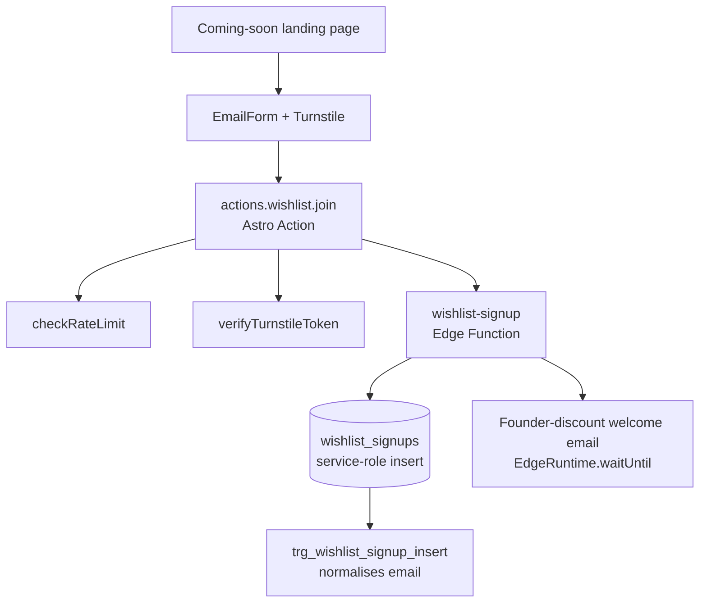

# Wishlist Signups — Backend Implementation Guide

Pre-launch "coming soon" email capture for the marketing site. No auth, no service-specific logic — a single table written exclusively through the service-role client, via the `wishlist-signup` edge function.

## Architecture

## Source Files

| File | Location |
|---|---|
| Table, trigger, indexes | `backend/supabase/schemas/wishlist.sql` |
| pgTap tests | `backend/supabase/tests/029_wishlist_test.sql` |
| Edge function | `backend/supabase/functions/wishlist-signup/index.ts` |
| Welcome email template | `backend/supabase/functions/_shared/email-templates/wishlist-welcome.ts` |
| Unsubscribe link builder | `backend/supabase/functions/_shared/email-templates/unsubscribe-link.ts` (`buildWishlistUnsubscribeUrl`) |
| Astro action | `marketing/src/actions/wishlist.ts` |

## Key Design Decisions

| Concern | Decision |
|---|---|
| Access model | Zero RLS policies + `revoke all ... from anon, authenticated` — service-role only, same pattern as `creator_reports` / `platform_settings` |
| Why no anon insert policy | Turnstile verification and rate limiting live in the Astro Action layer; the action uses `createServiceDBClient()` to write, so the table itself never needs to trust the browser |
| Dedup | `idx_wishlist_signups_email` unique index on the (already normalised) `email` column |
| Email normalisation | `trg_wishlist_signup_insert` (BEFORE INSERT) lower-cases + trims `email` so case/whitespace variants can't bypass the unique index |
| Diff-tool gotcha | `supabase db diff` did not capture the `revoke all on table ... from anon, authenticated` for this table because it was created in the same migration — the default public-schema ACL grants `anon`/`authenticated` full privileges at `CREATE TABLE` time. The revoke had to be added by hand to the generated migration (`20260618113722_add_wishlist_signups_table.sql`). Always verify generated migrations for new service-role-only tables against this. |
| `ip_address`/`user_agent` capture | These are **not** read from `req.headers` inside the edge function. `wishlist.join` is an Astro server action, so its call to `supabase.functions.invoke("wishlist-signup", ...)` is a server-to-server request — `cf-connecting-ip`/`user-agent` on that request reflect the marketing server, not the original visitor. The Astro action reads the real values off `context.request.headers` (the browser's actual request, as seen by the marketing Worker) and forwards them explicitly in the invoke body; the edge function reads `body.ip_address`/`body.user_agent` instead of its own `req.headers`. |
| Welcome email delivery | The founder-discount welcome email is sent fire-and-forget after the insert succeeds, wrapped in `EdgeRuntime.waitUntil(...)`. Without `waitUntil`, Supabase's edge runtime can recycle the isolate as soon as the HTTP response is returned, killing the in-flight `sendEmail()` call before it reaches Resend/SMTP — a bare `.then()/.catch()` is not sufficient. |

## Database Schema

### `wishlist_signups`

| Column | Type | Notes |
|---|---|---|
| `id` | `bigint PK` | `generated always as identity` |
| `email` | `text NOT NULL` | Normalised (lower-case + trimmed) by trigger before insert; unique |
| `ip_address` | `text` | Captured for spam/abuse review |
| `user_agent` | `text` | Captured for spam/abuse review |
| `created_at` | `timestamptz NOT NULL DEFAULT now()` | |

RLS: enabled, zero policies. `revoke all on table ... from anon, authenticated` — only `service_role` can read/write.

## Edge Function: `wishlist-signup`

| Property | Value |
|---|---|
| **Method** | `POST` |
| **Auth Required** | No |
| **Rate Limit Tier** | `public` |

Called by `marketing/src/actions/wishlist.ts` (`wishlist.join` Astro action). Flow:

1. Validates `email` against a basic pattern; 400 on failure.
2. Inserts into `wishlist_signups` with `ip_address`/`user_agent` taken from the request body (see gotcha above), using the service-role client. `23505` (unique violation — already joined) is treated as success, both to avoid leaking whether an email is already on the list and to skip re-sending the welcome email on a repeat submission.
3. On a genuinely new signup, builds a signed wishlist-unsubscribe link (`buildWishlistUnsubscribeUrl`, keyed on the `wishlist_signups.id` since joiners have no `auth.users`/`profiles` row) and renders + sends the founder-discount welcome email, fire-and-forget under `EdgeRuntime.waitUntil(...)`.
4. Always responds `{ success: true }` once the insert step resolves — the email send never blocks or fails the response.

## Frontend Integration (marketing site)

Wired via `marketing/src/actions/wishlist.ts` (Astro Action) + the `EmailForm` component, guarded by Cloudflare Turnstile and the `wishlistLimit` Upstash rate limit (see `marketing/infrastructure/index.md`).
