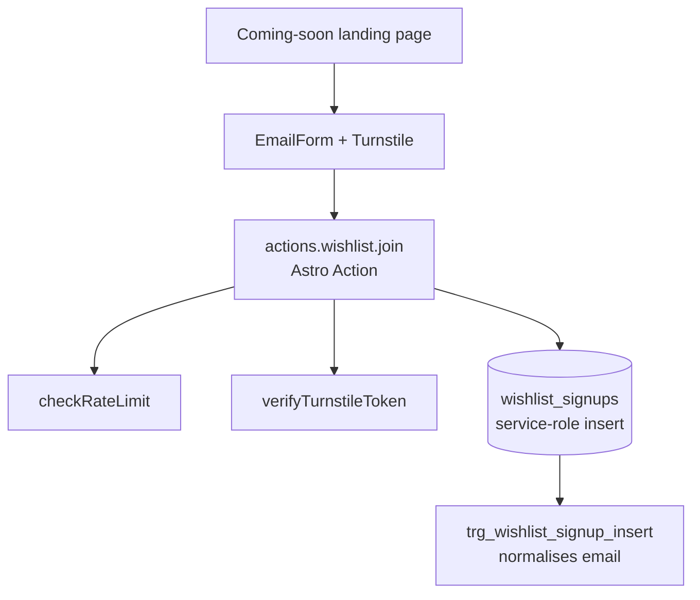

# Wishlist Signups — Backend Implementation Guide

Pre-launch "coming soon" email capture for the marketing site. No auth, no service-specific logic — a single table written exclusively through the service-role client.

## Architecture

## Source Files

| File | Location |
|---|---|
| Table, trigger, indexes | `backend/supabase/schemas/wishlist.sql` |
| pgTap tests | `backend/supabase/tests/029_wishlist_test.sql` |

## Key Design Decisions

| Concern | Decision |
|---|---|
| Access model | Zero RLS policies + `revoke all ... from anon, authenticated` — service-role only, same pattern as `creator_reports` / `platform_settings` |
| Why no anon insert policy | Turnstile verification and rate limiting live in the Astro Action layer; the action uses `createServiceDBClient()` to write, so the table itself never needs to trust the browser |
| Dedup | `idx_wishlist_signups_email` unique index on the (already normalised) `email` column |
| Email normalisation | `trg_wishlist_signup_insert` (BEFORE INSERT) lower-cases + trims `email` so case/whitespace variants can't bypass the unique index |
| Diff-tool gotcha | `supabase db diff` did not capture the `revoke all on table ... from anon, authenticated` for this table because it was created in the same migration — the default public-schema ACL grants `anon`/`authenticated` full privileges at `CREATE TABLE` time. The revoke had to be added by hand to the generated migration (`20260618113722_add_wishlist_signups_table.sql`). Always verify generated migrations for new service-role-only tables against this. |

## Database Schema

### `wishlist_signups`

| Column | Type | Notes |
|---|---|---|
| `id` | `bigint PK` | `generated always as identity` |
| `email` | `text NOT NULL` | Normalised (lower-case + trimmed) by trigger before insert; unique |
| `ip_address` | `text` | Captured for spam/abuse review |
| `user_agent` | `text` | Captured for spam/abuse review |
| `created_at` | `timestamptz NOT NULL DEFAULT now()` | |

RLS: enabled, zero policies. `revoke all on table ... from anon, authenticated` — only `service_role` can read/write.

## Frontend Integration (marketing site)

Not yet wired — see `marketing/docs/wishlist-frontend-guide.md` for the implementation guide (Astro Action + TanStack Form, following the existing `EmailForm` pattern).
